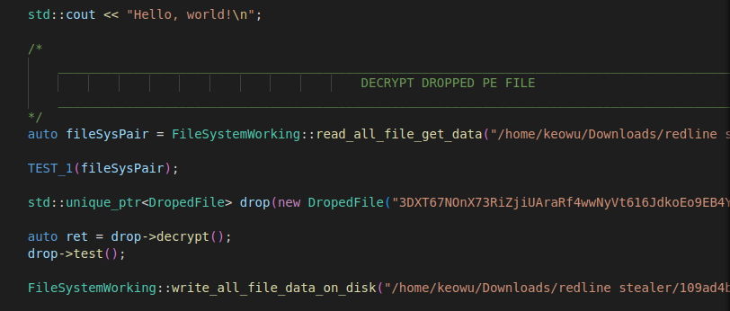
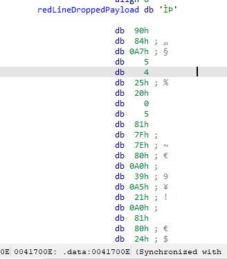
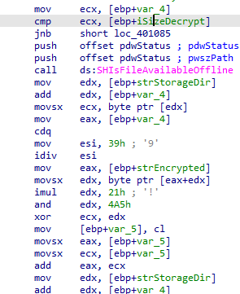
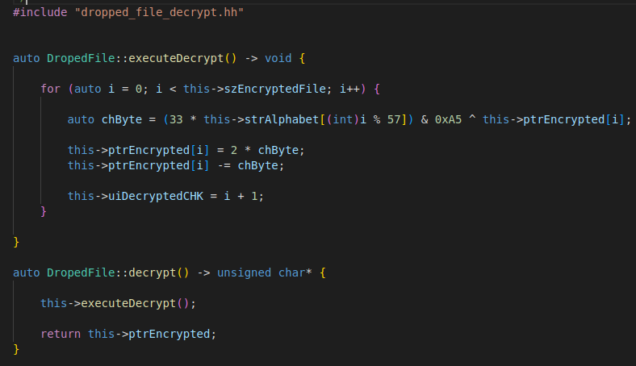
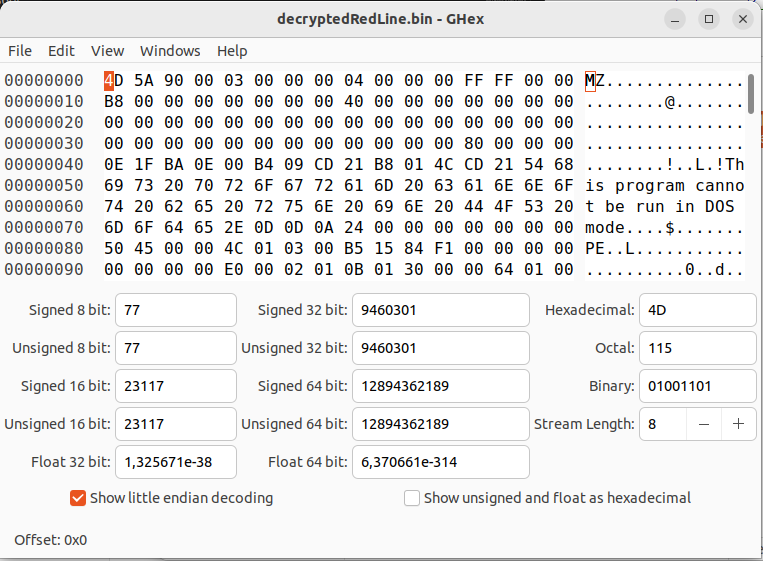
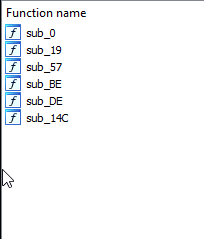
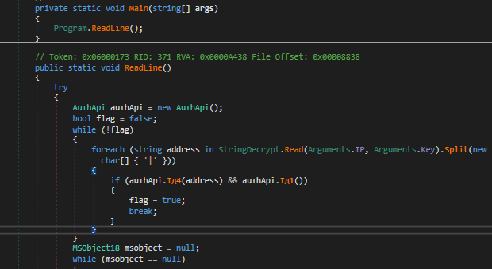
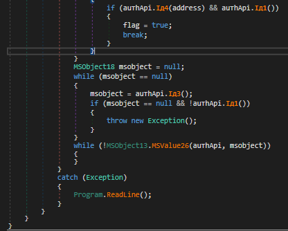

# Malware Analysis Writeup | RedLine Stealer
Author: João Vitor (@Keowu) - Malware Security Researcher

# Sample identification hash

This malware is from the RedLine Stealer family, and it is sold on illegal hacking forums for around (US 100 to US 150, depending on the version). The attack scope of this malware includes browsers with saved credentials and auto-filled data, credit card information, and other valuable information for the attacker.

| Arch              | PE Header                        | '.text' Section                  |   '.rsrc' Section                   | '.data' Section                 | 
|--                 |--                                |--                                |--                                   |--                                |--                                 |
| PE32 - Visual Studio C++ 2008 - IA32 | 5986260ff1717651f845cac811314cf4 | 237abd28f46f7b5afb4d22ba99c20573 | 4fb9fc33872a14a95c46dce08c7b0beb    | 375a007dfdf68788bb1606290c27e98b |

# Overview

The sample analyzed here has the characteristic of mass email propagation, offering a file that the attacker induces their victim to execute by offering something in return.

# Analyzing the dropper.

- The first stage is characterized by dropping a .NET file.
- It executes embedded shellcode via stack-based and takes advantage of hidden execution attack to evade antivirus detection.
- It does not use overlay techniques because it runs encrypted shellcode.
- Useful information: Its .NET PE is stored in .data.

Let's check the file:


At first glance, we can see that the attacker heavily relies on stack-based techniques to load some data, which is initially unknown.


We can see a high usage of detected allocated variables here, which is not very common in legitimate software, raising a flag of obfuscation.


After advancing through the excessive amount of variable declarations, we find the beginning of our software's logic, following the stack adjustment:

```
push ebp
mov ebp, esp
sub esp, 880h
```

Let's focus our attention, at first, on the following code snippet. We can observe...

```
# Normal Instructions
push 0
call ds:GetConsoleWindow
push eax
call ds:ShowWindow
call ds:GetCommandLIneW

# Instructions point flutuant calculation
fld ds:flt_413AD0
fstp [ebp+var_28]
fld ds:flt_413ACC

```

We can observe that we have a non-logical, normal usage of system API calls here, in this case, passing 0 as an argument, followed by a call to GetConsoleWindow, a push to its return, and two calls to ShowWindow and GetCommandLineW. After that, there is a massive usage of instruction opcodes for calculation with floating-point numbers.

Given this context, we can conclude that the sample itself employs some obfuscation technique.

Looking at the pseudocode, we can see this difference and attempt at obfuscation that the author used:


Advancing further, we can find a high usage of stack-based techniques, basically a stack of mov opcodes.


We can observe a very high usage of bytes directly assigned to memory regions. In reverse engineering, we nickname this technique "stack-based." In this screenshot, I renamed the first address declaration as "redLineStackBasedShellcode," which is our initial displacement or base code to make it more intuitive. Alternatively, we can simply say that this is the zero index of our array.

We can see this in the sequence of previous variable declarations, noticing the sequence of one byte between [ebp+var_82F] and the next [ebp+var_82E], and so on.

See our pseudocode below:


Let's obtain a binary file containing only this shellcode to take a look:


After processing and preparation, we will obtain a .bin file containing our shellcode, but obviously this code is encrypted. The decryption routine for this shellcode can be found by searching the assembly for the first defined offset flag, in this case the redLineStackBasedShellcode.


Here we can observe several parameters passed to the redLineDecryptStringA method, basically we have the following signature: redLineDecryptStringA(aI0obyn5qi9oijh, 0x77E, 0x42).

Let's move forward, let's take a look at its content:


We noticed that several operations between multiplication, division, and XOR are performed. Let's try to obtain this algorithm if possible instead of executing it and obtaining the decrypted data after execution.



For this task, I rewrote the routine responsible for decrypting the shellcode from memory, using standard C++ with CMAKE in a UNIX environment.

Let's first take a look at the rewritten routine that is responsible for decrypting this shellcode, this time in C++:


The routine is composed of a size of the shellcode that will be executed, in this case previously obtained and identified as 0x77E. Afterwards, the malware uses a key with valid ASCII characters and an XOR key, in this case 0x42.

After running the project named REDLINEMALWAREDECRYPT, we will obtain an output .bin file with our decrypted opcode.


Let's save this binary as we will use it in the future, let's move forward to understand more about the loading process.

Continuing our analysis, we will look for where this code is used after decryption.

Upon searching for references in the assembly, we arrive at the following section:


In this section, we observe a technique called shellcode executing or call reinterpretation, which is quite common when one wants to execute code in a "safe" manner. In this case, the instruction "lea eax, [ebp+edx+redLineStackBasedShellcode]" tells us that we will reuse the address present in ebp, which is the base, with the address present in edx, which we still do not know, and the pointer to the beginning of the decrypted shellcode data in memory, and then a call is made to the resulting address in EAX. Let's investigate what EDX is in this context. We know that it is the result of a "mov edx, [ebp+entryFunctionShellCodeCdcl]" operator, but we still do not know the actual value stored there. So, let's look for it:


Here, we can observe a call to "getShellCodeEntryPoint", and its return value is then stored. Let's take a look at this call:


Inside this method, we can observe, obviously ignoring the obfuscation used, a "mov [ebp+var_C], 218h" being used. Then this value is moved to EAX where a "sub" instruction is used, subtracting 0x97 from the content, storing it back in "mov [ebp+var_8]", zeroing the register, and finally moving the value back to EAX. When we calculate it, we get 0x181, which is the RVA pointing to where the shellcode will start its execution, similar to a main function.

Upon analysis, we arrive at the following final logic:

```c++
((void (_cdecl *)(int, DWORD, char*))&redLineStackBasedShellCode[entryFunctionShellCodeCdcl](ptrloadlib, 0, redLineDroppedPayLoad));
```

This obviously allows us to discover how the function executed inside the shellcode works, but before we analyze its functionality, let's pay attention to "redLineDroppedPayLoad", which we had not seen before. Let's analyze it:



We were able to find the content stored in the data section, but it still looks strange and doesn't make much sense, so let's search and verify if there is any decryption being done on these bytes.


Upon finding a reference, it was possible to determine a routine capable of decrypting the bytes, with a calculation logic that is completely different but similar in terms of parameters to the shellcode encryption. Let's analyze:



We have a calculation being performed, and after using the same project previously mentioned, we arrived at the following decryption logic:



Basically, we receive the size of the payload file, an ASCII character key, and perform the decryption operation. After that, we obtain the following file:



This file is the actual RedLine file, which is a .NET file that will be dropped and executed using the malware's shellcode. Before we move on to the .NET file, let's analyze how the shellcode works.

To do this, we will use the previously decrypted shellcode using the REDLINEMALWAREDECRYPT tool:




When we work and prepare the segments and disassemble the code present in the output .bin file, we can observe a beautiful code in 32-bit Intel Assembly (IA-32) and some identified functions, but we still can't see the main execution function, let's look for it based on the information we have:


In the process of finding the entry point by calculating the displacement based on the address, and searching for the function entry bytes, we can obtain the correct location where the shellcode begins. However, IDA got a little confused during our analysis, so let's correct it and turn it into a valid procedure for it (mark it as a function):


After correcting the errors in IDA, we can observe that a new function has appeared in our list, and IDA has interpreted all the references used to store data. So let's analyze and understand its main behavior:


After a detailed analysis of the shellcode, some bug fixes in the stack, and some hash resolutions, it was possible to reach conclusions about how this Redline loader works. Here I will break down its operation:

The shellcode starts its execution in the "shellcode_main" function, receiving three distinct algorithms: "C:\Windows\Microsoft .NET\Framework\v4.0.30319\AppLaunch.exe", "0x00," and a "pointer to the decrypted payload in memory.":


For execution scope, the malware uses the PEB struct to its advantage. The malware author used hashes to encrypt the original loaded scope. By resolving these hashes, we obtain the following:


Through the author's algorithm, there are other easier ways to solve it, but in this case, it is best for learning purposes to solve the references from the author's malware algorithm present in solve_api_hash. Another technique used by the malware author is to use a scope hiding technique by referencing an array of references that resolves the loaded reference. To do this, the malware author resolves their hashes and retrieves the desired dll's export address through PEB to then execute their attack scope. In this specific shellcode, after all references are resolved, it calls the OpenProcessW API, which will be used to create a new process present in its argument "C:\Windows\Microsoft .NET\Framework\v4.0.30319\AppLaunch.exe." After allocating virtual memory and correcting offsets, it creates a thread, retrieves its context, copies the decrypted payload content from memory, and then resumes the thread, causing the binary to be executed, thus executing the RedLine Stealer malware family.

Analyzing the .NET binary of RedLine Stealer:



We can observe that right at the beginning, there is a TCP connection method with a previously unknown host. In its main method, it calls the RedLine() method responsible for several functions that I will break down in detail. At first, we should know that this method is the main one responsible for stealing credentials, establishing a TCP connection with the author's server, and sending the data. However, the malware author uses some tricks to ensure that the malware is always executed. If an exception occurs during execution, the malware calls the RedLine() method again, as can be seen below:



As can be seen, when an exception occurs, the method will be executed again to ensure that it is executed until it obtains success in stealing the credentials.

First, let's identify the indicators of compromise (IOC) of this version of RedLine that we are analyzing, but before we do that, we need to resolve some string encryption techniques employed by the malware author.


Along with the project, the REDLINEMALWAREDECRYPT tool was implemented, which includes the decryption algorithm for strings used by the malware. When we run it, applying it to all encrypted strings, we obtain:


When we query address information, we can obtain some information:


The attacker's server is hosted in Russia, probably using offshore hosting policies.

## IOCS

185.70.104.74 - HostKey - Russia - TCP - No certificate

109ad4bb0da7071bb6ec2c9250bc7db458b3973ece6769f30663ef2b82d51cec - Infection Excutable

fcff0b801d7a27f7bab4b4a989bfa6dcba5a5c4a8658eb941a8698b8c1c87cd4 - ShellCode

43496f28c5ce6267862de06fe96a9bc50d0fb83851bfc75337bd681c8cc1eb12 - RedLine .NET Binary