# Malware Analysis Writeup | RedLine Stealer
Author: João Vitor (@Keowu) - Malware Security Researcher

# Sample identification hash

Esse malware é da familia RedLine Stealer, esse malware é vendido em fóruns de hacking ilegal por cerca de (US 100 a US 150, dependendo da versão) o escopo de ataque desse malware são nevegadores com credenciais salvas e dados auto completados, informações de cartões de crédito entre outras informações de valor ao atacante.

| Arch                                 | PE Header                        | '.text' Section                  | '.rsrc' Section                  | '.data' Section                  |
|--------------------------------------|----------------------------------|----------------------------------|----------------------------------|----------------------------------|
| PE32 - Visual Studio C++ 2008 - IA32 | 5986260ff1717651f845cac811314cf4 | 237abd28f46f7b5afb4d22ba99c20573 | 4fb9fc33872a14a95c46dce08c7b0beb | 375a007dfdf68788bb1606290c27e98b |

# Overview

O sample aqui analisado tem como característica de propagação e-mails em massa oferecendo um arquivo ao qual o atacante induz sua vítima a efetuar sua execução oferecendo algo em troca.

# Analisando o dropper

- O primeiro estágio tem como característica principal dropar um arquivo .NET
- Executar shellcode inbutido e via stack based e aproveitar de ataque de execução escondida de anti-virus
- Ele não utiliza técnicas de overlay pois executa shellcode criptografado
- Informação útil: seu .net PE é armazenado na .data

Vamos verificar o arquivo:


A primeira vista percebemos que o atacante utiliza-se muito de técnicas de stack based para carregar algum dado, a primeiro momento desconhecido.

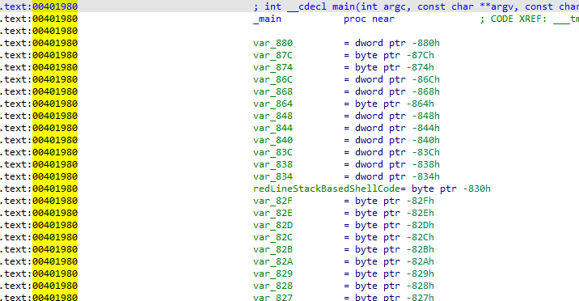

Percebemos aqui um elevado uso de variáveis alocadas detectada, não muito comum em softwares legitimos, e levantando a flag de uma ofuscação.


Avançando a demasiada quantidade de declarações de variáveis encontramos o início da lógica de nosso software, após o ajuste de stack em

```
push ebp
mov ebp, esp
sub esp, 880h
```

vamos dirigir nossa atenção a primeiro momento no trecho de código seguinte, podemos observar

```
# Normal Instruções
push 0
call ds:GetConsoleWindow
push eax
call ds:ShowWindow
call ds:GetCommandLIneW

# Instruções de calculo de ponto flutuante
fld ds:flt_413AD0
fstp [ebp+var_28]
fld ds:flt_413ACC

```

Podemos observar que possuímos uma não lógica, um uso normal de api's do sistema operacional, nesse caso 0 como argumento, seguido de uma chamada para GetConsoleWindow um push em seu retorno e duas chamadas para ShowWindow e GetCommandLineW, e após um uso massivo de opcodes de instrução para calculo com números com ponto flutuante.

Dado esse contexto podemos concluir que o sample em sí utiliza alguma técnica de ofuscação.

Ao olharmos o pseudocódigo podemos constatar essa diferença e tentativa de ofuscação que o autor utilizou:


Avançando é possível encontrar um elevado uso de stackbased, basicamente um amontoado de opcode mov.

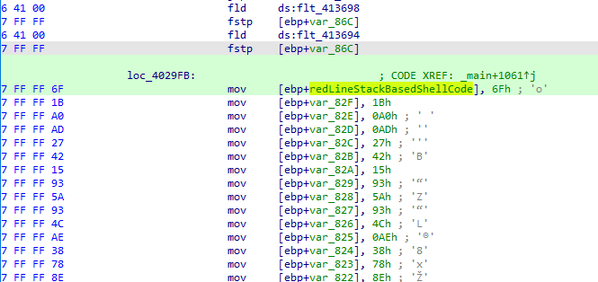

Podemos observar um elevadissimo uso de bytes diretamente atribuido a regiões de memória, em engenharia reversa nós apelidamos essa técnica de stack based, nesse trecho da captura de tela eu renomeei o primeira declaração de endereço como redLineStackBasedShellcode ele é nosso deslocamento inicial ou base do código para ficar mais intuitivo, ou também podemos simplesmente falar olha esse é o índice zero do meu array.
Podemos perceber isso pelo movimento de declaraçõe anteriormente vistos, perceba a sequência de um byte entre [ebp+var_82F] e o seguinte [ebp+var_82E], assim por diante.

Veja nosso pseudocódigo asseguir:


Vamos obter um arquivo binário contendo somente esse shellcode para darmos uma olhada:

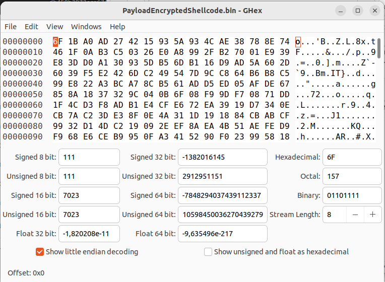

Após tratado e preparado obteremos um arquivo .bin contendo nosso shellcode, porem obviamente esse código esta criptografado. a rotina de descriptografia desse shellcode pode ser encontrada buscando no assembly pela primeira flag definida de offset, nesse caso a redLineStackBasedShellcode.


Aqui podemos observar diversos parâmetros passados para o método redLineDecryptStringA, basicamente temos a seguinte assinatura redLineDecryptStringA(aI0obyn5qi9oijh, 0x77E, 0x42).

Vamos em frente, vamos olhar seu conteúdo:

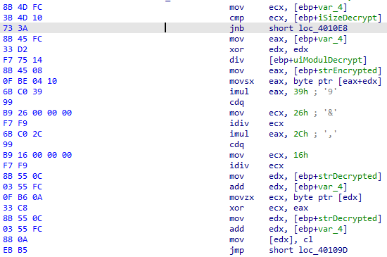

Percebemos que diversas operações entre multiplicação, divisão e xor são efetuadas, vamos tentar obter esse algoritmo se possível ao invés de executarmos e obtermos os dados descriptografados depois da execução.


Para esse tarefa reescrevi a rotina responsável por descriptografia do shellcode da memória, usando C++ padrão CMAKE em ambiente UNIX.

Vamos olhar a primeiro momento apenas a rotina reescrita que é responsável por descriptografar esse shellcode, dessa vez em C++:

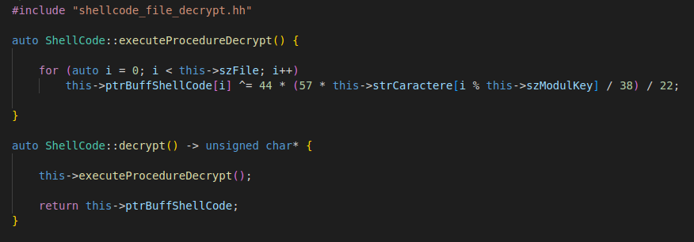

A rotina é composta por um tamanho do shellcode que será executado, nesse caso anteriormente ao obtermos pudemos identificar que era 0x77E, após o malware utiliza uma chave com caracteres ASCII validos e uma chave xor nesse caso 0x42.

Após executarmos o projeto apelidade de REDLINEMALWAREDECRYPT, obteremos um arquivo .bin de saída com nosso opcode descriptografado:

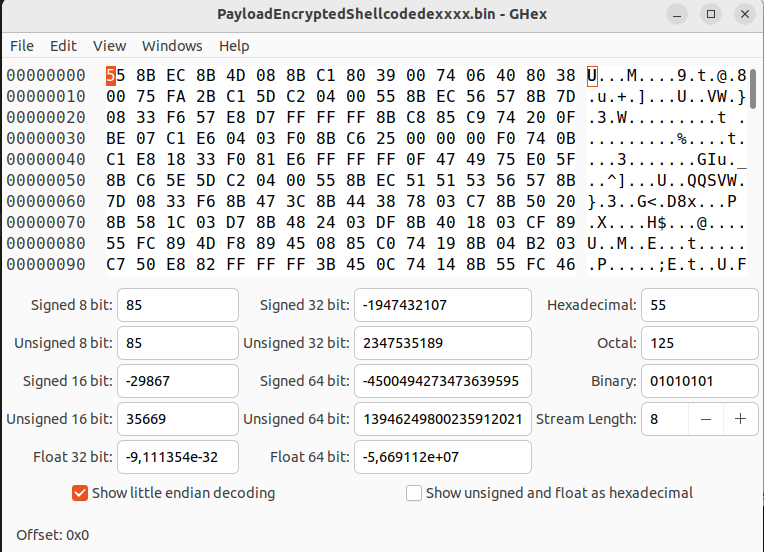

Vamos guardar esse binário pois vamos utilizar no futuro, vamos avançar para entender mais sobre o processo de carregamento.

Seguindo com nossa análise vamos procurar, após a descriptografia, onde esse código é utilizado.

Ao buscarmos por referencias no assembly chegamos no seguinte trecho:


Nesse trecho observamos uma técnica apelidade de shellcode executing ou de reinterpretação de chamada, isso é bem comum quando deseja-se executar códigos de maneira "segura", nesse caso a instrução lea eax, [ebp+edx+redLineStackBasedShellcode] nos diz que vamos reaproveitar o endereço presente em ebp que é a base, com o endereço presente em edx que ainda desconhecemos, e o ponteiro para o início dos dados do shellcode descriptografados em memória e depois uma call para o endereço resultante é feita em EAX. vamos investigar o que é EDX nesse contexto, sabemos que ele é resultante de um operador mov edx, [ebp+entryFunctionShellCodeCdcl] mais ainda não sabemos o valor de fato armazenado lá. então vamos atrás:


Aqui podemos observar uma chamada para getShellCodeEntryPoint, e seu retorno é então armazenado. vamos olhar nessa chamada:


Dentro desse método podemos observar então, obviamente ignorando a ofuscação utilizada, um mov [eb+var_C], 218h sendo utilizado, depois esse valor sendo movido para eax onde uma instrução sub é usada subtraindo então 0x97 do conteúdo, armazenando de volta em mov [ebp+var_8], zerando o registrador e enfim movendo novamente o valor para eax. ao calcularmos obteremos 0x181, sendo esse o RVA apontando para onde no shellcode começara sua execução, similar a um main.

Ao analisarmos chegamos na seguinte lógica final:

```c++
((void (_cdecl *)(int, DWORD, char*))&redLineStackBasedShellCode[entryFunctionShellCodeCdcl](ptrloadlib, 0, redLineDroppedPayLoad));
```

Isso nos permite obviamente descobrir como funciona a função executada dentro do shellcode, porem antes de analisarmos seu funcionamento, vamos prestar atenção em redLineDroppedPayLoad, antes não tinhamos visto, vamos analisar:


Conseguimos encontrar o conteúdo armazenado na seção data, porem isso ainda esta estranho e não faz muito sentido por isso vamos procurar e verificar se existe alguma descriptografia sendo feita desses bytes.


Ao encontrar uma referência foi possível determinar uma rotina capaz de descriptografar os bytes, com uma lógica de calculo totalmente diferente porem similar em termos de parâmetros com a criptografia de shellcode, vamos analisar:


Temos um calculo sendo efetuado, após utilizando o mesmo projeto anteriormente mencionado chegou-se ao seguinte resultado como lógica de descriptografia:


Basicamente recebemos o tamanho do arquivo de payload, uma chave de caractéres ASCII e efetua-se a operação de descriptografia, após obtemos o seguinte arquivo:


Esse arquivo é o arquivo padrão RedLine em sí, esse arquivo é um arquivo .NET que será dropado e executado usando o shellcode do malware, antes de avançarmos para o arquivo .NET vamos analisar como o shellcode funciona.

Para isso utilizaremos o shellcode descriptogrado anteriormente usando a ferramenta REDLINEMALWAREDECRYPT:

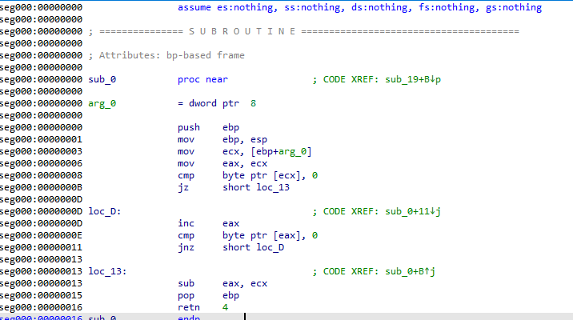


Quando trabalhamos e preparamos os segmentos e disassemblemos o código presente no arquivo .bin de saída podemos observar um código bonito em Assembly Intel de 32 bits(IA-32) e algumas funções identificadas, porem ainda não conseguimos ver a função principal de execução, vamos procura-la com base nas informações que possuímos:

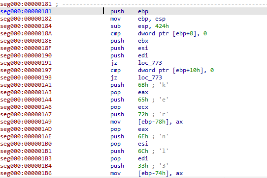

Ao encontrarmos a entrada calculando o deslocamento com base no endereço, e procurando pelos bytes da entrada da função podemos obter a localização correta onde o shellcode se incia. porem o IDA se confundiu um pouco durante nossa análise então vamos corrigir isso e transformar em um procedimento válido para ele(marcar como função):

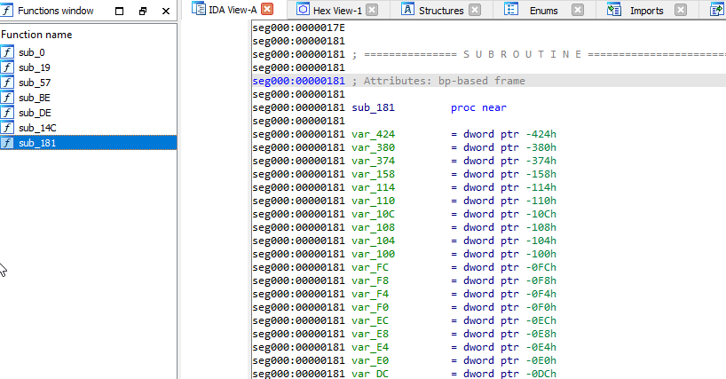

Após corrigirmos os erros do IDA podemos observar que uma nova função apareceu em nossa lista, e que o IDA interpretou todos as referências utilizadas para guardar dados. Então vamos analisar e entender seu comportamento principal:


Após uma analise detalhada do shellcode, algumas correções de bugs na stack, algumas resoluções de hash, foi possível chegar a conclusões sobre como esse loader do redline funciona, aqui vou destrinchar seu funcionamento:

O shellcode começa sua execução na função "shellcode_main" recebendo três algoritmos distintos, "C:\Windows\Microsoft .NET\Framework\v4.0.30319\AppLaunch.exe", "0x00" e um "Ponteiro para o payload descriptografado na memória":


Para escopo de execução o malware utiliza a PEB struct a seu favor, o autor do malware utilizou-se de hash's para criptografar o escopo original carregado, resolvendo essas hash obtemos o seguinte:

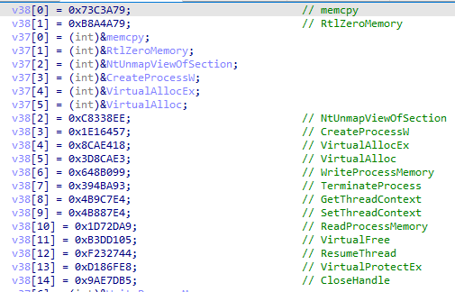

Através do algoritmo do autor, existem outras maneiras mais fáceis para resolver porem nesse caso o melhor para aprendizado é resolver as referências a partir do algoritmo do autor do malware presente em solve_api_hash. Outra técnica usado pelo autor do malware é utilizar de uma técnica de ocultação de seu escopo usando referências para um array de referências que resolve a referência carregada, para isso o autor do malware resolvia as suas hash's e através da PEB recuperava o endereço do export desejado da dll desejada, para então efetuar seu escopo de ataque. Nesse shellcode em específico após todas referências serem resolvidas ele chama a API OpenProcessW que será utilizada para criar um novo processo presente em seu argumento "C:\Windows\Microsoft .NET\Framework\v4.0.30319\AppLaunch.exe", após ele alocara memória virtual e corrigira deslocamentos criara uma thread, recuperara seu contexto, copiara o conteúdo do payload descriptografado da memória e então ira resumir a thread fazendo com que o binário seja então executado, dessa forma executando o malware da familia RedLine Stealer.

Analisando o binário .NET do RedLine Stealer:


Podemos observar que logo em seu inicio um método de conexão TCP com um host até então desconhecido, em sua main ele chama o método RedLine() responsável por diversas funções que irei destrinchar detalhadamente, a primeiro momento devemos saber que esse método é o principal de fato responsável por roubar as credênciais estabelacer uma conexão tcp com o servidor do autor e enviar os dados, porem o autor do malware utiliza alguns truques para garantir que o malware sempre seja executado, caso uma exception ocorra durante a execução o malware chama novamente o método RedLine() como pode-se comprovar abaixo:


Como pode-se comprovar quando uma exception ocorrer o método será executado novamente, para garantir que será executado até que obtenha um sucesso com o roubo das credênciais.

Primeiramente vamos identificar os indices de comprometimento(IOC) dessa versão do RedLine que estamos analisando, porem antes de fazermos isso precisamos resolver algumas técnicas de criptografia de strings empregadas pelo autor do malware:


Junto com o projeto a ferramenta REDLINEMALWAREDECRYPT, foi implementado o algoritmo de descriptografia de strings utilizado pelo malware ao executarmos aplicando todas as strings criptogradas obteremos:


Ao consultarmos informações do endereços conseguimos obter algumas informações:

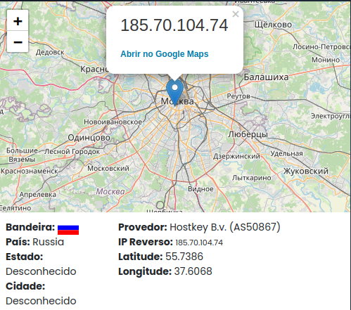

O servidor do atacante esta hospedado na Rússia. provavelmente utilizando uma hospedagem que adota a política offshore.

## IOCS

185.70.104.74 - HostKey - Russia - TCP - Sem certificado

109ad4bb0da7071bb6ec2c9250bc7db458b3973ece6769f30663ef2b82d51cec - Infection Excutable

fcff0b801d7a27f7bab4b4a989bfa6dcba5a5c4a8658eb941a8698b8c1c87cd4 - ShellCode

43496f28c5ce6267862de06fe96a9bc50d0fb83851bfc75337bd681c8cc1eb12 - RedLine .NET Binary
