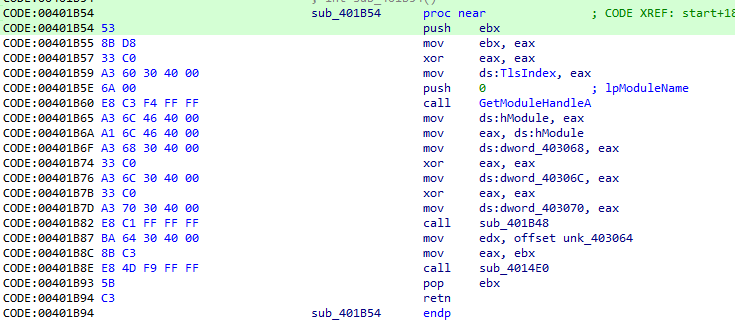
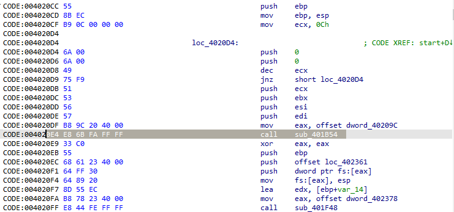
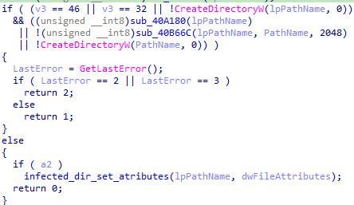
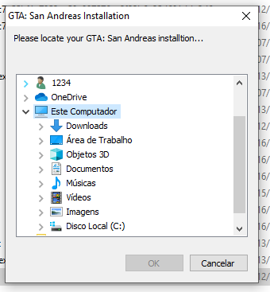
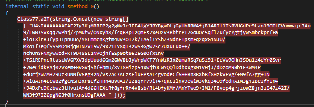
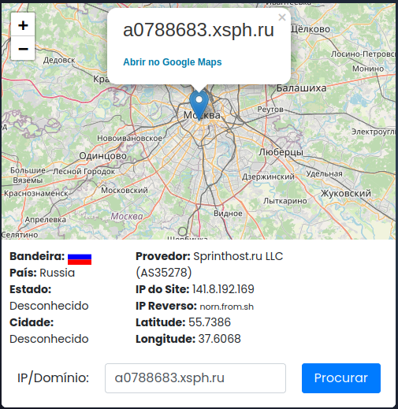
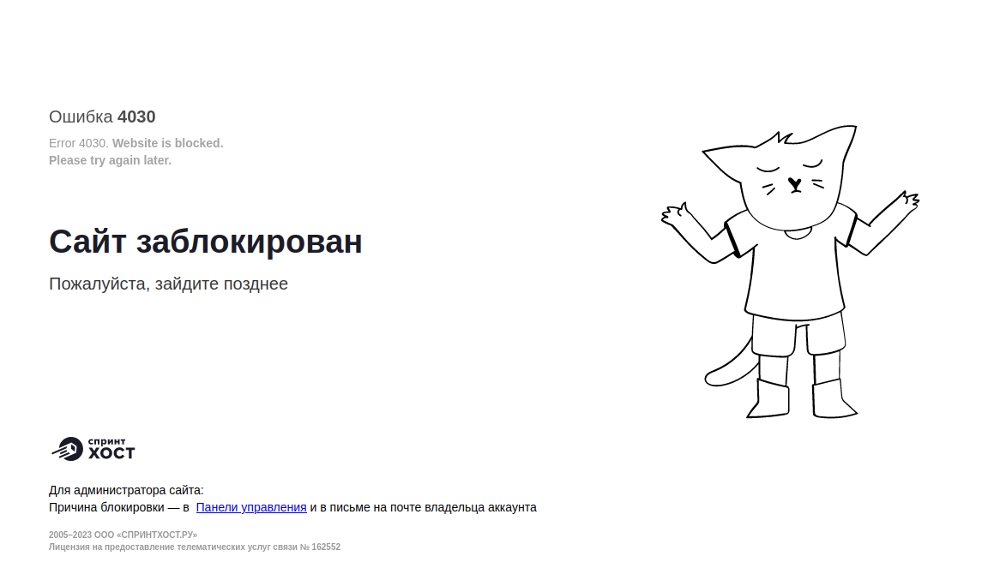

# Malware Analysis Writeup | DCRat
Author: João Vitor (@Keowu) - Malware Security Researcher

# Sample identification hash

This malware belongs to the DCRat family originating from 2018 but with characteristics of a recent redesign and relaunch. This malware is considered by the security community as a cheap malware, as it can be found on hacking forums for values below $5 equipped with several functions, from stealing usernames, passwords, credit/debit card information, browsing history, Telegram, Steam, Discord, Google accounts. DCRat does not fall into the category of stealers due to its ability for remote control and keylogging, which can provide the attacker with control over the victim.

The source code for the first outdated version can be found on a public repository on GitHub:
https://github.com/qwqdanchun/DcRat

| Arch                                 | PE Header                        | '.CODE' Section                  | '.rsrc' Section                  | '.data' Section                  |
|--------------------------------------|----------------------------------|----------------------------------|----------------------------------|----------------------------------|
| PE32 - Delphi 7 - IA32 | 259f776566eb46fb5b475151165f6d43 | e5913936857bed3b3b2fbac53e973471 | 33e6a6c5747f35eb57ab8f3e18701964 | cef89de607e490725490a3cd679af6bb |

# Overview

The propagation method of the sample could not be determined. However, its scope of attack is to impersonate an official file of the legitimate multiplayer modification for the game Grand Theft Auto San Andreas, specifically modifying an executable used to list and control player access to servers hosted by the community.

# Analyzing the dropper.

- The first stage drops a DCRatBuild.exe file and uses a PE executable developed in Delphi 7.
- The second stage, DCRatBuild, goes through an original WinRar binary and creates directories on the mapped primary disk where it creates three files: a persistence file named bLykItco1.bat, a binary executed through this mechanism named Chainsession.exe, and another binary (not used) named dasHost.exe (developed in .net). DCRatBuild is developed using C++, specifically Visual Studio.
- The third and final stage is the execution of the Chainsession.exe binary, which is the DCRAT family sample itself, developed in .NET.

Let's check the file:


Upon analyzing the file, we found several characteristics of a Delphi binary:



We can find right in its export "start" an entry point characteristic of Delphi developed binaries.

As we continue our analysis, we can see the continuation of our export "start", and shortly after, our sample/dropper will execute.



Let's continue analyzing the region and describe its operation in more detail. This binary is similar to a console software developed in Visual Studio, but in Delphi. Because it was developed using a different technology, there are some differences when analyzing it. Please see the final analysis result below, followed by a detailed explanation:


After a detailed analysis, we were able to notice some interesting things. Right at the beginning, we have a call to "create_delphi_application_context()". This call is standard in Delphi binaries and is even characterized as an Entry Point identifier because it is usually the first call made in binaries of this type.

However, when we direct our attention a little further ahead, we notice an interesting call in "find_resource_delphi()". Before we focus on that, let's check other interesting calls. As we advance further in our analysis, we can see a large switch case block:


We notice numerous calls to APIs used to obtain directories considered suspicious in any analysis. We will understand later what this information tells us about the functioning of this sample.


This time we noticed a Delphi-style string being converted, equivalent to our old good "char pointer". In addition, we noticed a file being created on disk, a file pointer being moved to the beginning, and finally writing a buffer of bytes in the Delphi pattern, also known as ANSI or "char pointer". After this writing, the handle is closed, and a verification occurs, and if the write is successful, a call to ShellExecuteA is made, also converting a Delphi-style string to the "char pointer" pattern used by the API. Finally, we have a dispose that ends the current Delphi software, also a pattern present in this type of binary.

So, in general, after a thorough analysis, we were able to understand the functionality of this malicious software:

- It obtains the temporary path of Windows
- It creates a new file
- It sets the pointer to the beginning of the file
- It writes a buffer to the file
- If the buffer is written, then a call to ShellExecuteA is made

As we can see:


Let's now focus our attention on the new binary dropped by this Delphi application:


This binary is compiled using Visual Studio 2017 and pretends to be a legitimate Winrar binary.

When executed by its Delphi dropper, this binary takes some interesting actions:

Creates a new directory on the C drive with the name "chainwebRuntimeCrtdll" if it does not already exist:



Creates four files on disk:


The first of them being a persistence file nicknamed "bLykItco1.bat":


The second one is a strange binary but without threats nicknamed "server_browser.exe".




The third one is a malware family binary called DCRat, developed in heavily obfuscated C# and named "Chainsession.exe". Another binary exactly like it, named "dasHost.exe", is also created, but only Chainsession.exe is used.


As both binaries are identical, I will not go into detail about "dasHost.exe" and will only focus on "Chainsession.exe":


Let's look for the attacker's DCRat configuration files and command-and-control information.




Upon conducting a deeper analysis of the binary, it is possible to observe the use of some encryption on this string. After rewriting the algorithm and the logic behind it, we obtain the configuration file.


After decryption, we obtain a JSON string that is parsed:


Let's analyze this as a formated Json:


Let's understand the most important parts:


SCRT and PCRT are used to decrypt other parts of the DCRat configuration.


The name of the "MUTEX" used to synchronize threads is also configurable.


ASCFG stands for "Advanced Settings Configuration" and refers to the configurable options and capabilities of the DCRat, including:

| **ASCFG**                    	| **Is Enabled**       	|
|------------------------------	|----------------------	|
| savebrowsersdatatosinglefile 	| false                	|
| ignorepartiallyemptydata     	| false                	|
| cookies                      	| true                 	|
| passwords                    	| true                 	|
| forms                        	| true                 	|
| cc                           	| true                 	|
| history                      	| false                	|
| telegram                     	| true                 	|
| steam                        	| true                 	|
| discord                      	| true                 	|
| filezilla                    	| true                 	|
| screenshot                   	| true                 	|
| clipboard                    	| true                 	|
| sysinfo                      	| true                 	|
| searchpath                   	| %UsersFolder% - Fast 	|

As we have strange bytes present in SCRT, PCRT, we know that they are used to decrypt more malware configuration content, such as its C2, for example, so let's check what we found:


A string is being encrypted and parsed as a dictionary, when we rewrite the algorithm, we get:


When we execute the algorithm, we get another Json configuration string:


By parsing this Json string, we can understand important details about the malware:


"T" is used to identify which C2 address should be used first, but the operator of this malware chose to replicate it in a way that uses a single server without redundancy.



The hosting server is called Sprinthost LLC, and like any serious company that has an LLC registration, they noticed and performed a takedown:



This obviously isn't all, we have another interesting piece of information present in the malware configuration, "PCRT" is also an encryption key used by the malware:


Within this routine we have another encrypted Json, which contains a new PE binary that is dropped to disk:


When executed, we obtain a new .net PE binary used for persistence purposes:


The scripts used for this extraction process can be found in the "DCRatMalwareDecrypt" directory of this repository.

We can confirm some information on how DCRat carries out its malicious actions of credential theft:


A malicious .bat file capable of executing commands and deleting files.


A reference file to a log with a very suspicious name "stealer".


A reference to the local database where Telegram stores data, and its registration key.


A reference to the local database where Discord stores the user account token.


A reference to the registration key used by Valve to store the Steam auto-login credential.


Another reference, but this time directly relating to its malware family DcRat, used for logs.


Another reference to DcRat used for log storage.

Throughout this report, I wrote a Yara rule for detecting this malware family:

```yara

import "pe"

rule dc_rat_stealer_detect {

    meta:
        author = "João Vitor - Keowu"
        date_created = "16/03/2023 ^=^"
        description = "Essa regra detecta malwares da Familia DcRat"

    strings:
        $str1 = { 40 [1] 65 [1] 63 [1] 68 [1] 6F }
        $str2 = { 73 [1] 74 [1] 65 [1] 61 [1] 6C [1] 65 [1] 72 [1] 6C [1] 6F [1] 67 [1] 73 [1] 74 [1] 61 [1] 74 [1] 75 [1] 73 }
        $str3 = { 54 [1] 65 [1] 6C [1] 65 [1] 67 [1] 72 [1] 61 [1] 6D [1] 2E [1] 65 [1] 78 [1] 65 }
        $str4 = { 64 [1] 69 [1] 73 [1] 63 [1] 6F [1] 72 [1] 64 }
        $str5 = { 76 [1] 61 [1] 6C [1] 76 [1] 65 }
        $str6 = { 44 [1] 43 [1] 52 [1] 61 [1] 74 }
        $str7 = { 44 [1] 43 [1] 52 [1] 61 [1] 74 [1] 2E [1] 43 [1] 6F [1] 64 [1] 65 }
        $nyan_pasu = { F3 A1 [5] F3 A6 [1] F3 A7 [5] F3 AC [5] F3 B1 [5] F3 B6 }

    condition:
        (uint16(0) == 0x5A4D and pe.is_pe and pe.imports("mscoree.dll") )
        and
        ($str6 or $str7) 
        and
        ($str1 or $str2 or $str3 or $str4 or $str5 or $nyan_pasu)
}

```


## IOCS

hxxp://a0788683.xsph.ru - Network Domain

141.8.192.169 - Network IP/DNS

5ba1b028da2c0e52c38c7a55bf1e7952cc50c907576ec2f22b6a25d691dde2d6 - DelphiStageOne.exe

21f9deb378c28ffefe9290b66b17db36c5f6b8a2c3f9a19f68e9b9b46c9caf72 - DCRatBuildStageTwo.exe

17303a8f6309aecccfce184b38daf556e50db1f166f6eded94795a319085e642 - Chainsession.exe and dasHost.exe

838bb9ee4c141ed6369d7d8d812d249b7b7356c95ced083f0d14e6af8fc7b709 - server_browser.exe

e16d31256434834519f0fc54095f9a5e03700adaba2e51a75dad1ab581441323 - out.bin

dcrat.yar - Yara Detection Rule

#### References

COMPUGRAF. DCRat: malware barato e “caseiro” é surpreendentemente eficaz e preocupa pesquisadores de segurança. [S. l.], 20 maio 2022. Disponível em: https://www.compugraf.com.br/dcrat-malware-barato-e-caseiro-e-surpreendentemente-eficaz-e-preocupa-pesquisadores-de-seguranca/. Acesso em: 12 mar. 2023.

BINARY DEFENSE. Creating YARA Rules Based on Code. 1. Online, 10 ago. 2020. Disponível em: https://www.binarydefense.com/creating-yara-rules-based-on-code/. Acesso em: 16 mar. 2023.
