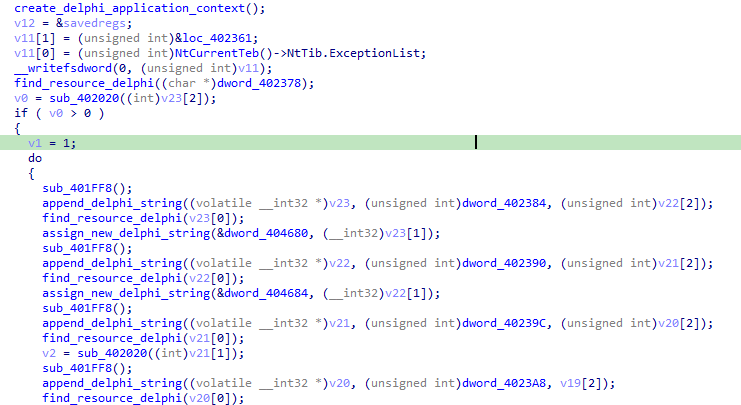
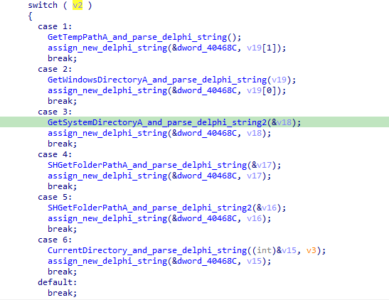
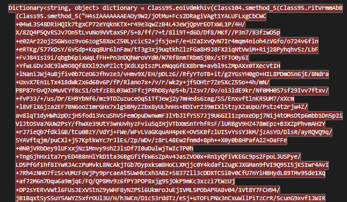
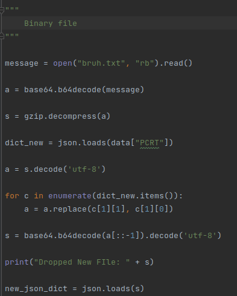
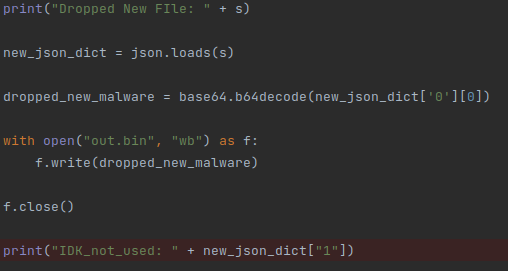

# Malware Analysis Writeup | DCRat
Author: João Vitor (@Keowu) - Malware Security Researcher

# Sample identification hash

Esse malware pertence a familia DCRat originario de 2018 porem com características de um redesenho e relançamento recente, esse malware é considerado pela comunidade de segurança como um malware barato, por pode ser encontrado em fóruns de hacking por valores abaixo de US 5,00 equipado com diversas funções desde roubar nomes de usuário, senhas, Cartão de Crédito/Débito, histório, Telegram, Steam, Discord, Contas Google. DCRat não entra na categoria de stealer devido sua capacidade de controle remoto e keylogger ao qual pode fornecer controle da vítima ao atacante.

O Código fonte da primeira versão desatualizada pode ser encontrado em um repositório público no github:
https://github.com/qwqdanchun/DcRat

| Arch                                 | PE Header                        | '.CODE' Section                  | '.rsrc' Section                  | '.data' Section                  |
|--------------------------------------|----------------------------------|----------------------------------|----------------------------------|----------------------------------|
| PE32 - Delphi 7 - IA32 | 259f776566eb46fb5b475151165f6d43 | e5913936857bed3b3b2fbac53e973471 | 33e6a6c5747f35eb57ab8f3e18701964 | cef89de607e490725490a3cd679af6bb |

# Overview

Não foi possível constatar o método de propagação do sample. porem o seu escopo de ataque é se passar por um arquivo oficial da modificação(legitima) de multiplayer para o jogo Grand Theft Auto San Andreas, em específico modificando um executável utilizado para listar e controlar o acesso do jogador em servidores hospedados pela comunidade.

# Analyzing the dropper.

- O Primeiro estágio tem característica de dropar um arquivo DCRatBuild.exe, esta etapa utiliza um executável PE desenvolvido em Delphi 7.
- O Segundo estágio DCRatBuild passa por um binário original do WinRar, e cria diretórios no disco primário mapeado onde cria-se três arquivos, um de persistência com o nome bLykItco1.bat, e um binário ao qual é excutado através desse mecanismo criado com o nome de Chainsession.exe, outro binário(não utilizado) com o nome de dasHost.exe(desenvolvido em .net), DCRatBuild é desenvolvido usando C++ em específico Visual Studio.
- O Terceiro e último estágio trata-se da execução do binário Chainsession.exe que trata-se do sample da família DCRAT em sí, desenvolvido em .NET.

Vamos verificar o arquivo:


Ao analisarmos o arquivo encontramos diversas características de um binário em Delphi:


Podemos encontrar logo em seu export start, um entrada para uma chamada característica de entrypoint de binários desenvolvidos em Delphi.

Ao continuarmos nossa analise podemos verificar a continuidade do nosso export start, logo abaixo o nosso sample/dropper já vai executar.


Vamos continuar a analise da região e descrever melhor seu funcionamento. esse binário é similar a um software de console desenvolvido em Visual Studio, porem em Delphi, graças a ter sido desenvolvido usando uma tecnologia diferenciada temos algumas diferenças ao analisar perceba o resultado da análise final abaixo seguida da sua explicação detalhada:



Após uma análise detalhada conseguimos perceber algumas coisas interessantes, Logo ao início temos uma chamada para "create_delphi_application_context()", essa chamada é padrão em binários Delphi, ele é caracterizado inclusive como identificador de Entry Point pois é geralmente a primeira call efetuada em binários desse tipo.

Porem quando dirigimos nossa atenção um pouco mais a frente, percebemos uma chamada interessante, em "find_resource_delphi()" antes de dirigirmos nossa atenção vamos verificar outras chamadas interessantes, avançando um pouco mais em nossa análise podemos verificar um grande switch case:



Percebemos inumeras chamadas para api's utilizadas para obter diretórios considerados suspeitos em qualquer análise, vamos entender a frente o que essas informações nos dizem sobre o funcionamento desse sample.


Desta vez percebemos uma string do padrão utilizado pelo delphi sendo convertida, equivalente ao nosso bom e velho "Ponteiro de char's" além disso percebemos um arquivo sendo criado no disco. um ponteiro de arquivo sendo movido ao início e por fim escrevendo um buffer de bytes no padrão do delphi também como ANSI ou "ponteiro de char's". após essa escrita o handle é fechado, e uma verificação ocorre e caso a escrita seja um sucesso, uma chamada para ShellExecuteA é feita, também convertendo uma string do padrão do Delphi para o padrão "ponteiro de char's" utilizado pela API. ao final temos um dispose que encerra o software delphi atual também um padrão presente neste tipo de binário.

Então de forma geral após uma boa analise conseguimos entender o funcionamento desse software malicioso:

- Ele obtem o path temporário do Windows
- Ele cria um novo arquivo
- Ele define o ponteiro ao início do arquivo
- Grava um buffer no arquivo
- Se o buffer for gravado, então uma chamada para ShellExcuteA é feita

Como podemos constatar:


Vamos agora dirigir nossa atenção no novo binário dropado por essa aplicação Delphi:


Esse binário é compilado usando o Visual Studio 2017 e se passa por um binário legítimo do Winrar.

Esse binário toma algumas ações interessantes quando executado pelo seu "droper delphi":

Criar um novo diretório no disco C, com o nome de "chainwebRuntimeCrtdll" caso não esteja criado:


Cria quatro arquivos em disco:


Sendo o primeiro deles um arquivo de persistência apelidado de "bLykItco1.bat":


O segundo é um binário estranho porem sem ameaças apelidado de "server_browser.exe":


O Terceiro é um binário da familia de malware apelidada de DCRat, desenvolvido em C# fortemente ofuscado e com o nome de "Chainsession.exe" outro binário exatamente igual com o nome de "dasHost.exe" também é criado porem apenas Chainsession.exe é utilizado.


Como ambos os binários são iguais, não entrarei em detalhes sobre "dasHost.exe" somente do "Chainsession.exe":


Vamos procurar pelos arquivos de configuração e informações de comando e controle do DCRat do atacante:


Ao efetuar uma analise mais profunda do binário é possível constatar a utilização de alguma criptografia nessa string, após reescrevermos o algoritmo e a lógica por trás obtemos o arquivo de configuração:


Após a descriptografia obtemos uma string Json que é parseada:


Vamos analisar a string Json formatada:


Vamos entender as partes mais importantes:


SCRT, PCRT são utilizados para descriptografar outras partes da configuração do DCRat.


O nome da "MUTEX" utilizada para sincronizar as threads também é configurável.


ASCFG, são as configurações e possibilidades configurável do DCRat, sendo elas:

| **ASCFG**                    	| **Is Enabled**       	|
|------------------------------	|----------------------	|
| savebrowsersdatatosinglefile 	| false                	|
| ignorepartiallyemptydata     	| false                	|
| cookies                      	| true                 	|
| passwords                    	| true                 	|
| forms                        	| true                 	|
| cc                           	| true                 	|
| history                      	| false                	|
| telegram                     	| true                 	|
| steam                        	| true                 	|
| discord                      	| true                 	|
| filezilla                    	| true                 	|
| screenshot                   	| true                 	|
| clipboard                    	| true                 	|
| sysinfo                      	| true                 	|
| searchpath                   	| %UsersFolder% - Fast 	|

Como possuímos bytes estranhos presente em SCRT, PCRT, sabemos que eles são usados para descriptografar mais conteúdo de configuração do malware, como seu C2 por exemplo, então vamos verificar o que encontramos:


Uma criptografia e parseamento de uma string como dicionário sendo realizada, ao reescrevermos o algoritmos obtemos:


Ao executarmos o algoritmos obtemos outra string Json de configuração:


Parseando essa string Json conseguimos entender detalhes importantes sobre o malware:


"T" é utilizado para identificar qual endereço de C2 deve ser utilizado primeiramente, porem o operador desse malware optou por replicar de forma a utilizar um único servidor sem uma redundância.


O servidor de hospedagem chama-se. Sprinthost LLC, como qualquer empresa séria que possuí um registro LLC se atentou e efetuou um takedown:


Isso obviamente não é tudo, temos mais uma informação interessante presente na configuração do malware, "PCRT" também é uma chave de criptografia utilizada pelo malware:



Dentro dessa rotina temos um outro Json criptografado, ao qual possui um binário PE novo que é dropado ao disco:





Quando executado nos obtemos um novo binário PE .net utilizado para propositos de persistência:


Os scripts utilizados para esse processo de extração podem ser encontrados no diretório "DCRatMalwareDecrypt" deste repositório.

Podemos comprovar algumas informações de como o DCRat executa suas ações maliciosas de roubo de credencial:


Um arquivo .bat malicioso capaz de executar comandos e excluir arquivos.


Um arquivo de referencia a um log com um nome bastante suspeito "stealer".


Uma referência para o banco de dados local onde o telegram armazena dados, e sua chave de registro.


Uma referência para o banco de dados local onde o discord armazena o token da conta do usuário.


Uma referência a chave de registro utilizada pela valve para armazenar credêncial de auto login do steam.


Outra referência só que dessa vez relacionando diretamente a sua familia de malware a DcRat, usada para logs.


Outra referência ao DcRat utilizado para armazenamento de logs.


Ao decorrer desse relatório escrevi uma regra Yara para detecção dessa familia de malware:

```yara

import "pe"

rule dc_rat_stealer_detect {

    meta:
        author = "João Vitor - Keowu"
        date_created = "16/03/2023 ^=^"
        description = "Essa regra detecta malwares da Familia DcRat"

    strings:
        $str1 = { 40 [1] 65 [1] 63 [1] 68 [1] 6F }
        $str2 = { 73 [1] 74 [1] 65 [1] 61 [1] 6C [1] 65 [1] 72 [1] 6C [1] 6F [1] 67 [1] 73 [1] 74 [1] 61 [1] 74 [1] 75 [1] 73 }
        $str3 = { 54 [1] 65 [1] 6C [1] 65 [1] 67 [1] 72 [1] 61 [1] 6D [1] 2E [1] 65 [1] 78 [1] 65 }
        $str4 = { 64 [1] 69 [1] 73 [1] 63 [1] 6F [1] 72 [1] 64 }
        $str5 = { 76 [1] 61 [1] 6C [1] 76 [1] 65 }
        $str6 = { 44 [1] 43 [1] 52 [1] 61 [1] 74 }
        $str7 = { 44 [1] 43 [1] 52 [1] 61 [1] 74 [1] 2E [1] 43 [1] 6F [1] 64 [1] 65 }
        $nyan_pasu = { F3 A1 [5] F3 A6 [1] F3 A7 [5] F3 AC [5] F3 B1 [5] F3 B6 }

    condition:
        (uint16(0) == 0x5A4D and pe.is_pe and pe.imports("mscoree.dll") )
        and
        ($str6 or $str7) 
        and
        ($str1 or $str2 or $str3 or $str4 or $str5 or $nyan_pasu)
}

```


## IOCS

hxxp://a0788683.xsph.ru - Network Domain

141.8.192.169 - Network IP/DNS

5ba1b028da2c0e52c38c7a55bf1e7952cc50c907576ec2f22b6a25d691dde2d6 - DelphiStageOne.exe

21f9deb378c28ffefe9290b66b17db36c5f6b8a2c3f9a19f68e9b9b46c9caf72 - DCRatBuildStageTwo.exe

17303a8f6309aecccfce184b38daf556e50db1f166f6eded94795a319085e642 - Chainsession.exe and dasHost.exe

838bb9ee4c141ed6369d7d8d812d249b7b7356c95ced083f0d14e6af8fc7b709 - server_browser.exe

e16d31256434834519f0fc54095f9a5e03700adaba2e51a75dad1ab581441323 - out.bin

dcrat.yar - Yara Detection Rule

#### References

COMPUGRAF. DCRat: malware barato e “caseiro” é surpreendentemente eficaz e preocupa pesquisadores de segurança. [S. l.], 20 maio 2022. Disponível em: https://www.compugraf.com.br/dcrat-malware-barato-e-caseiro-e-surpreendentemente-eficaz-e-preocupa-pesquisadores-de-seguranca/. Acesso em: 12 mar. 2023.

BINARY DEFENSE. Creating YARA Rules Based on Code. 1. Online, 10 ago. 2020. Disponível em: https://www.binarydefense.com/creating-yara-rules-based-on-code/. Acesso em: 16 mar. 2023.
