# Malware Analysis Writeup | Trojan Delephant
Author: João Vitor (@Keowu) - Malware Security Researcher

# Sample identification hash

This Brazilian malware belongs to the Delephant family and is designed to steal credentials (not limited to banks), keyloggers, means of propagation through physical devices, and communication via SMTP. Despite its characteristics, it does not establish a direct connection with the attacker, meaning that it does not have the power of control. The only action of the malware is to send the collected information to its operator.

| Arch                                 | PE Header                        | '.text' Section                  | '.rsrc' Section                  | '.data' Section                  |
|--------------------------------------|----------------------------------|----------------------------------|----------------------------------|----------------------------------|
| PE32 - Delphi XE - IA32 | 0e167549ce0530a2754381fe53c210ae | c6085e5b3ac3a86c1bb4a8c1350660d2 | 031f4bacc5d6537448ae951a1c45ab17 | 803fb3ddac13bd65ad3d2fbf266831a9 |

# Overview

This malware starts with a daring being who tried to infect my personal USB drive. However, it is also characterized by the pendrive drop attack technique, basically the artifact has as its main means of propagation removable devices and even email attachments.

# Analyzing

- The first stage is characterized by dropping two files on disk, "taskWin.exe" and "winPrsv.exe", in addition to making a new copy of the malware to the same folder with the name "default.exe", which is the same binary that will be copied to plugged peripherals (a kind of worm).
- The second stage only occurs when the first stage creates a persistence mechanism that only starts working when the computer boots up, this stage triggers the third stage in addition to collecting all user credentials and file information present in a configuration file.
- The third stage is characterized by the keylogger which will capture victim peripheral information and store it in a file for the second stage to obtain and send via SMTP.

Let's begin by analyzing our malware:


First, let's understand its scope of operation:


As we are analyzing a Delphi binary, the first step is to find the form create function, as in this particular malware it is where the main logic is concentrated. After that, we need to find the reference to the data segment (ds) section with its respective offset. It's normal to feel some prejudice when analyzing Delphi binaries, nowadays IDA has evolved a lot and Lumina helps a lot, but that doesn't eliminate the need to understand a little bit how Delphi composes its procedures/classes (yes, it is object-oriented). Similar to our beloved C++, we have something similar to vtables (which I call dtables) - arrays that have references to other addresses that are, in turn, procedures. For example, when Delphi is going to call a procedure, it is very common for it to use a call to ds:offset, which is where the classes are stored as an array. To make it clearer, let me show you an example:


Reusing my screenshot of the Delphi start() section, let's focus our attention only on the above portion.

```
mov edx, ds:off_52FBD8
call Forms:TApplication::CreateForm()
```

When we think of:
ds:off_52FBD8
We have a reference to the data segment and a specific offset, and when we direct our attention to this offset, we can obtain something similar to a vtable, where the methods that compose a TApplication are stored. Take a look at an example:

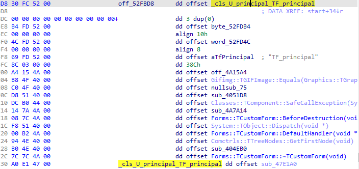

! It is worth noting that symbols are not available and were added during static analysis.

Continuing our analysis, let's look at the main function, which is the only one used by the malware during its first stage:

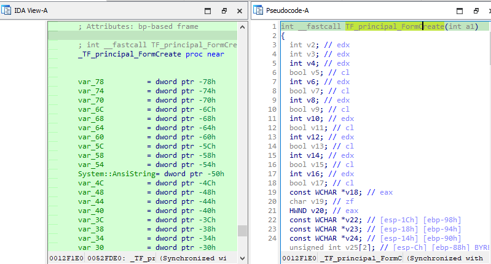

In Delphi binary analysis, it is recommended to split the screen between Assembly code and pseudocode, as IDA almost always misses some declarations, so maximum attention is necessary.

Moving forward, we find some interesting indications:

! It should be noted that all actions performed happen when the Delphi form enters the FormCreate state.

- Firstly, the malware obtains the temporary directory of its victim and creates a subdirectory, "C:\Users\user\Local\Microsoft Windows", if it does not already exist:


- Shortly thereafter, the malware begins to obtain resources from the resource section of the PE binary, using ready-made Delphi procedures, and saves them in the new directory:


- Several files are created, including a malware configuration file nicknamed "config.ini", several dependency DLLs used by the malware for SMTP server connection, as well as dependencies required for sqlite3 (which are used by software to store data/credentials). In addition, two executables are saved to disk for performing malicious acts on the victim's computer, and finally, one of the propagation mechanisms, "default.exe," which is the same binary that executes these actions, is copied to the directory created for infecting subsequent devices:


Two other persistence methods were created, which correspond to the next stages:


The malware defines two persistence mechanisms for executables in the created directory, using a registry key reference at "HKEY_LOCAL_MACHINE\Software\Microsoft\Windows\CurrentVersion\Run" or the WOW64 subsystem directory of the Windows x64:


- At the end of the execution flow, the malware checks if it already has one of the persistence mechanisms, and if so, it executes that mechanism again using the ShellExecute API:


Finally, after all these steps, the malware calls Forms::TApplication::Terminate and ends its execution:


Now let's analyze the second stage, which is composed of two executables responsible for stealing credentials and files, running a keylogger, and sending all this information via SMTP to the attacker:


Let's start with the malicious binary "taskWin.exe". We will retrieve the dynamic references of the Delphi form:


Let's analyze the initial behavior of this component of the malware:


Right in the FormCreate procedure, the malware checks if its persistence keys are defined. Then, it also checks for keys related to MSN (Microsoft's old communication platform). In addition, the malware performs a new verification:

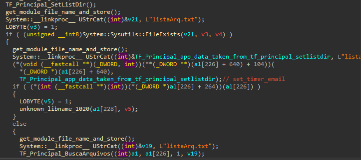

In the new verification, the malware validates if it has a file called listaArq.txt in its main directory. This file stores all the paths of files that are searched using the call to the TF_Principal_BuscaArquivos procedure. If the file exists, the malware enables the timer to send an email to the operator via SMTP. However, if the file does not exist, a call to TF_Principal_BuscaArquivos is used to create the list and store it in the txt file, to be sent to its operator the next time.


At the end of the first procedure after searching for files defined in the config.ini file and stored in the listaArq.txt file, every time the malware runs, a new search for files is performed. The malware stores the past and current number of file entries. Finally, a call to random is made, and a new timer is set, this time for its propagation function through plugged devices (such as pendrives).

Now, focusing our attention on the timers that continue to run all the time, let's start with the "_DE_EmailTimer" procedure:


At the beginning of this procedure, we can identify various information the malware author stores timing information, validates the amount of data present in the file, and also checks if there is an available internet connection to execute. If there is no connection, it performs an additional file check and terminates its execution. If none of the checks fail, the malware loads the listaArq.txt file and the Log.txt file into a TStringList, and then performs type conversions using TEncoding.

Moving on a little further after the string conversions, we find something interesting:


Two calls to create_snapshot_find_process, passing as parameter two wchar's with the names of the most used browsers, the name for this method was given after reverse engineering where it was found that it used a createSnapshot32 to search and retrieve information from the process, and based on the information it made a call to openprocess and terminateprocess, this has a very important reason since the malware will use sqlite to access the database of these browsers where the saved credentials are stored.


He also obtains the name of his victim's computer:

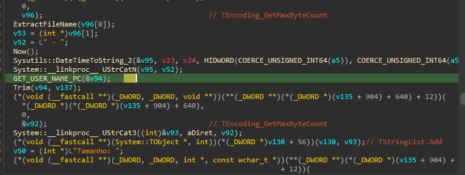

The email to which the collected information is sent is ```npcclassic_email@yahoo.com.br```:


The method for sending the information is:

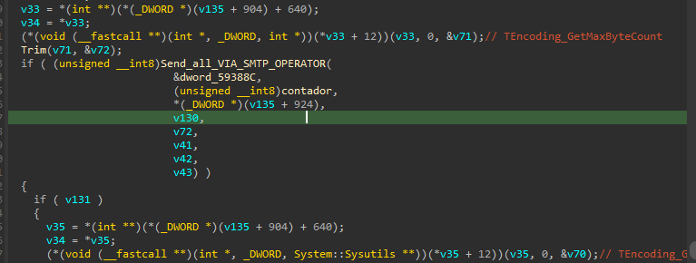

Information used during the malware development stage is also present, which can give us information about the name of the malware compiler "Alberto":


Dissecting the malware smtp sending method (it should be highlighted that IDA did not recognize a good part of the code, so I edited the size of the function and forced a disassembly for the remaining part until finding a ret instruction, combining it with some Delphi analysis tools).


Right at the beginning of the function nicknamed "Send_All_Via_SMTP_Operator", the email address previously presented is used as the recipient and added to a TIdEmailAddressItem object. Soon after, a validation of the existence of the previously highlighted files is used to validate the attachments to be added to the email, a call to TIdAttachmentFile.Create adds these attachments to the email context. A call to ```call dword ptr [edx+68h]``` stores a reference to validate if the IIdEmail object is correct. If it is not, the malware disconnects; otherwise, the sending procedure begins. It is divided into 9 parts, and 9 email addresses are used for this stage of sending to the malware operator. Before categorizing these emails, let's understand how the procedure is done.


At first, we find a string indicating "Config #1 - Attempts: #". Let's mark it as a point to be observed, as it is one of the few things that will change from now on in the next attempts, in addition to the access credentials.


After that, we can highlight a reference to a SMTP server belonging to Yahoo, followed by an email address and password. It is worth noting that the malware operator repeats the destination email whenever a credential is used (even if the credential comes as a parameter of the sending method).

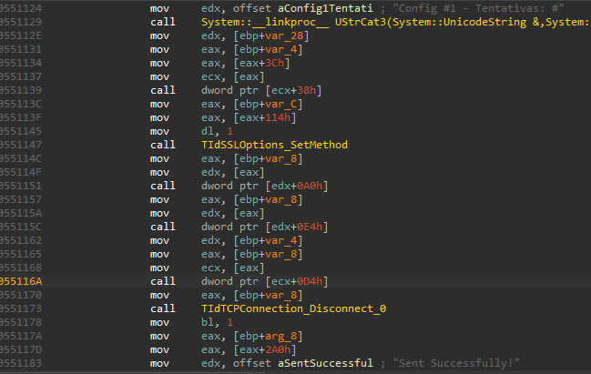

After concatenating and defining an SSL connection method (hence the libssl DLLs being in the same directory), the malware finally sends and closes the connection, but it still doesn't know if the procedure was successful or not.


Moving forward, a validation is used in case of success and the malware returns, otherwise it closes the connection and restarts the same procedure but with a completely new credential.

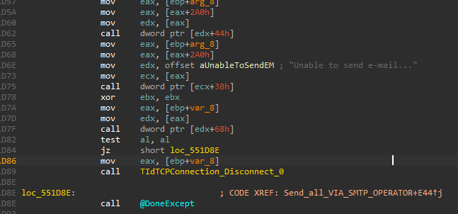

If all credentials fail, then the malware writes to the log that it was unable to send emails ("Unable to send e-mail...").

Below is a list of these credentials used by the malware operator:

| **Attempt**               | **SMTP server**        | **To E-mail**                 | **From E-mail**               | **Password**               |
|---------------------------|------------------------|-------------------------------|-------------------------------|----------------------------|
| Config #1 - Tentativas: # | smtp.mail.yahoo.com.br | npcclassic_email[@]yahoo[.]com[.]br | npcclassic_email[@]yahoo[.]com[.]br | npcclassic_email@keylogger |
| Config #2 - Tentativas: # | smtp.mail.yahoo.com.br | npcclassic_email[@]yahoo[.]com[.]br | npcclassic_email[@]yahoo[.]com[.]br | npcclassic_email@keylogger |
| Config #3 - Tentativas: # | smtps.bol.com.br       | npcclassic.email[@]bol[.]com[.]br   | npcclassic.email[@]bol[.]com[.]br   | npccl2ssic                 |
| Config #4 - Tentativas: # | smtps.bol.com.br       | npcclassic.email[@]bol[.]com[.]br   | npcclassic.email[@]bol[.]com[.]br   | npccl2ssic                 |
| Config #5 - Tentativas: # | smtp.gmail.com         | npcclassic.email[@]gmail[.]com    | npcclassic.email[@]gmail[.]com    | npcclassic.email@keylogger |
| Config #6 - Tentativas: # | smtp.live.com          | npcclassic[@]hotmail[.]com        | npcclassic[@]hotmail[.]com        | npccl@ssic                 |
| Config #7 - Tentativas: # | smtp.live.com          | npcclassic[@]hotmail[.]com        | npcclassic[@]hotmail[.]com        | npccl@ssic                 |
| Config #8 - Tentativas: # | smtps.bol.com.br       | classicnpc.email[@]bol[.]com[.]br   | classicnpc.email[@]bol[.]com[.]br   | npccl2ssic                 |
| Config #9 - Tentativas: # | smtp.live.com          | npc_court_black[@]hotmail[.]com   | npc_court_black[@]hotmail[.]com   | npccl@ssic                 |

![] were added due to annoying chatbots.

Let's try to log into some of these emails to verify if the malware is still active:

Almost all email addresses were deleted, but two still remain somewhat active, namely:

- classicnpc.email[@]bol[.]com[.]br which was blocked for fraud by the bol platform:


- npc_court_black[@]hotmail[.]com still active, but they changed its password:
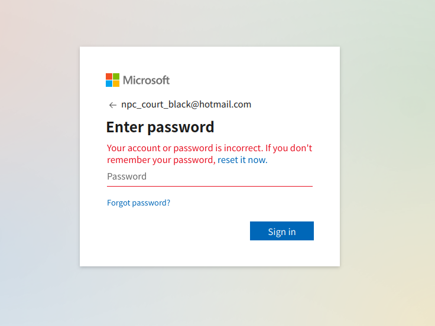

Now before we end this stage, let's analyze the worm/spread method of the analyzed malware, its "TF_Principal_PendriveTimer" method:


One of the two ways of propagation/worm works based on a list of all removable devices connected to the computer, where a while loop executes while there are entries and for each entry in this list, the path of the removable device is retrieved, where it is then copied to its root with the name "Arquivo.exe", where an unwary user executes it and begins the infection process.


The second propagation method is a similar procedure. The while loop is still present, but this time a TStringList is used, where each path is retrieved through its index, treatments are carried out, and a file named "default.exe" is created in the root directory of the removable device.

One of the indicators of compromise would be to check if the removable device has "default.exe" or "Arquivos.exe" in its root directory.

Now let's analyze the "TF_Principal_PrintTimer" routine:


Right at the beginning of the procedure we can see some important calls, which will make sense as we progress through the explanation. Firstly, there is a call to "Vcl::Forms::TCustomForm:GetMonitor" recovering the context of the screen that will be used to obtain the width of the monitor using "TMonitor::GetWidth", the same procedure is repeated to obtain the height of the monitor.

Shortly after, a call to obtain the execution directory of the binary is made and concatenated with the output file name nicknamed screen.jpg, allowing the malware to create a screenshot.


Moving forward, we find the function responsible for taking the screenshot of the screen, affectionately nicknamed "take_screenshot_delphi_winapi". Let's analyze it:


At the beginning of the function, we first encounter a call to the function that creates an instance for a Delphi object nicknamed "JPEGImage::Create", then we have another call to "Graphics::TBitmap::TBitmap" responsible for preparing the bitmap object returned by the WinAPI and converting it to JPEG format.

Moving forward, we can observe a call to "TBitmap.SetWidth" and another to "TBitmap.SetHeight", and then a call to retrieve the window context needed to be able to perform the capture using User32.dll!GetDC().

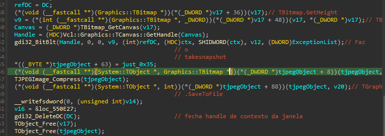

Right after, we can see a call to get the Height and a call passing the height as a parameter to "TBitmap.FImage::TBitMapImage", calls to retrieve the Canvas of the BitMap from its height, and finally, before taking the screenshot, a call to retrieve its handle with "Vcl::Graphics::TCanvas::GetHandle".

Next, we have the WinApi responsible for taking the screenshot, Gdi32.dll!BitBlt. After that, the screenshot stream is stored in a BitMap for later conversion and compression to JPEG, and finally, the captured image is saved to the disk (in the same directory as the executable).

Returning now to the caller function, let's analyze the rest of the behavior:


Finally, the malware checks the content of the captured image and the "ListArq.txt" capture file and terminates the procedure's execution.

Analyzing the function nicknamed "TF_Principal_ProcessosTimer" responsible for controlling the execution of the KeyLogger and its persistence on the victim's computer:

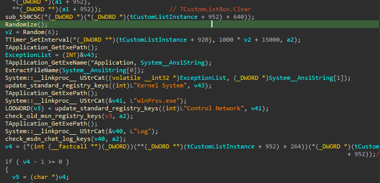

This function is responsible for creating a CustomListBox that will store processes obtained through a CreateSnapshot, as well as checking their persistence keys and bypass techniques for UAC (User Account Control) and old techniques for disabling dialog balloons. At the beginning, we see a call to "TCustomListBox.Clear", responsible for clearing previous entries since it is a function of a timer. It sets a new timing interval with "TTimer.SetInterval", gets the location of the executable, and gets the executable's name to check its persistence keys. For this, it makes a call to the "update_standard_registry_key" procedure, let's check how it works:


This function allows the malware to disable some functions by disabling Windows notification balloons on older versions, and also makes a modification to the UAC registry that notifies the user about changes on the computer.


Finally, the malware validates if its persistence key is set correctly (ensuring its execution always).

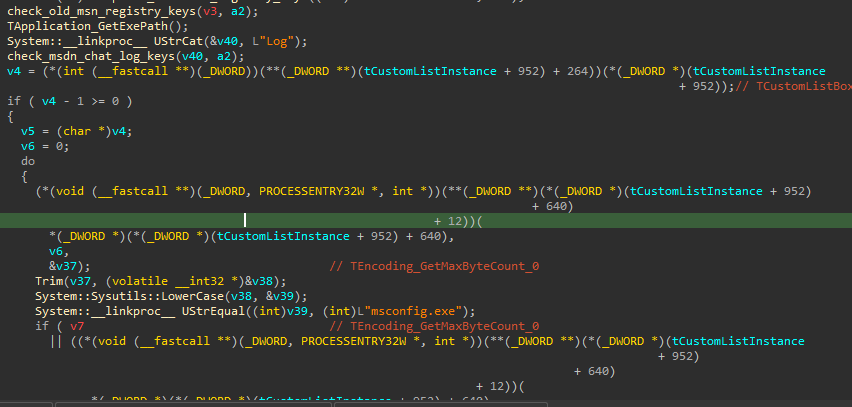

Returning to the main function, we can notice some validations on MSN registry keys to obtain conversation chat information. Further down, we notice that the TCustomListBox starts being used, searching for processes with the name "msconfig.exe" and "regedit.exe":

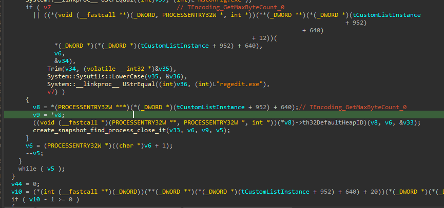

Afterwards, a call is made to the "create_snapshot_find_process_close_it" function. This function uses a new snapshot to retrieve information about processes and compares if the process in the parameter is the same as the process in the list, opens the process and calls terminate to close it.


Additionally, there is a new check that compares if the KeyLogger process is active. If it is, it is terminated, otherwise this routine will simply execute by going through all entries in the TCustomListBox until the end.


And finally, regardless of whether KeyLogger has been terminated or not, its process is recreated again, always ensuring that its execution is carried out (An important observation is that at the beginning of the function a Timer is defined, its value is relatively high, basically this routine will only run when Windows starts again).

Now let's analyze the keylogger, also known as "winPrsv.exe":

The main procedures/functions present in the keylogger executable are "TF_principal_TeclasTimer", "TF_principal_SalvarTimer", "TF_principal_FormClose", and "TF_principal_ProcessosTimer". Let's analyze them one by one to understand their malicious behavior.

Let's start with the "TF_principal_TeclasTimer" function, which is responsible for using "getKeyState" to observe the keys pressed by the user, storing them in a list in memory, and writing everything to a log.txt file present in the root directory of its execution.

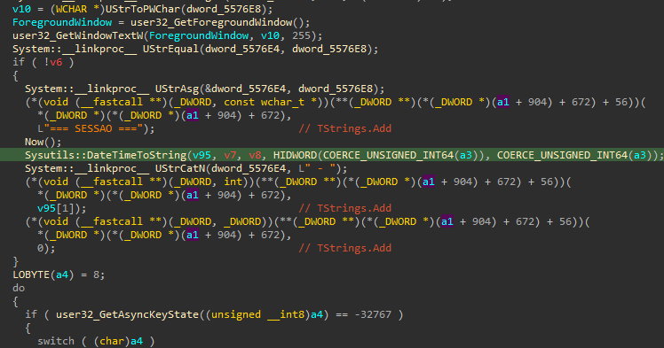

The log structure uses a TStrings object, all string data added uses the TStrings.Add call, the log is composed of the string "=== SESSION ==" followed by a string containing the date, a blank line, and then the fun begins:


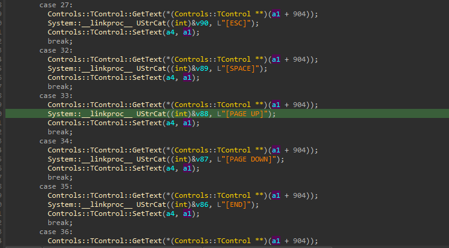

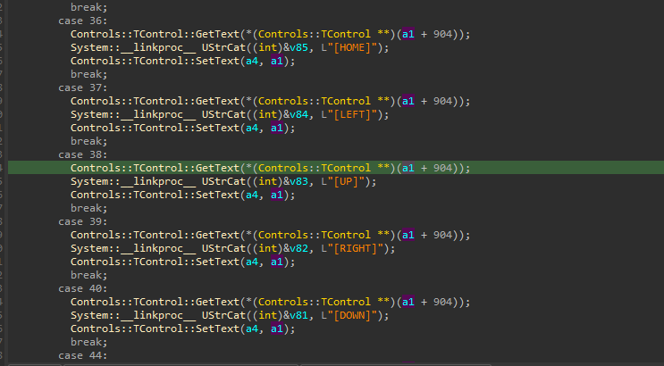

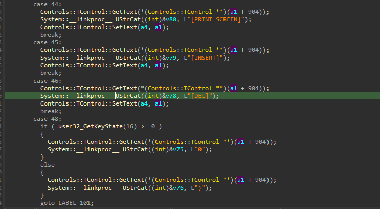

GetKeyState is used to find out which keys the victim in question is pressing and stores this information in the created TStrings object that will later be saved. The procedure responsible for storing the generated logs present in TString periodically at defined times is called "TF_principal_SalvarTimer". Let's analyze its behavior:


Right at the beginning of the file saving procedure, the malware performs a check to validate if its parent process is active and kills it. You will understand the reason for this later, for now, keep in mind that when saving the log file, the malware kills its parent process.

Moving forward, we can see that the malware obtains its execution path and concatenates it to store a file nicknamed "Log.txt" in its own directory.


Moving forward, we can see the file being saved to disk, using the TStrings object previously presented. After saving the path in the "ListaArq.txt" file, and for some unknown reason in the "Log.txt" file itself, the malware then terminates.

Let's now understand the operation of the procedure nicknamed "TF_principal_ProcessosTimer" which is used to reopen the stealer processes in case the previous procedure killed them. However, before analyzing it, we need to keep in mind that the malware resolves some API information dynamically:

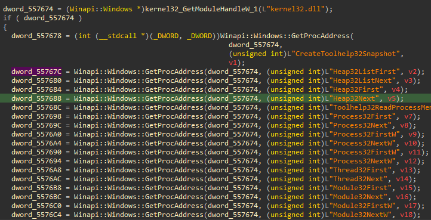

After solving:

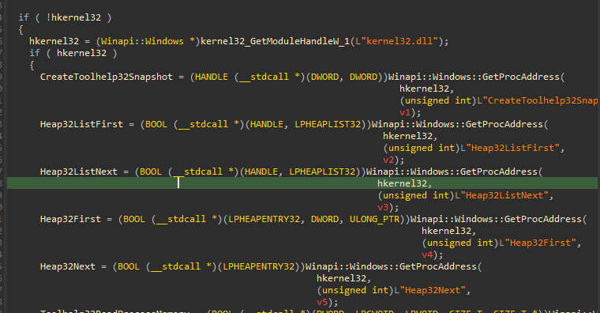

This will help us later in the analysis of this procedure. So now, let's finally start analyzing it:

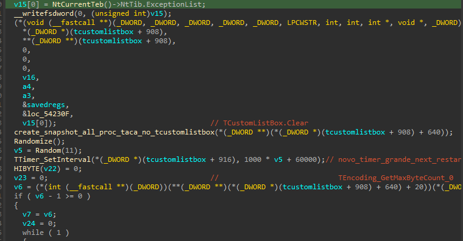

At first, we see a call to "TCustomListBox.Clear" which will clear the present values (process names), and it will recreate this list of processes again and store it in the same list using the call to "create_snapshot_all_proc_taca_no_TCustomListBox":


This method is responsible for creating a snapshot of all running processes at the moment and storing it using the reference of "TCustomListBox" that comes as an argument.

Continuing the previous function, it sets a new waiting timer for the next execution of the procedure.


In addition, this function gets all items from the "TCustomListBox" and loops through, retrieving the string and comparing it with the name of the parent process that creates the execution of this keylogger, the "taskwin.exe".


After identifying and, of course, if the process is running, a call to "terminate_process_with_snapshot32" is made:

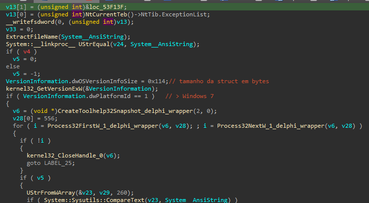

In this routine, it is checked if the binary is being executed in environments prior to Windows 7 or newer ones, for that a call to GetVersionExW is used.


If the version is higher than Windows 7, the malware uses WinApi CreateToolHelp32Snapshot, opens the process, and terminates it. Otherwise, if it is equal to or lower than Windows 7, the malware uses WinApi EnumProcess and performs the same process of opening and terminating the process, all using the name passed as a parameter, in this case, the name of the parent executable.


Returning now to the previous procedure, finally the binary obtains its execution path, concatenates it with the name of the parent process, in this case "taskWin.exe", and executes it again (creates it) if the flag is set to zero.

Now let's understand the call flow for the last procedure, nicknamed "TF_principal_FormClose":

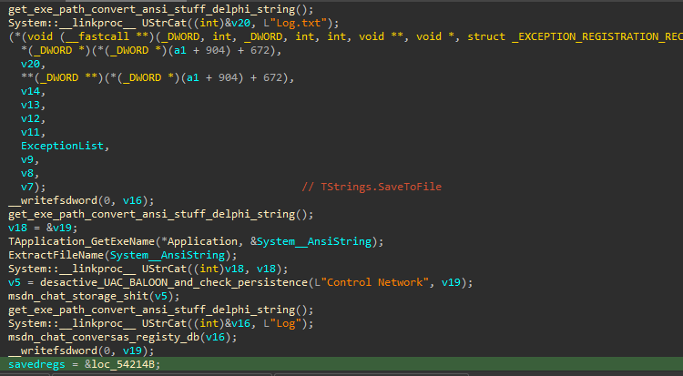

As a last mechanism, in addition to the temporary saving done by the timer procedure nicknamed by the attacker as "TF_principal_SalvarTimer" (which periodically saves data to the log file), the malware also saves the stored data when terminating to ensure data theft. It validates its persistence and settings made in UAC and Balloon, validates MSN keys, and finally ends its complete flow of execution, leaving everything ready for sending to the attacker's email.

Yara Rule:
```yara
import "pe"

rule delephant_dropper_brazil_malware_detect {
    meta:
        author = "João Vitor - Keowu"
        date_created = "25/03/2023 :)"
        description = "Essa regra detecta o dropper malwares da família Delephant Brasil | This rule detect's dropper malware from Delpehant brazil"

    strings:

        $delphi = "Software\\Embarcadero\\Locales" wide
        $delphi2 = "Software\\CodeGear\\Locales" wide
        $delphi3 = "Software\\Borland\\Locales" wide
        $delphi4 = "Software\\Borland\\Delphi\\Locales" wide
        $delphi5_ssl = "Open SSL Support DLL Delphi and C++Builder interface" wide

        $path = "Local AppData" wide
        $config = "\\Config.ini" wide
        $libeay = "\\libeay32.dll" wide
        $ssley32 = "\\ssleay32.dll" wide
        $sqlite = "\\sqlite3.dll" wide
        $taskwin = "\\taskWin.dll" wide
        $winprsv = "\\winPrsv.exe" wide
        $default = "\\default.exe" wide

        $persiskernel = "Kernel System" wide
        $controlnetwo = "Control Network" wide

        $codepattern = { 8D 55 90 E8 7B CE EE FF 8B 45 90 8D 55 94 E8 A0 BB EE FF 8B 45 94 BA 04 05 53 00 E8 53 75 ED FF 74 3C 6A 01 68 1C 05 53 00 68 1C 05 53 00 8D 45 88 E8 29 EF FF FF 8D 45 88 BA 04 05 53 00 }
        $codepattern2 = { E8 A0 73 ED FF 8B 45 88 E8 A4 71 ED FF 50 68 20 05 53 00 8B C3 E8 5F D3 F4 FF 50 E8 69 C0 F6 FF }

    condition:
        (uint16(0) == 0x5A4D and pe.is_pe
         and ($delphi or $delphi2 or
              $delphi3 or $delphi4
               and $delphi5_ssl))
         and (
            $path and
            $config and
            $libeay and
            $ssley32 and
            $sqlite and
            $taskwin and
            $winprsv and
            $default
         ) or
         (
            $persiskernel and
            $controlnetwo
         ) and
         (
            $codepattern and
            $codepattern2
         )
}

```


## IOCS

6cd7a4195d1775530986603b5b65486fc6ce9f7186107162071b55a15caae4e6 - default.exe (Worm, Dropper), Default.exe (Worm, Dropper)

7491bded3d6da3ad573149cbd3826f274a6fb1da09f0fb2c6049a818eea83b75 - taskWin.exe(Stealer)

c3ff6fe117b8becaefb3f36e267284c8cc0f9392035439dbbd4ef2d51d2dcfe2 - winPrsv.exe(Keylogger)

Config.ini file:

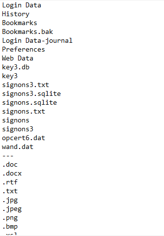


listArq.txt file:

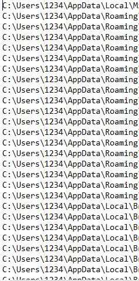

Log.txt file:

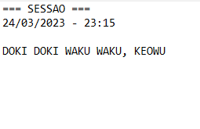

Credentials, SMTP Server from attacker:

| **Attempt**               | **SMTP server**        | **To E-mail**                 | **From E-mail**               | **Password**               |
|---------------------------|------------------------|-------------------------------|-------------------------------|----------------------------|
| Config #1 - Tentativas: # | smtp.mail.yahoo.com.br | npcclassic_email[@]yahoo[.]com[.]br | npcclassic_email[@]yahoo[.]com[.]br | npcclassic_email@keylogger |
| Config #2 - Tentativas: # | smtp.mail.yahoo.com.br | npcclassic_email[@]yahoo[.]com[.]br | npcclassic_email[@]yahoo[.]com[.]br | npcclassic_email@keylogger |
| Config #3 - Tentativas: # | smtps.bol.com.br       | npcclassic.email[@]bol[.]com[.]br   | npcclassic.email[@]bol[.]com[.]br   | npccl2ssic                 |
| Config #4 - Tentativas: # | smtps.bol.com.br       | npcclassic.email[@]bol[.]com[.]br   | npcclassic.email[@]bol[.]com[.]br   | npccl2ssic                 |
| Config #5 - Tentativas: # | smtp.gmail.com         | npcclassic.email[@]gmail[.]com    | npcclassic.email[@]gmail[.]com    | npcclassic.email@keylogger |
| Config #6 - Tentativas: # | smtp.live.com          | npcclassic[@]hotmail[.]com        | npcclassic[@]hotmail[.]com        | npccl@ssic                 |
| Config #7 - Tentativas: # | smtp.live.com          | npcclassic[@]hotmail[.]com        | npcclassic[@]hotmail[.]com        | npccl@ssic                 |
| Config #8 - Tentativas: # | smtps.bol.com.br       | classicnpc.email[@]bol[.]com[.]br   | classicnpc.email[@]bol[.]com[.]br   | npccl2ssic                 |
| Config #9 - Tentativas: # | smtp.live.com          | npc_court_black[@]hotmail[.]com   | npc_court_black[@]hotmail[.]com   | npccl@ssic                 |