# Malware Analysis Writeup | Trojan Delephant
Author: João Vitor (@Keowu) - Malware Security Researcher

# Sample identification hash

Esse malware brasileiro pertence a familia Delephant. cuja finalidade se destina em roubo de credênciais(não limitado a bancos), keylogers, meio de propagação por dispositivos físicos e comunicação via SMTP, apesar da característica ele não estabelece uma conexão com o atacante diretamente. ou seja ele não tem poder de controle, a única ação do malware é enviar as informações coletadas ao seu operador.

| Arch                                 | PE Header                        | '.text' Section                  | '.rsrc' Section                  | '.data' Section                  |
|--------------------------------------|----------------------------------|----------------------------------|----------------------------------|----------------------------------|
| PE32 - Delphi XE - IA32 | 0e167549ce0530a2754381fe53c210ae | c6085e5b3ac3a86c1bb4a8c1350660d2 | 031f4bacc5d6537448ae951a1c45ab17 | 803fb3ddac13bd65ad3d2fbf266831a9 |

# Overview

Esse malware começa com um ser audacioso ao qual tentou infectar meu pendrive pessoal. porem ele também se caracteriza pela técnica de pendrive drop attack, basicamente o artefato tem como principal meio de propagação dispositivos removiveis e até anexos de e-mail.

# Analyzing

- O primeiro estágio se caracteriza por dropar dois arquivos em disco, "taskWin.exe" e "winPrsv.exe", além de fazer uma nova cópia do malware para a mesma pasta com o nome de "default.exe" sendo esse o mesmo binário que será copiados para periférios plugados(uma espécie de worm).
- O segundo estágio só ocorre quando o primeiro estágio cria um mecanismo de persistência que só começa a funcionar quando quando o computador iniciar, esse estágio aciona o terceiro estágio além de coletar todas as credênciais do usuário e informaçõe de arquivos presentes em um arquivo de configuração.
- O terceiro estágio se caracteriza pelo keylogger ao qual vai capturar informações de periféricos da vítima e armazenar em um arquivo. para que o segundo estágio obtenha e envie via smtp.

Vamos começar analisando o nosso malware:


Primeiramente vamos entender seu escopo de funcionamento:


como estamos analisando um binário delphi, primeiramente é necessário encontrarmos a função form create. pois nesse malware em específico é onde a lógica principal se concentra, depois disso precisamos encontrar a referencia para seção de data segment(ds) com seu devido offset. é nermal que a gente sinta certo preconceito ao analisar binários Delphi, hoje em dia o IDA evoluiu muito e o lumina ajuda muito, porem isso não nos deixa a necessidade de entender um poquinho como o Delphi componhe as suas procedures/classes(sim ele é orientado a objetos), similar ao nosso querido C++ temos algo similar as vtables(bom eu chamado de dtables) são arrays que possui referências a outros endereços que por sua vez são as procedures, por exemplo quando o delphi vai chamar uma procedure é muito comum que ele utilize uma chamada para ds:offset que é onde as classes ficam armazenadas como um array. para ficar mais claro me permita demonstrar um exemplo:


Reaproveitando o meu screenshot do trecho da start() do Delphi, vamos concertar nossa atenção somente no techo acima.

```
mov edx, ds:off_52FBD8
call Forms:TApplication::CreateForm()
```

Quando pensamos em:
ds:off_52FBD8
Temos que é uma referência a data segment e um offset específico, e quando dirigimos nosso olhar para esse offset podemos obter algo similar a um vtable, onde os métodos que compõe uma TApplication são armazenados, veja um exemplo:


! Cabe-se destacar que os simbolos não estão disponíveis e foram adicionados durante uma análise estática.

Continuando nossa análise vamos olhar a função principal e a única utilizada pelo malware durante seu primeiro estágio:


Em análises de binários Delphi é recomendado que divida-se a tela entre código Assembly e pseudocódigo, pois o IDA quase sempre erra algumas declarações então atenção máxima faz-se necessário.

Avançando encontramos alguns indicativos interessantes:

! Cabe-se detacar que todas as ações performadas acontecem quando o form do Delphi entra em estado de FormCreate.

- Primeiramente o malware obtem o diretório temporário da sua vítima e cria caso não exista um subdiretório, "C:\Users\usuario\Local\Microsoft Windows":


- Logo em seguida o malware começa a obter recursos da seção de recursos do binário PE, utilizando-se de procedures prontas do Delphi, e grava no novo diretório:


- Diversos arquivos são criados. um arquivo de configuração do malware apelidado de "config.ini", diversas dlls de dependência que o malware utiliza para conexão com o servidor smtp, além de dependências necessárias para o sqlite3(que são usados pelos softwares para armazenar seus dados/credênciais), além de gravar em disco dois executáveis usados para fazer os atos maliciosos no computador da vitíma, por último temos um dos mecanismos de propagação, "default.exe" trata-se do mesmo binário que executa essas ações que é copiado para o diretório criado para infectar dispositivos posteriores:


Outros dois métodos de persistência criado, se tratam dos próximos estágios:


O Malware define dois mecanismos de persistência para executáveis no diretório criado. usando referência de chave de registro em "HKEY_LOCAL_MACHINE\Software\Microsoft\Windows\CurrentVersion\Run", ou diretório WOW64 subsistema do x64 do Windows: 


- Ao final do fluxo de execução o malware verifica se já possui uma dos mecanismos de persistência, e caso possua ele executa esse mecanismo novamente usando a API ShellExecute:


Por fim, após todas essas etapas o malware, finalmente chama Forms::TApplication::Terminate e encerra sua execução:


Agora vamos analisar o segundo estágio, o qual é composto por dois executáveis responsáveis por roubar credênciais e arquivos, executar um keylogger e enviar todas essas informações via smtp para o atacante:


Vamos iniciar pelo binário malicioso "taskWin.exe", vamos recuperar as referências dinâmicas do formulário Delphi:

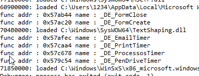

Vamos analisar o comportamento inicial desse componente do malware:


Logo no procedimento de FormCreate, o malware verifica se suas chaves de persistência estão definidas, logo em seguida também é verificado a questão de chaves relacionadas ao MSN(antiga plataforma de comunicação da microsoft), além disso o malware efetua uma nova verifciação:


Na nova verificação o malware valida se em seu diretório principal possui um arquivo chamado de listaArq.txt, arquivo este ao qual armazena-se todos os caminhos de arquivos, que são buscados com a chamada para a procedure TF_Principal_BuscaArquivos. e caso o arquivo exista então o malware habilita o timer para enviar e-mail ao operador via SMTP, porem caso o arquivo não exista uma chamada para TF_Principal_BuscaArquivos é utilizada para que a lista seja criada e armazenada no arquivo txt, para a próxima vez ser enviado ao seu operador.

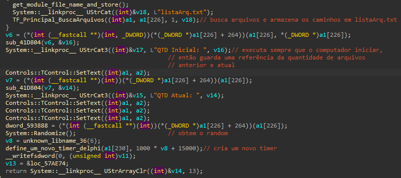

Ao final do primeiro procedimento após as buscar de arquivos definidos no arquivo config.ini, e armazenados no arquivo listaArq.txt, toda vez que o malware executa, uma nova busca por arquivos. o malware armazena as quantidades passadas e atual de entradas de arquivos. por último uma chamada para random é feita e um novo timer é definido, dessa vez para sua função de propagação atráves de dispositivos plugados(como pendrivers).

Agora dirigindo nossa atenção para os timers que continuam executando a todo momento. vamos começar pela procedure "_DE_EmailTimer":

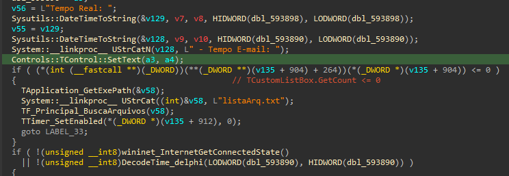


Logo no início dessa procedure podemos identificar diversas informações o autor do malware armazena informações de timing, além de validar quantidade de dados presente no arquivo, e ainda verifica se possui conexão com a internet disponível para executar, caso não tenha ele executa uma verificação a mais por arquivos e encerra sua execução, caso nenhuma das verificações falhe o malware carrega o arquivo listaArq.txt e o arquivo Log.txt em um TStringList, após ele executa conversões de tipos usando TEncoding.

Avançando mais uma pouco após as conversões de strings, encontramos algo interessante:


Duas chamadas para create_snapshot_find_process, passando como parâmetro duas wchar's com o nome dos navegadores mais utilizados, o nome para esse método foi dado após a engenharia reversa onde constatou-se que ele utilizava um createSnapshot32 para procurar e recuperar informações do processo, e com base nas informações efetuava uma chamada para openprocess e terminateprocess, isso tem um motivo muito importante já que o malware vai usar sqlite para acessar o banco de dados desses navegadores onde as credênciais salvas são armazenadas:


Ele também obtem o nome do computador de sua vítima:


O E-mail ao qual as informações coletadas são enviados é ```npcclassic_email@yahoo.com.br```:


O método para envio das informações é:


Informações utilizadas durante a etapa de desenvolvimento do malware também estão presentes, podendo nos dar a informação do nome do compilador do malware "Alberto":


Dissecando o método de envio smtp do malware(cabe-se destacar que o IDA não reconheceu uma boa parte do código, então editei o tamanho da função e forcei um disassembly para o restante até encontrar uma instrução ret combinando com algumas ferramentas de analise delphi):

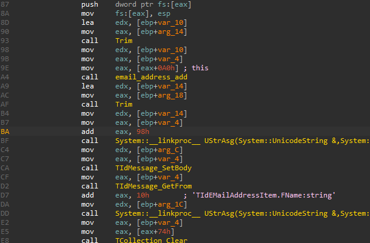

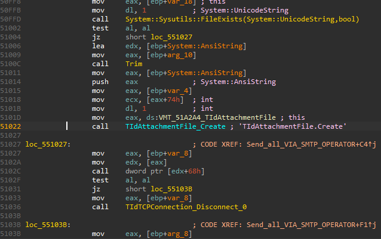

Logo no início da função apelidada de "Send_All_Via_SMTP_Operator" o endereço de e-mail anteriormente apresentado é utilizado como destinatário, e adicionado a um objeto TIdEmailAddressItem. logo após uma validação de existência para os arquivos anteriormente destacados é utilizada para validar os anexos a serem adicionados ao e-mail, uma chamada para TIdAttatchmentFile.Create adiciona esses anexos ao contexto do e-mail. uma chamada para ```call dword ptr [edx+68h]``` armazena uma referência para validar se o objeto de IIdEmail está correta, caso não esteja o malware desconecta, do contrário inicia-se o procedimento de envio. que é dividido em 9 partes, 9 endereços de e-mail são utilizados para essa etapa de envio para o operador do malware, antes de uma categorização desses e-mails vamos entender como o procedimento é feito:


A primeiro momento encontramos uma string índicando "Config #1 - Tentativas: #". vamos marcar como um ponto a ser observado, pois é uma das poucas coisas que irão mudar daqui para frente nas proximas tentativas, além das credênciais de acesso.


Após podemos destacar uma referência a um servidor smtp pertencente ao yahoo, seguido de um endereço de e-mail e senha, cabe-se destacar que o operador do malware repete o e-mail de destino sempre que uma credêncial é usada(mesmo a credêncial vindo como parâmetro do método de envio).


Após concatenar e definir um método de conexão ssl(por isso das dll's da libssl estarem no mesmo diretório) o malware por fim efetua o envio, e fecha a conexão, mais ainda não sebe se o procedimento foi um sucesso ou não.

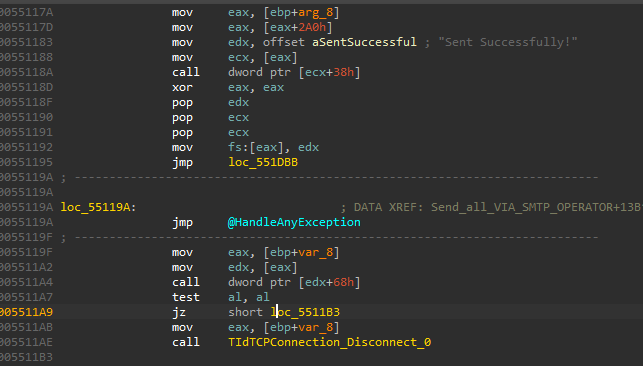

Avançando um pouco uma validação em caso de sucesso é utilizada e o malware retorna, do contrário ele fecha a conexão e reinicia o mesmo procedimento porem com uma credêncial totalmente nova.


Se todas as credênciais falharem então o malware escreve no log que não conseguiu enviar os emails("Unable to send e-mail...").

Abaixo segue uma lista dessas credências utilizadas pelo operador do malware:

| **Attempt**               | **SMTP server**        | **To E-mail**                 | **From E-mail**               | **Password**               |
|---------------------------|------------------------|-------------------------------|-------------------------------|----------------------------|
| Config #1 - Tentativas: # | smtp.mail.yahoo.com.br | npcclassic_email[@]yahoo[.]com[.]br | npcclassic_email[@]yahoo[.]com[.]br | npcclassic_email@keylogger |
| Config #2 - Tentativas: # | smtp.mail.yahoo.com.br | npcclassic_email[@]yahoo[.]com[.]br | npcclassic_email[@]yahoo[.]com[.]br | npcclassic_email@keylogger |
| Config #3 - Tentativas: # | smtps.bol.com.br       | npcclassic.email[@]bol[.]com[.]br   | npcclassic.email[@]bol[.]com[.]br   | npccl2ssic                 |
| Config #4 - Tentativas: # | smtps.bol.com.br       | npcclassic.email[@]bol[.]com[.]br   | npcclassic.email[@]bol[.]com[.]br   | npccl2ssic                 |
| Config #5 - Tentativas: # | smtp.gmail.com         | npcclassic.email[@]gmail[.]com    | npcclassic.email[@]gmail[.]com    | npcclassic.email@keylogger |
| Config #6 - Tentativas: # | smtp.live.com          | npcclassic[@]hotmail[.]com        | npcclassic[@]hotmail[.]com        | npccl@ssic                 |
| Config #7 - Tentativas: # | smtp.live.com          | npcclassic[@]hotmail[.]com        | npcclassic[@]hotmail[.]com        | npccl@ssic                 |
| Config #8 - Tentativas: # | smtps.bol.com.br       | classicnpc.email[@]bol[.]com[.]br   | classicnpc.email[@]bol[.]com[.]br   | npccl2ssic                 |
| Config #9 - Tentativas: # | smtp.live.com          | npc_court_black[@]hotmail[.]com   | npc_court_black[@]hotmail[.]com   | npccl@ssic                 |

! [] foram adicionados por questão de bot's chatos.

Vamos tentar logar em alguns desses e-mails para constatar se o malware ainda é ativo:

Quase todos os endereços de e-mail foram excluídos. porem dois ainda continuam de certa formas ativos, sendo eles: 

- classicnpc.email[@]bol[.]com[.]br ao qual foi bloqueado por fraude plea plataforma bol:


- npc_court_black[@]hotmail[.]com ainda continua ativo, porem alteraram a senha dele:


Agora antes de encerramos essa etapa vamos analisar o método de worm/propagação do malware analisado, seu método "TF_Principal_PendriveTimer":


Uma das duas formas de propagação/worm funciona com base em uma lista de todos os dispositivos removiveis conectados ao computador, onde um while executa enquanto tiver entradas e em cada entrada dessa lista recupera-se o path do dispositivo removível, onde então é copiado para sua raiz com o nome de "Arquivo.exe", onde um usuário desavidado executa e tem início ao processo de infecção.


A segunda forma de propagação trata-se de um procedimento parecido. o loop while continua presente, porem dessa vez um TStringList é utilizado, onde cada path é recuperado através do seu índice, tratativas são efetuadas, e um arquivo com o nome de "default.exe" é criado no diretório raiz do dispositivo removível.

Um dos índices de comprometimento seria verificar se o dispositivo removível possui em seu diretório raiz "default.exe" ou "Arquivos.exe".

Vamos agora analisar a rotina "TF_Principal_PrintTimer":


Logo no início da procedure podemos constatar algumas chamadas importantes, que frão sentidos conforme avançamos na explicação. primeiramente temos uma chamada para "Vcl::Forms::TCustomForm:GetMonitor" recuperando o contexto da tela que será utilizado para obter o tamanho do largura do monitor utilizando "TMonitor::GetWidth", o mesmo procedimento se repete para obter a altura do monitor.

Logo após uma chamada para obter o diretório de execução do binário é chamada e concatenada com o nome do arquivo de saída apelidado de screen.jpg. possibilitando que o malware crie uma screenshot.


Avançando um pouco mais encontramos a função responsável por tirar o screenshot da tela apelidada carinhosamente de "take_screenshot_delphi_winapi", vamos analisar:


Ao início da função. primeiramente nos deparamos um uma chamada para a função que cria uma instância para um objeto do Delphi apelidado de "JPEGImage::Create", logo após possuímos uma outra chamada para "Graphics::TBitmap::TBitmap" responsáveis para preparar o objeto bitmap retornado pelo winapi e converter para o formato JPEG.

Avançando podemos observar uma chamada para "TBitmap.SetWidth" e outra para "TBitmap.SetHeight" e logo depois uma chamada para recuperar o contexto da janela necessário para poder efetuar a captura User32.dll!GetDC().


Logo após podemos constatar uma chamada para obter Height e uma chamada passando a altura como parâmetro para "TBitmap.FImage::TBitMapImage", chamadas para recuperar o Canvas da BitMap a partir de sua height e por fim antes de efetuar a screenshot uma chamada para recuperar seu handle com "Vcl::Graphics::TCanvas::GetHandle".

Após temos a WinApi responsável por efetuar a screenshot a Gdi32.dll!BitBlt. Após o stream da screenshot é armazenado em um BitMap para posterior conversão e compressão para JPEG, onde por fim salva a imagem capturada no disco(no mesmo diretório do executável).

Retornando agora para a função caller, vamos analisar o resto do comportamento:

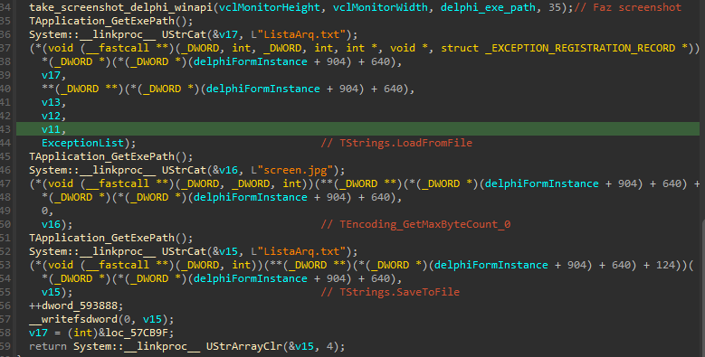

Por fim, o malware verifica o conteúdo da imagem capturada e do arquivo de capturas "ListArq.txt" e encerra a execução do procedimento.

Analisando a função apelidada de "TF_Principal_ProcessosTimer" responsável por controlar a execução do KeyLogger e suas persistências no computador da vítima:


Essa função é responsável por criar um CUstomListBox que armazenara processos obtidos por meio de um CreateSnapshot, além de verificar suas chaves de persistências e técnicas de bypass da UAC(User Account Control) e antigas técnicas de disable de balões de dialogos. Logo ao início vemos uma chamada para "TCustomListBox.Clear" responsável por limpar as entradas anteriores, já que é uma função de um timer. ele define um novo intervalo de timing com "TTimer.SetInterval" ele obtem o local de execução do executável. obtem o nome do executável para verificar suas chaves de persistência, para isso ele faz uma chamada para o procedimento "update_standard_registry_key", vamos conferir seu funcionamento:

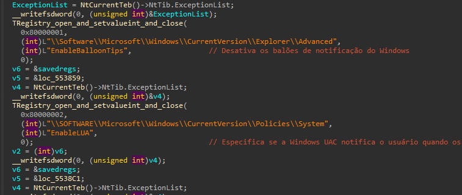

Essa função permite que o malware desabilite algumas funções permitindo desativar balões de notificações do Windows em versões mais antigas, além disso ele faz uma modificação no registro de UAC que notifica o usuário sobre alterações no computador.


Por fim o malware valida se a sua chave de persistência esta definida corretamente(garantindo sempre sua execução).


Voltando a função principal, podemos perceber algumas validações em chaves de registro do MSN para obter informações de chat de conversa. e mais abaixo percebemos que o TCustomListBox começa a ser utilizado, ele procura por precessos com o nome de "msconfig.exe" e "regedit.exe":


Após uma chamada é feita para a função "create_snapshot_find_process_close_it", essa função utiliza-se de uma nova snapshot que recupera informações dos processos e compara se o processo do parâmetro é igual ao processo presente na lista, abre o processo e chama terminate, assim encerrando-o.


Além disso existe uma nova verificação que compara se o processo do KeyLogger está ativo. caso esteja, ele é encerrado, caso não esteja simplesmente essa rotina vai executar passando por todas entradas no TCustomListBox até o fim.


E por fim independente do KeyLogger ter sido encerrado ou não, seu processo é recriado novamente garantindo sempre que sua execução seja feita(Uma observação importante refere-se que ao início da função um Timer é definido, seu valor é relativamente alto, de maneira básica essa rotina só executara quando o Windows Iníciar novamente).

Vamos agora analisar o keylogger, vulgo "winPrsv.exe":

Os principais procedimentos/funções presentes no executável de keylogger são, "TF_principal_TeclasTimer", "TF_principal_SalvarTimer", "TF_principal_FormClose",
"TF_principal_ProcessosTimer", vamos analisa-los um a um para entender seu comportamento malicioso.

Vamos iniciar pela função "TF_principal_TeclasTimer" ela é responsável por usar getKeyState para observar as teclas pressionadas pelo usuário, armazenar em uma lista na memória e gravar tudo em um arquivo log.txt presente no diretório raiz de sua execução:


A estrutura do log utiliza de um objeto TStrings, todos os dados de string adicionado utilizam da chamada TStrings.Add, o log é composto pela string "=== SESSAO ==" seguido de uma string contendo a data uma linha vazia, e logo em seguida a diversão começa:

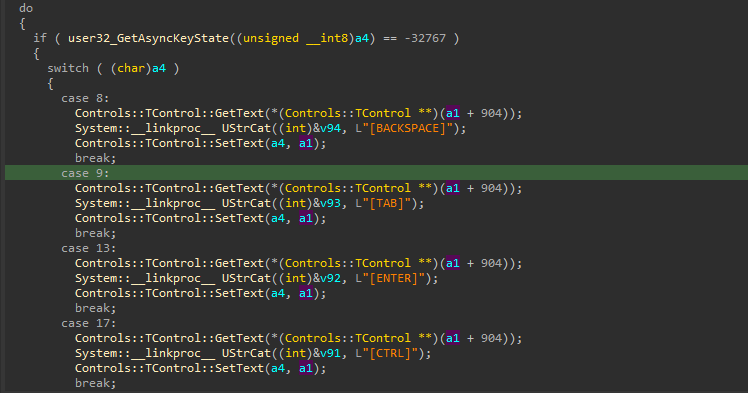


GetKeyState é utilizado para descobrir quais teclas a vítima em questão esta pressionando e armazena essa informação no objeto TStrings criado que posteriormente sera salvo o procedimento responsável por armazenar os logs gerados e presentes no TString periodicamente em tempos definidos chama-se "TF_principal_SalvarTimer" vamos analisar seu comportamento:

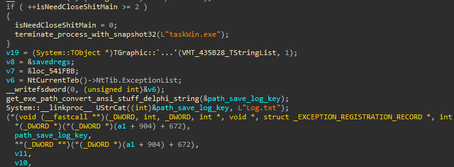

Logo ao início do procedimento de salvamento do arquivo, o malware faz uma verificação para validar se o seu processo pai esta ativo, e mata-o, você vai entender o motivo disso mais a frente, por hora tenha em mente que ao salvar o arquivo de log o malware mata o seu processo paí.

Avançando mais um pouco podemos constatar que o malware obtem seu path de execução e concatena para armazenar em seu próprio diretório um arquivo apelidado de "Log.txt".

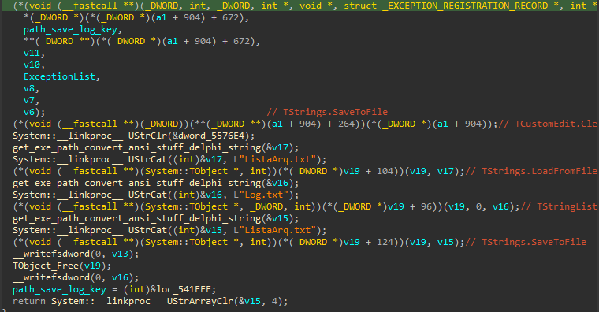

Avançando podemos constatar o arquivo sendo salvo em disco, usando obviamente o objeto TStrings anteriormente apresentado. após o malware efetua salvamentos do path no arquivo "ListaArq.txt" e por algum motivo desconhecido no próprio arquivo "Log.txt" e então encerra.

Vamos agora entender o funcionamento do procedimento apelidado de "TF_principal_ProcessosTimer" que é utilizado para reabrir os processos do stealer caso o procedimento anterior tenha matado ele, porem antes de analisar precisamos ter em mente que o malware resolve algumas infomações de API dinâmicamente veja:


Após resolvermos:


Isso vai nos ajudar mais a frente na analise desse procedimento. então agora vamos enfim dar início a analise dele:


A primeiro momento vemos uma chamada para "TCustomListBox.Clear" que vai limpar os valores presentes(nomes dos processos), e vai recriar essa lista de processos novamente e armazenar na mesma lista usando a chamada para "create_snapshot_all_proc_taca_no_TCustomListBox":


esse método é responsável por criar uma snapshot de todos os processos em execução no momento e armazenar usando a referência do "TCustomListBox" vinda como argumento.

Continuando a função anterior, ela define um novo timer de espera para a próxima execução do procedimento.


Além disso essa função obtem todos os itens da "TCustomListBox" e faz um loop recuperando a string e comparando com o nome do processo pai que cria a execução desse keylogger o "taskwin.exe".

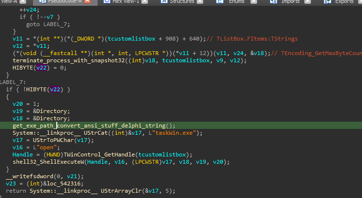

após identificar e claro caso o processo esteja em execução, uma chamada para "terminate_process_with_snapshot32" é feita:


Nessa rotina verifica-se se o binário esta sendo executado em ambiantes anteriores igual ao Windows 7, ou maior dele, para isso usa-se uma chamada para GetVersionExW.

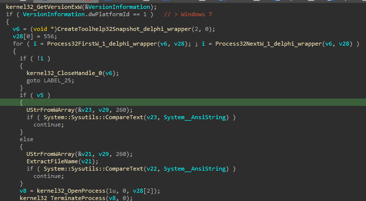

Caso a versão seja superior ao Windows 7, o malware utiliza da WinApi CreateToolHelp32Snapshot, abre o processo e mata ele. do contrário caso seja inferior e igual ao Windows 7 o malware utiliza a WinApi EnumProcess e efetua o mesmo fluxo de abrir e terminar o processo, tudo isso usando o nome passado como parâmetro, nesse caso o nome do executável pai.


Voltando agora ao procedimento anterior por último o binário obtem o seu path de execução concatena com o nome do processo pai, nesse caso "taskWin.exe" e executa-o novamente(cria-o) caso a flag esteja definida como zero.

Vamos agora entender o fluxo de chamada para a última procedure, apelidada de "TF_principal_FormClose":


Como último mecanismo, além do salvamento temporário feito pelo procedimento de timer apelidado pelo atacante de "TF_principal_SalvarTimer"(que salva periódicamente os dados no arquivo de log), o malware ao encerrar também salva os dados armazenados para garantir seu roubo de dados. valida sua persistência e configurações feitas na UAC e Baloon, valida chaves do msn e enfim encerra seu fluxo completo de execução, deixando tudo pronto para o envio ao e-mail do atacante.

Regra Yara:
```yara
import "pe"

rule delephant_dropper_brazil_malware_detect {
    meta:
        author = "João Vitor - Keowu"
        date_created = "25/03/2023 :)"
        description = "Essa regra detecta o dropper malwares da família Delephant Brasil | This rule detect's dropper malware from Delpehant brazil"

    strings:

        $delphi = "Software\\Embarcadero\\Locales" wide
        $delphi2 = "Software\\CodeGear\\Locales" wide
        $delphi3 = "Software\\Borland\\Locales" wide
        $delphi4 = "Software\\Borland\\Delphi\\Locales" wide
        $delphi5_ssl = "Open SSL Support DLL Delphi and C++Builder interface" wide

        $path = "Local AppData" wide
        $config = "\\Config.ini" wide
        $libeay = "\\libeay32.dll" wide
        $ssley32 = "\\ssleay32.dll" wide
        $sqlite = "\\sqlite3.dll" wide
        $taskwin = "\\taskWin.dll" wide
        $winprsv = "\\winPrsv.exe" wide
        $default = "\\default.exe" wide

        $persiskernel = "Kernel System" wide
        $controlnetwo = "Control Network" wide

        $codepattern = { 8D 55 90 E8 7B CE EE FF 8B 45 90 8D 55 94 E8 A0 BB EE FF 8B 45 94 BA 04 05 53 00 E8 53 75 ED FF 74 3C 6A 01 68 1C 05 53 00 68 1C 05 53 00 8D 45 88 E8 29 EF FF FF 8D 45 88 BA 04 05 53 00 }
        $codepattern2 = { E8 A0 73 ED FF 8B 45 88 E8 A4 71 ED FF 50 68 20 05 53 00 8B C3 E8 5F D3 F4 FF 50 E8 69 C0 F6 FF }

    condition:
        (uint16(0) == 0x5A4D and pe.is_pe
         and ($delphi or $delphi2 or
              $delphi3 or $delphi4
               and $delphi5_ssl))
         and (
            $path and
            $config and
            $libeay and
            $ssley32 and
            $sqlite and
            $taskwin and
            $winprsv and
            $default
         ) or
         (
            $persiskernel and
            $controlnetwo
         ) and
         (
            $codepattern and
            $codepattern2
         )
}

```


## IOCS

6cd7a4195d1775530986603b5b65486fc6ce9f7186107162071b55a15caae4e6 - default.exe (Worm, Dropper), Default.exe (Worm, Dropper)

7491bded3d6da3ad573149cbd3826f274a6fb1da09f0fb2c6049a818eea83b75 - taskWin.exe(Stealer)

c3ff6fe117b8becaefb3f36e267284c8cc0f9392035439dbbd4ef2d51d2dcfe2 - winPrsv.exe(Keylogger)

Config.ini file:


listArq.txt file:


Log.txt file:


Credentials, SMTP Server from attacker:

| **Attempt**               | **SMTP server**        | **To E-mail**                 | **From E-mail**               | **Password**               |
|---------------------------|------------------------|-------------------------------|-------------------------------|----------------------------|
| Config #1 - Tentativas: # | smtp.mail.yahoo.com.br | npcclassic_email[@]yahoo[.]com[.]br | npcclassic_email[@]yahoo[.]com[.]br | npcclassic_email@keylogger |
| Config #2 - Tentativas: # | smtp.mail.yahoo.com.br | npcclassic_email[@]yahoo[.]com[.]br | npcclassic_email[@]yahoo[.]com[.]br | npcclassic_email@keylogger |
| Config #3 - Tentativas: # | smtps.bol.com.br       | npcclassic.email[@]bol[.]com[.]br   | npcclassic.email[@]bol[.]com[.]br   | npccl2ssic                 |
| Config #4 - Tentativas: # | smtps.bol.com.br       | npcclassic.email[@]bol[.]com[.]br   | npcclassic.email[@]bol[.]com[.]br   | npccl2ssic                 |
| Config #5 - Tentativas: # | smtp.gmail.com         | npcclassic.email[@]gmail[.]com    | npcclassic.email[@]gmail[.]com    | npcclassic.email@keylogger |
| Config #6 - Tentativas: # | smtp.live.com          | npcclassic[@]hotmail[.]com        | npcclassic[@]hotmail[.]com        | npccl@ssic                 |
| Config #7 - Tentativas: # | smtp.live.com          | npcclassic[@]hotmail[.]com        | npcclassic[@]hotmail[.]com        | npccl@ssic                 |
| Config #8 - Tentativas: # | smtps.bol.com.br       | classicnpc.email[@]bol[.]com[.]br   | classicnpc.email[@]bol[.]com[.]br   | npccl2ssic                 |
| Config #9 - Tentativas: # | smtp.live.com          | npc_court_black[@]hotmail[.]com   | npc_court_black[@]hotmail[.]com   | npccl@ssic                 |