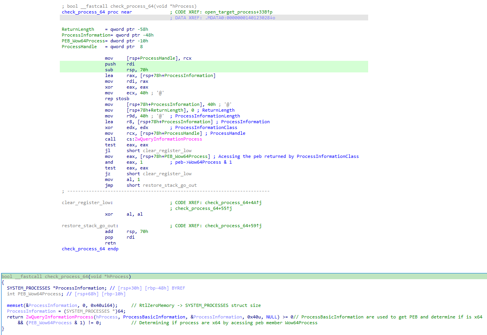
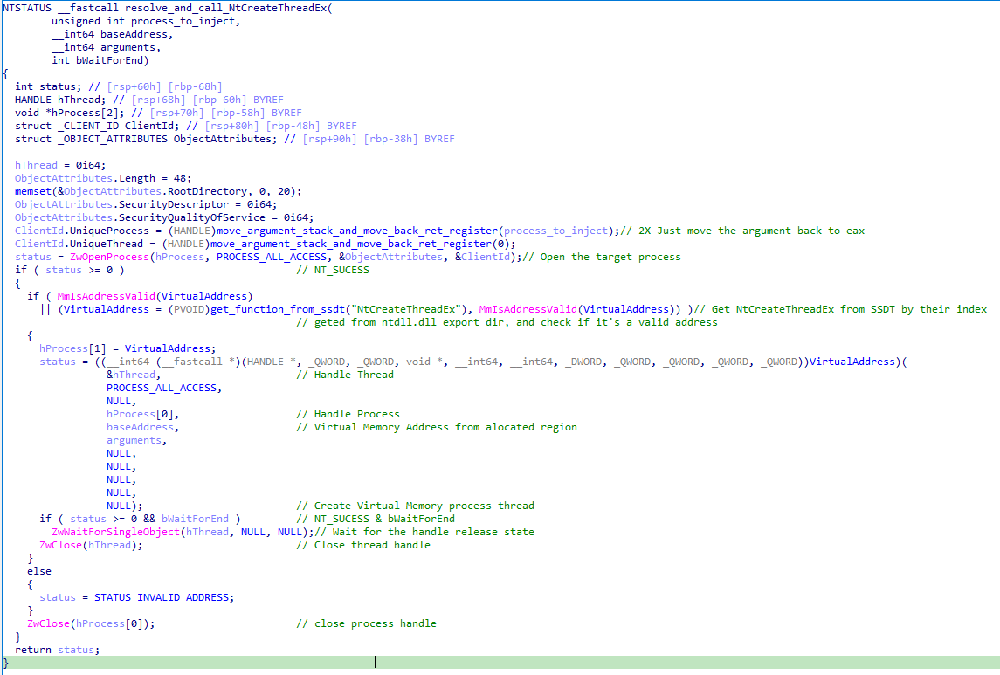
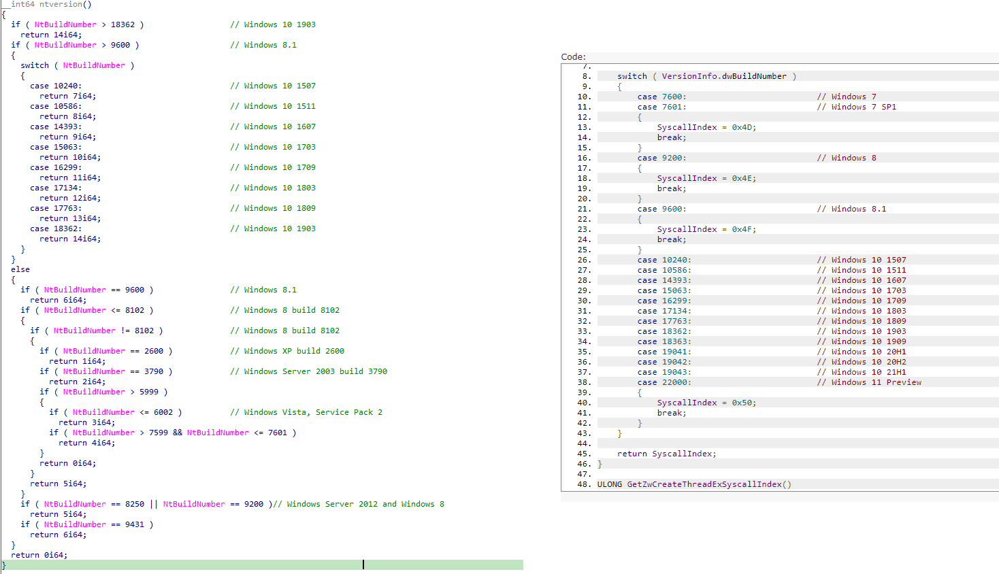
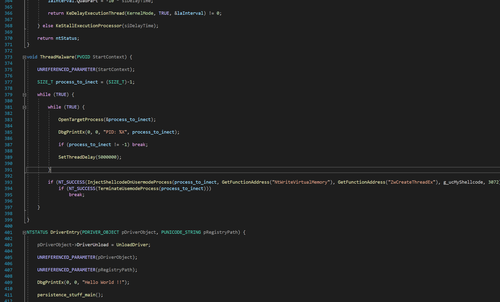

# Malware Reverse Engineering | Analyzing and Rewriting the WINTAPIX Driver and Learning From It
Author: João Vitor (@Keowu) - Malware Security Researcher

# Sample identification hash

Wintapix is a malware identified and originally reported by the company "Fortinet" in an article announcing its discovery. It is particularly well-crafted. My article was written in an attempt to explain how a payload shellcode is injected into a thread from a kernel driver to bypass EDR mechanisms. Additionally, I investigate some aspects of its functionality. I will refrain from analyzing the .NET payload (Donut and its shellcode) and only explain here the kernel-mode injection and how it works when applied to the Windows system. Furthermore, I will provide the complete source code for researchers and enthusiasts who are interested in studying malware, just like myself.

# Table of Contents
1. [Overview](#overview)
2. [A brief look at the concept of the Windows kernel](#a-brief-look-at-the-concept-of-the-windows-kernel)
3. [Wintapix](#wintapix)
4. [Criteria for choosing targets](#criteria-for-choosing-targets)
5. [How writes to virtual memory occur and how a thread is created from the kernel using the SSDT](#how-writes-to-virtual-memory-occur-and-how-a-thread-is-created-from-the-kernel-using-the-ssdt)
6. [How they work and what are the techniques for persistence in kernel mode](#how-they-work-and-what-are-the-techniques-for-persistence-in-kernel-mode)
7. [Taking advantage of the knowledge acquired, the Driver is being completely rewritten](#taking-advantage-of-the-knowledge-acquired-the-driver-is-being-completely-rewritten)
8. [Proof of concept of the attack](#proof-of-concept-of-the-attack)
9. [References](#references)


## Overview

"Wintapix is a malware that targets countries in the Middle East and exploits the SSDT (KeServiceDescriptorTable) to make calls to the operating system's system calls."

## A brief look at the concept of the Windows kernel

In Windows, there are two SSDTs, the first one is named KeServiceDescriptorTable, and the second one is KeServiceDescriptorTableShadow. Both are structures, and SSDT is just a nickname for System Service Dispatch. Its composition consists of arrays of pointers in a direct manner. The SSDT provides functionalities for both user mode (indirectly via ntdll.dll, for example, using the syscall number) and for kernel mode (drivers like Wintapix). However, not all system calls can be directly utilized, and the same applies to SSDT, at least in x64 versions of operating systems. In x32 systems, it can be accessed by calling ```MmGetSystemRoutineAddress```.

Here's a small example of how to do that:

```c++
UNICODE_STRING uniStr;
RtlInitUnicodeString(&uniStr, L"KeServiceDescriptorTable");
PVOID pSsdt = MmGetSystemRoutineAddress(&uniStr);
```

However, in x64 operating systems, this task is not as straightforward. Therefore, it becomes necessary to use techniques to search for the pointer to the SSDT. Creativity knows no bounds here, but the objective remains the same: to find KeServiceDescriptorTable\KeServiceDescriptorTableShadow. The technique used by the developer of WintaPix is quite creative and will be detailed throughout the article.

Before advancing with the reading, let's understand a bit about how system calls work on Windows through ntdll.dll. It is somewhat necessary to comprehend this because WintaPix uses it to search for the so-called "indexes" of system calls. All system calls in operating systems follow the same assembly code pattern, with only the index varying. 

Here's an example of this routine:

```
Zw/Nt/SomeCall proc near
    mov r10, rcx
    mov eax, SYCALL_INDEX
    test byte ptr ds:7FFE0308h, 1
    jnz flag
    syscall ; Kernel syscall
    ret

flag:
    int 2Eh
    retn
Zw_Nt_SomeCall endp
```

Let's suppose that I want to obtain the index for "NtCreateUserProcess":

```
ZwCreateUserProcess proc near
    mov r10, rcx
    mov eax, 0BDh
    test byte ptr ds:7FFE0308h, 1
    jnz flag
    syscall
    ret

flag:
    int 2Eh
    retn

ZwCreateUserProcess endp
```

In this case, our index is determined by the value ```0xBD```. It is important to understand this concept as it will be essential to comprehend how WintaPix parses NTDLL in search of the index to use in the SSDT structure, which is retrieved through a signature scanner to obtain the address of the routine for the proper call.

## WintaPix

The WintaPix driver uses the commercial version of the VM Protect protector to protect its code and make analysis more challenging. This protector is known for executing the program's scope in an unconventional architecture created by the protector itself. In this specific case, the routine we are analyzing did not contain virtualization technology. The only virtualized points were the DriverEntry and DriverUnload routines. After correcting the binary and IAT, I then began my analysis of the artifact.

The main operation of the malware occurs through a system thread: 


This routine is called by the "DriverEntry" routine (which was virtualized by vmprotect). After creating the system thread, the main routine responsible for all the malware functionalities comes into action. I nicknamed it "StartRoutine" to keep everything a bit more organized.


The scope of operation is divided into steps:

- Find a process with the desired characteristics and privilege level.
- Obtain a handle to the running process.
- Allocate virtual memory in the running process.
- Find the pointer to the SSDT, determine the system call index, and obtain the function's address. Additionally, declare its signature and correct calling convention for use.
- Use NtWriteVirtualMemory to copy the shellcode into virtual memory.
- Create a thread in the process's virtual memory using NtCreateThreadEx and ensure its execution.
- Terminate the process used for injection to avoid detections.

##### Criteria for choosing targets

Let's understand the scope of WintaPix's operation during the process selection through the "open_target_process" procedure:


The routine aims to find a process with system permissions for shellcode injection. To perform this task, WintaPix uses calls to the WinAPI "ZwQuerySystemInformation" to obtain a listing of the "SYSTEM_PROCESS" structure.

```c++
struct _SYSTEM_PROCESSES {
  ULONG NextEntryDelta;
  ULONG ThreadCount;
  ULONG Reserved1[6];
  LARGE_INTEGER CreateTime;
  LARGE_INTEGER UserTime;
  LARGE_INTEGER KernelTime;
  UNICODE_STRING ProcessName;
  KPRIORITY BasePriority;
  SIZE_T ProcessId;
  SIZE_T InheritedFromProcessId;
  ULONG HandleCount;
  ULONG Reserved2[2];
  VM_COUNTERS VmCounters;
  IO_COUNTERS IoCounters;
  SYSTEM_THREADS Threads[1];
};
```
Based on the populated structure and, obviously, after determining the correct size of the structure chain and allocating a pool with the tag "xp" for storage, the malware will iterate through the structures using the offset present in the "NextEntryDelta" attribute to check for a possible process for injection. Additionally, the malware will check if the PID of the verified process is 4 or if the inheritance PID is also 4. This PID is always reserved for the "System.exe" process. Moreover, the malware will verify if the process is part of a blacklist of processes. The following processes make up the WintaPix blacklist:

```
wininit.exe
csrss.exe
smss.exe
services.exe
winlogon.exe
lsass.exe
```

If the process meets the conditions established by WintaPix, it will perform one more check, this time verifying if the process belongs to the SID group "S-1-5-18". This SID indicates the identity used by the operating system and its services configured to act as LocalSystem.


To find the SID of the current search process, WintaPix uses "ZwQuerySystemInformation" to obtain a reference to the target SID and then converts it to a UNICODE_STRING using "RtlConvertSidToUnicodeString" and stores it in the reference pointer of its second argument.


The verification of a potential target process is done when the "executeCheckingSecurityIdentifiers" procedure returns a TRUE result after comparing the NT_SUCCESS macro. Then, the standard "wcscmp" is used to compare, accessing the reference of the UNICODE_STRING in "buffer" as a const wchar and comparing it with the SID "S-1-5-18" to validate if the process has LocalSystem permission. If you are curious about other SIDs a PEPROCESS can assume, I recommend reading the Microsoft Learn article [Security Identifiers](https://learn.microsoft.com/pt-br/windows-server/identity/ad-ds/manage/understand-security-identifiers).

If the process passes the SID validation performed by WintaPix, the final check will occur. This time, it needs to ensure that the process in question is WOW64 (x64) and not a x32 process, so that it can inject its shellcode. For this task, WintaPix uses the procedure nicknamed "check_process_64".



During the process architecture verification, WintaPix uses a call to ZwQueryInformationProcess, passing the PROCESSINFOCLASS "ProcessBasicInformation" to retrieve a pointer to the PEB structure and access "Wow64Process".

If the entire list of processes reaches the end, and WintaPix fails to find a suitable process for injection, it will use the procedure nicknamed "set_thread_delay":


By default, the delay before restarting a new search for injection processes is 5000000.

When a process meets all the criteria imposed by WintaPix, the second stage begins, divided into two parts. The first part is responsible for writing to the process's virtual memory through the "resolve_and_call_NtWriteVirtualMemory" procedure, as well as creating a thread in the process using the "resolve_and_call_NtCreateThreadEx" procedure.

Let's start our analysis with the "resolve_and_call_NtWriteVirtualMemory" procedure:


In this routine, WintaPix will allocate virtual memory in the previously chosen process using the system call "ZwAllocateVirtualMemory." Then, it will resolve the address of the system call "NtWriteVirtualMemory" using the SSDT to write to the allocated virtual memory. After that, it will store the base address of the allocated region to be used when creating its thread in the target process.

Next, the "resolve_and_call_NtWriteVirtualMemory" procedure is used to create a thread in the virtual memory of the process:



In this stage, the malware will create a new thread in the virtual memory of the process, retrieving the address of the system call "NtCreateThreadEx" from the SSDT and using it to make the call. By default, the malware always waits for the thread to be terminated, using ZwWaitForSingleObject to its advantage. Since the "bWaitForEnd" parameter is always true, the malware will always wait for the complete execution of its injected thread.

Finally, after all the steps of injecting a thread into a user-mode process based on specific criteria, WintaPix will terminate the process that was used as the "host" for its thread. The procedure responsible for this task has been nicknamed "terminate_usermode_process":


Based on the target process, the malware makes a call to ZwTerminateProcess with the intent of terminating it. This is because the injection it performed will map a new process independent of the parent process (the target of the injection), making it a reasonably efficient technique to evade EDR (Endpoint Detection and Response) security solutions.

##### How writes to virtual memory occur and how a thread is created from the kernel using the SSDT

All interactions with the SSDT, such as signature scanning in ntoskrnl.exe, and obtaining the system call index to retrieve addresses by accessing the ServiceTable member, occur through subprocedures of "get_function_from_ssdt.":


Let's begin our explanation and discoveries of where some techniques were "based" by the WintaPix developer, and how they work in detail. We will start with the procedure "parse_ntdll_get_index." This procedure takes a parameter as a reference to a "char*" containing the string that makes up the name of the syscall to be searched in ntdll:


This is the declaration of the "struct_malware" structure, reversed similarly to the one used by the WintaPix developer to store the necessary data for their index scanning:

```c++
struct struct_malware {
  PVOID pMemBuffer; // Full ntdll.dll mapped buffer
  _QWORD image_base_ntdll; // Ntdll.dll image base
  _QWORD section_range; // Section range for search
  unsigned int fileLowPart; // File size
};
```

A more understandable example explains how the verification occurs, comparing the verification performed by WintaPix and the calling standard present in ntdll.dll:


The functions responsible for mapping the ndll, parsing, finding the name of the system call in the export directory, and the address for scanning are performed by the "open_ntdll_and_parse_pe" and "parse_pe_file_exported" procedures:


After finding the index of the system call, we move on to the search for the SSDT. In this step, we will understand how and where the author of WintaPix based themselves to create their search routines. The main procedure used in the searches is nicknamed "acess_ssdt_by_index," which is responsible for calling the sub-procedure nicknamed "determine_os_best_signature_and_find_ssdt_by_pattern" and, of course, calculating the correct offset to retrieve the pointer to the system call (considering only WoW64):


When we analyze the logic used by WintaPix to perform its signature scan, we can identify some inspirations of the malware developer from source code in a tutorial on an online forum:


Despite some modifications, the idea of using the address of another system call to search for the SSDT signature was used by the author of WintaPix. Obviously, they used their own more effective signature for their attack, demonstrating that even though they based their work on an idea from a forum, they have a good understanding of reverse engineering and system internals.

In addition to the signature scan, the malware author may have also relied on the same post, but for the idea of verification and offset to resolve the issue of differences between instructions in versions:



Based on this information, we can determine the scope of the malware's attack and in which builds the used signature works. They are: 

| Targets OS build numbers           |
|------------------------------------|
| Windows 10 1903                    |
| Windows 10 1809                    |
| Windows 10 1803                    |
| Windows 10 1709                    |
| Windows 10 1703                    |
| Windows 10 1607                    |
| Windows 10 1511                    |
| Windows 10 1507                    |
| Windows 8.1 All builds             |
| Windows 8 build 8102               |
| Windows Server 2012 All builds     |
| Windows 7 All builds               |
| Windows Vista, Service Pack 2      |
| Windows Server 2003 build 3790     |
| Windows XP build 2600              |

##### How they work and what are the techniques for persistence in kernel mode

In addition to injections into processes running on the operating system, WintaPix acts as a backdoor, establishing effective persistence mechanisms to ensure its execution always occurs smoothly and without raising suspicions. It also ensures that the driver service runs smoothly, is loaded in safe boot, and prevents disk file alteration.


The "persistence_stuff_main" procedure is called by the virtualized DriverEntry routine before the injection thread is created. It performs modifications and sets up change notifications for registry keys, ensuring that its service always runs smoothly. Additionally, it creates the file system monitoring thread to detect any changes to its driver on disk:


To check for change events or alterations in its file on disk, WintaPix uses the system call "NtNotifyChangeDirectoryFile," resolving the address from the SSDT. The system call stores the data in the "FILE_NOTIFY_INFORMATION" struct.

```c++
typedef struct _FILE_NOTIFY_INFORMATION {
  DWORD NextEntryOffset;
  DWORD Action;
  DWORD FileNameLength;
  WCHAR FileName[1];
} FILE_NOTIFY_INFORMATION, *PFILE_NOTIFY_INFORMATION;
```

WintaPix uses the "NextEntryOffset" attribute to access the next data in the list while "NextEntryOffset" is different from zero. It compares using "FileName" if the file's name and path exactly match the malware's driver file in the drivers directory in system32. If it matches, the malware ensures to delete the file and overwrite its content using the buffer of the previously stored file. This way, the malware can always guarantee that it runs without being compromised by third-party tools, for example. Along with the calls to the "ZwNotifyChangeKey" system call, it can identify and prevent changes to its persistence keys.


##### Taking advantage of the knowledge acquired, the Driver is being completely rewritten

After analyzing the malware and its entire structure, we were able to replicate and fully understand its operation, providing the necessary inputs to rewrite its entire behavior:


Based on the reversed source code, corrected data types, and some corruptions of my IDA database (Thanks to Hex-Rays for being able to save an 8MB file with completely zeroed bytes), I created a project using the driver development kit provided by Microsoft and recreated the malware (the routines may be different, but it performs exactly the same behavior when executed).




The source code can be found in the repository: 

[wintapix-source-code-reversed](https://github.com/keowu/wintapix).


#### Proof of concept of the attack

A proof of concept uses a simple shellcode that creates a new process from a thread injected from kernel mode using all the reversed resources of the WintaPix malware, as well as demonstrating all the persistence mechanisms used and reversed.

Watch the video of the proof of concept:

[](https://www.youtube.com/embed/AnIiWo3ASdw)


## References

! References uses Brazilian-ABNT-Standard to demonstrate respect with others research's.

REVAY, G.; JAZI, H. WINTAPIX: A new kernel driver targeting countries in the Middle East. Disponível em: <https://www.fortinet.com/blog/threat-research/wintapix-kernal-driver-middle-east-countries>.

OGILVIE, D. TitanHide: Hiding kernel-driver for x86/x64. Disponível em: <https://github.com/mrexodia/TitanHide>.

HFIREF0X. WinObjEx64: Windows Object Explorer 64-bit. Disponível em: <https://github.com/hfiref0x/WinObjEx64>.