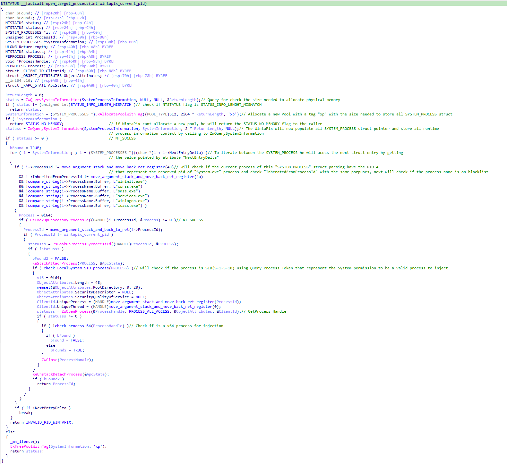
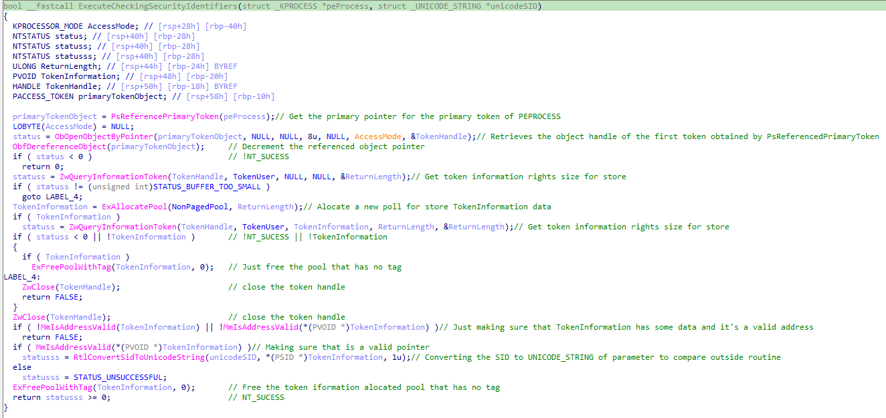
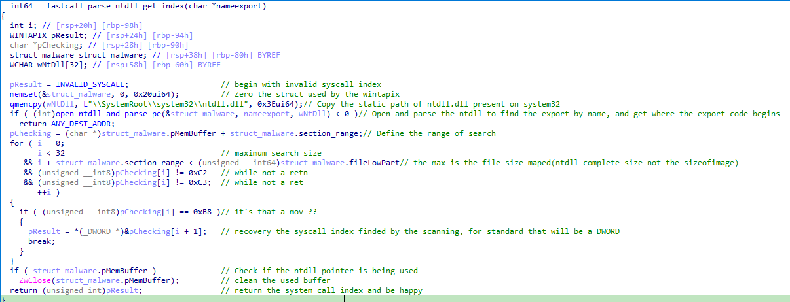
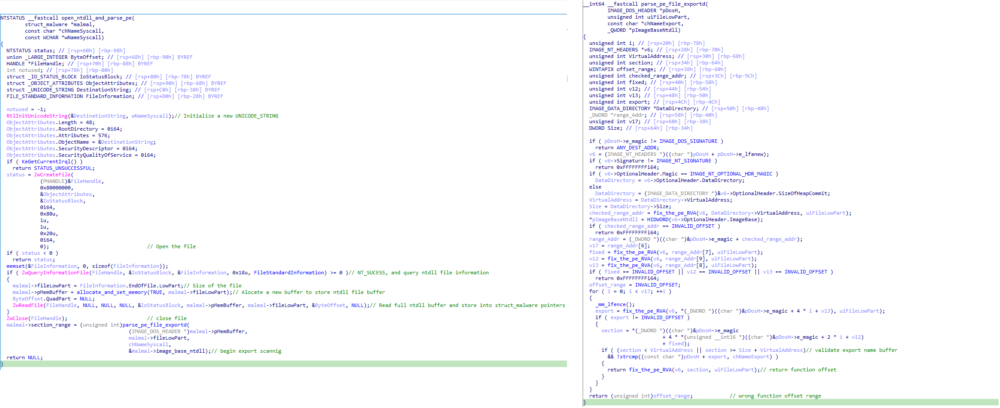
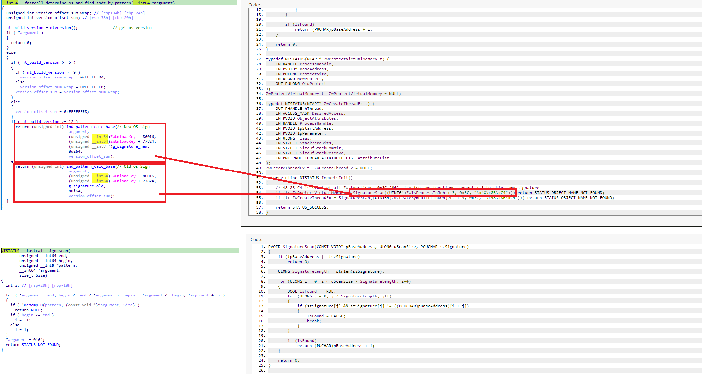
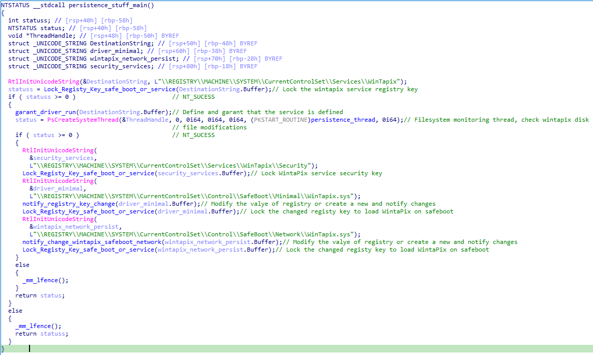
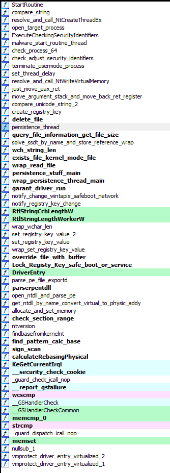
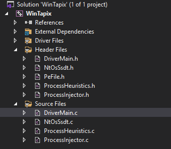
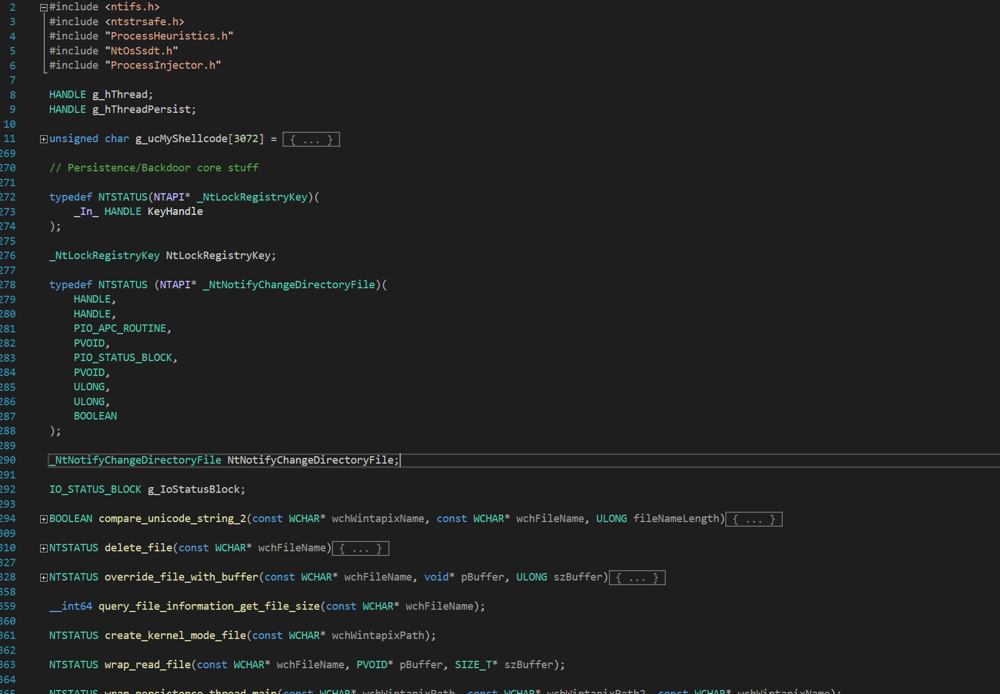

# Malware Reverse Engineering | Analyzing and Rewriting the WINTAPIX Driver and Learning From It
Author: João Vitor (@Keowu) - Malware Security Researcher

# Sample identification hash

Wintapix é um malware identificado e reportado originalmente pela empresa "Fortinet" em um artigo anunciando sua descoberta. particularmente muito bem feito. meu artigo foi escrito na tentativa de explicar como um payload shellcode é injetado em uma thread a partir de um kernel driver, de forma a bypassar mecanismos EDR, e além disso investigar alguns pontos de seu funcionamento. eu irei me abster da analise do payload .net(Donut e seu shellcode) e apenas explicar aqui a injeção de modo kernel e como funciona aplicado ao sistema windows, além é claro de reverter e fornecer o código fonte completo para estudiosos e entusiastas que se animam com malwares, assim como eu.

# Table of Contents
1. [Overview](#overview)
2. [Uma pequena olhada no conceito do kernel do windows](#uma-pequena-olhada-no-conceito-do-kernel-do-windows)
3. [Wintapix](#wintapix)
4. [Criterios de escolha de alvos](#criterios-de-escolha-de-alvos)
5. [Como ocorrem escritas na memória virtual e como uma thread é criada usando a prtir do kernel usando a SSDT](#como-ocorrem-escritas-na-memória-virtual-e-como-uma-thread-é-criada-usando-a-prtir-do-kernel-usando-a-ssdt)
6. [Como funcionam e quais são as técnicas de persistência no kernel mode](#como-funcionam-e-quais-são-as-técnicas-de-persistência-no-kernel-mode)
7. [Aproveitando do aprendizado e reescrevendo completamente o Driver](#aproveitando-do-aprendizado-e-reescrevendo-completamente-o-driver)
8. [Prova de conceito do ataque](#prova-de-conceito-do-ataque)
9. [Referências](#referências)


## Overview

Wintapix é um malware que tem como alvo países do oriente médio. e explora da SSDT(KeServiceDescriptorTable) para efetuar chamadas para as system calls do sistema operacional.

## Uma pequena olhada no conceito do kernel do windows

No Windows existem duas SSDT's sendo a primeira KeServiceDescriptorTable e a segunda KeServiceDescriptorTableShadow ambas são estruturas, SSDT é só um apelido para a System Service Dispatch, sua composição são arrays de ponteiros de maneira direta. a SSDT prove funcionalidades tanto ao usermode(de maneira indireta via a ntdll.dll por exemplo usando o número da syscall), como para o kernelmode(drivers como o Wintapix) porem obviamente nem todas as system calls podem ser utilizadas diretamente e isso não é diferente com a SSDT(pelo menos nas versões x64 dos sistemas operacionais), porem em sistemas x32 ela pode ser acessada chamando ```MmGetSystemRoutineAddress```, aqui tem um pequeno exemplo de como fazer isso: 

```c++
UNICODE_STRING uniStr;
RtlInitUnicodeString(&uniStr, L"KeServiceDescriptorTable");
PVOID pSsdt = MmGetSystemRoutineAddress(&uniStr);
```

Porem em sistemas operacionais x64 essa tarefa não é tão simples, faz-se então necessário o uso de técnicas de busca pelo ponteiro da SSDT. a criatividade é sem limites aqui porem o objetivo é o mesmo encontrar a KeServiceDescriptorTable\KeServiceDescriptorTableShadow. a técnica utilizada pelo desenvolvedor do WintaPix é um tanto quanto criativa, e sera detalhada ao decorrer do artigo. 

Antes de avançar com a leitura, vamos entender um pouco de como funcionam as system calls no windows através da ntdll.dll faz-se um pouco necessário compreender por conta do WintaPix utiliza-la em buscas dos chamados "índices" de system calls, convenhamos que o nome em inglês é bem melhor ou seja "index". todas as system calls dos sistemas operacionais seguem o mesmo padrão de código assembly, variando apenas o índice, veja um exemplo desta rotina:

```
Zw/Nt/SomeCall proc near
    mov r10, rcx
    mov eax, SYCALL_INDEX
    test byte ptr ds:7FFE0308h, 1
    jnz flag
    syscall ; Kernel syscall
    ret

flag:
    int 2Eh
    retn
Zw_Nt_SomeCall endp
```

vamos supor que eu deseja obter o índice para "NtCreateUserProcess":

```
ZwCreateUserProcess proc near
    mov r10, rcx
    mov eax, 0BDh
    test byte ptr ds:7FFE0308h, 1
    jnz flag
    syscall
    ret

flag:
    int 2Eh
    retn

ZwCreateUserProcess endp
```

Nesse caso nosso índice é determinado pelo valor ```0xBD```. é importante entendermos este conceito pois ele vai ser essencial para compreender como o WintaPix parseia a NTDLL em busca do índice para utilizar na estrutura da SSDT recuperada através de um signature scanner e recuperar o endereço da rotina para efetuar a devida chamada.

## WintaPix

O Driver do WintaPix utiliza a versão comercial do protector VM Protect para proteger seu código e dificultar analises, esse protector é conhecido por executar o escopo do programa em uma arquitetura não convencional e criada pelo próprio protector. nesse caso em específico a rotina que vamos analisar não continha a tecnologia de virtualização. o único ponto virtualizado eram as rotinas de DriverEntry e DriverUnload. após certa correção do binário e IAT iniciei então a minha analise do artefato.

O funcionamento principal do malware ocorre através de uma thread de sistema:


Esta rotina é chamada pela rotina de "DriverEntry"(que foi virtualizada pelo vmprotect). após a criação da thread de sistema a rotina principal responsável por todas as funcionalidades do malware entra em ação. apelidada por mim de "StartRoutine" para manter tudo um pouco mais organizado.


O escopo do funcionamento esta dividido em etapas:
- Encontrar um processo com as características e nível de privilégio desejado
- Obter um handle para o processo em execução
- Alocar memória virtual no processo em execução
- Encontrar o ponteiro para a SSDT, encontrar o índice da system call e obter o endereço da função e além disso declarar sua assinatura e calling convention correta para utilização
- Utilizar NtWriteVirtualMemory para copiar o shellcode para a memória virtual
- Criar uma thread no processo em memória virtual usando NtCreateThreadEx e garantir que sua execução acontecera
- Encerrar o processo utilizado para injeção para evitar detecções

##### Criterios de escolha de alvos

Vamos entender o escopo do funcionamento do WintaPix durante a escolha de um processo, através do procedimento "open_target_process":



A rotina tem como objetivo encontrar um processo com permissões de sistemas para injeção do shellcode. então para realizar esta tarefa o WintaPix utiliza-se de chamadas para a winapi "ZwQuerySystemInformation" com o intuíto de obter uma listagem da estrutura "SYSTEM_PROCESS".

```c++
struct _SYSTEM_PROCESSES {
  ULONG NextEntryDelta;
  ULONG ThreadCount;
  ULONG Reserved1[6];
  LARGE_INTEGER CreateTime;
  LARGE_INTEGER UserTime;
  LARGE_INTEGER KernelTime;
  UNICODE_STRING ProcessName;
  KPRIORITY BasePriority;
  SIZE_T ProcessId;
  SIZE_T InheritedFromProcessId;
  ULONG HandleCount;
  ULONG Reserved2[2];
  VM_COUNTERS VmCounters;
  IO_COUNTERS IoCounters;
  SYSTEM_THREADS Threads[1];
};
```
Com base na estruct populada e após obviamente determinar o tamanho correto da cadeia de estruturas e alocar uma pool com a tag "xp" para armazenamento. o malware ira iterar entre as estructures usando offset presente no atributo "NextEntryDelta" de maneira a verificar um possível processo para a injeção. além disso o malware ira verificar se o PID do processo verificado é 4 ou se de o PID de herança também é 4. este PID é sempre reservado para o processo "System.exe", além é claro de verificar se o processo faz parte de uma blacklist de processos, os seguintes processos compõem a lista de blacklist do WintaPix:
```
wininit.exe
csrss.exe
smss.exe
services.exe
winlogon.exe
lsass.exe
```

Caso o processo passe nas condições estabelecidas pelo WintaPix, ele efetuara mais uma verificação e desta vez verificando se o processo pertence ao grupo de SID "S-1-5-18", esse SID indica a identidade usada pelo sistema operacional e seus serviços configurados para agirem como LocalSystem.



Para encontrar o SID do processo atual de busca, o WintaPix utiliza da "ZwQuerySystemInformation" em busca de obter uma referência ao SID de busca, e então o converte para uma UNICODE_STRING utilizando "RtlConvertSidToUnicodeString" e armazena no ponteiro de referência de seu segundo argumento.


A verificação de um possível processo de escolha é usado quando o procedimento "executeCheckingSecurityIdentifiers" retorna um resultado TRUE após a comparação da macro NT_SUCESS. e então a utilização do standard "wcscmp" compara acessando a referência da UNICODE_STRING em "buffer" como uma const wchar, e compara com o SID "S-1-5-18" com o intuíto de validar se o processo possível a permissão LocalSystem. caso você fique curioso de quais outras SID um PEPROCESS pode assumir recomendo a leitura do artigo da Microsoft Learn [Identificadores de segurança](https://learn.microsoft.com/pt-br/windows-server/identity/ad-ds/manage/understand-security-identifiers).

Caso o processo passe na validação de SID performada pelo WintaPix, ocorrera a última verificação. dessa vez ele precisara garantir que o processo em questão seja de WOW64(x64) e não um processo de x32. para que possa então injetar o seu shellcode. para esta tarefa o WintaPix utiliza o procedimento apelidado de "check_process_64".


Durante a verificação de arquiteura de processo. o WintaPix utiliza-se de uma chamada para ZwQueryInformationProcess passando a PROCESSINFOCLASS "ProcessBasicInformation" com o intuíto de recuperar um ponteiro para a estrutura da PEB e acessar "Wow64Process".

Caso toda a lista dos processos chegue ao fim, e o WintaPix não consiga encontrar um bom processo para sua injeção, ele utiliza-ra o procedimento apelidado de "set_thread_delay":


Por padrão o delay antes de reiniciar uma nova busca por processos para injeção é de 5000000.

Quando um processo passa em todos os critérios impostos pelo WintaPix, inicia-se o segundo estágio. dividido em duas partes. sendo o primeiro responsável por escrever na memória virtual do processo através do procedimento "resolve_and_call_NtWriteVirtualMemory". além de criar uma thread no processo utilizando o procedimento "resolve_and_call_NtCreateThreadEx".

Vamos iniciar nossa analise pelo procedimento "resolve_and_call_NtWriteVirtualMemory":


Nesta rotina o WintaPix vai alocar memória virtual no processo anteriormente escolhido por meio da system call "ZwAllocateVirtualMemory". e em seguida resolver o endereço da system call "NtWriteVirtualMemory" utilizando a SSDT para então escrever na memória virtual alocada. após armazenara o endereço base da região alocada para ser utilizado no momento de criação de sua thread no processo alvo.

Em seguida o procedimento resolve_and_call_NtWriteVirtualMemory é utilizado para criar uma thread na memória virtual do processo:


Nesta etapa o malware vai criar uma nova thread na memória virtual do processo, recuperando o endereço da system call "NtCreateThreadEx" da SSDT e a partir disso efetuando sua chamada. por padrão o malware sempre espera que a thread seja encerrada utilizando ZwWaitForSingleObject ao seu favor para esta tarefa, dado que o parâmetro "bWaitForEnd" sempre sera true o malware sempre ira esperar a completa execução de sua thread injetada.

Por fim após todas as etapas de injeção de thread em um processo do modo de usuário com base em critérios específicos, o WintaPix vai encerrar o processo ao qual foi utilizado como "hospedeiro" de sua thread, o procedimento responsável por esta tarefa foi apelidado de "terminate_usermode_process":


Com base no processo alvo, o malware efetua uma chamada para ZwTerminateProcess. com o intúito de encerra-lo. pois a injeção por ele efetuada ira mapear um novo processo independente do processo pai(alvo da injeção), tornando esta uma técnica rasoavelmente efiente de evasão a soluções de segurança EDR's.

##### Como ocorrem escritas na memória virtual e como uma thread é criada usando a partir do kernel usando a SSDT

Todas as interações com a SSDT, como por exemplo signature scanner na ntoskrnl.exe até obtenção de system call index para recuperar os endereços acessando o membro ServiceTable ocorrem por subprocedimentos de "get_function_from_ssdt":


Vamos iniciar nossa explicação e descobertas de onde algumas técnicas foram "baseadas" pelo desenvolvedor do WintaPix, e como elas funcionam em detalhes. iniciaremos a partir do procedimento "parse_ntdll_get_index", este procedimento recebe como parâmetro uma referência "char*" contendo a cadeia de caracteres que compõem o nome da syscall a ser buscada na ntdll:



Esta é a declaração da estrutura "struct_malware" revertida similar a utilizada pelo desenvolvedor do WintaPix para armazenar os dados necessários para seu escaneamento do index:

```c++
struct struct_malware {
  PVOID pMemBuffer; // Full ntdll.dll mapped buffer
  _QWORD image_base_ntdll; // Ntdll.dll image base
  _QWORD section_range; // Section range for search
  unsigned int fileLowPart; // File size
};
```

Um exemplo mais compreensivel explana como a verificação ocorre, comparando a verificação realizada pelo WintaPix e o padrão de chamadas presente na ntdll.dll:


As funções responsáveis por mapear a ndll, parsear, encontrar o nome da system call na export directory e o endereço para escaneamento, são feitos pelos procedimentos "open_ntdll_and_parse_pe" e "parse_pe_file_exported":



Após encontrar o index da system call, avançamos para a busca da SSDT, nesta etapa vamos entender como e onde o autor do WintaPix se baseou para criar suas rotinas de busca, o procedimento principal utilizado nas buscas é apelidado de "acess_ssdt_by_index", sendo ele o responsável por chamar o sub procedimento apelidado de "determine_os_best_signature_and_find_ssdt_by_pattern" e claro calcular o deslocamento correto para recuperar o ponteiro para a system call(considerando apenas WoW64):


Quando analisamos a lógica utilizada pelo WintaPix para fazer sua signature scan conseguimos identificar algumas inspirações do desenvolvedor do malware em um código fonte de um tutorial em um fórum online:



Apesar de algumas modificações a ideia de utilizar o endereço de uma outra system call para buscar pela assinatura da SSDT foi utilizada pelo autor do WintaPix, obviamente utilizando uma assinatura própria e mais efetiva para seu ataque, demonstrando que mesmo baseando em uma ideia de um fórum ele possui um bom conhecimento em engenharia reversa e system internals.

Além da signature scan o autor do malware também pode ter se baseado no mesmo post, porem na ideia da verificação e offset para resolver a questão das diferenças entre as instruções nas versões:


Com base nessas informações conseguimos determinar o escopo de ataque do malware, e em quais builds a assinatura usada funciona, sendo eles:

| Targets OS build numbers           |
|------------------------------------|
| Windows 10 1903                    |
| Windows 10 1809                    |
| Windows 10 1803                    |
| Windows 10 1709                    |
| Windows 10 1703                    |
| Windows 10 1607                    |
| Windows 10 1511                    |
| Windows 10 1507                    |
| Windows 8.1 All builds             |
| Windows 8 build 8102               |
| Windows Server 2012 All builds     |
| Windows 7 All builds               |
| Windows Vista, Service Pack 2      |
| Windows Server 2003 build 3790     |
| Windows XP build 2600              |

##### Como funcionam e quais são as técnicas de persistência no kernel mode

Além das injeções em processos em execução no sistema operacional, o WintaPix age como uma backdoor, definindo mecanismos de persistência eficazes na tarefa de garantir que sua execução sempre ocorra sem problemas e sem levantar suspeitas, além de garantir que o serviço do driver execute sem problemas, bem como seja carregado em safe boot e faça a prevenção de alteração do arquivo em disco.



O procedimento "persistence_stuff_main" é chamado pela rotina virtualizada de DriverEntry, antes da thread de injeção ser criada, efetua as modificações e define notificações de mudança para as chaves de registro, bem como garante que seu serviço sempre execute sem problemas, além é claro de criar a thread de monitoração de sistema de arquivos para detectar qualquer alteração no seu driver em disco:


Para verificar por eventos de mudança ou alterações em seu arquivo em disco, o WintaPix utiliza-se da system call "NtNotifyChangeDirectoryFile" resolvendo o endereço a partir da SSDT. a system call armazena os dados na struct "FILE_NOTIFY_INFORMATION":

```c++
typedef struct _FILE_NOTIFY_INFORMATION {
  DWORD NextEntryOffset;
  DWORD Action;
  DWORD FileNameLength;
  WCHAR FileName[1];
} FILE_NOTIFY_INFORMATION, *PFILE_NOTIFY_INFORMATION;
```

O WintaPix utiliza o atributo "NextEntryOffset" para acessar os próximos dados da lista. enquanto "NextEntryOffset" for diferente de zero. e compara utilizando "FileName" se o nome do arquivo e path é exatamente o mesmo do arquivo do driver do malware no diretório de drivers na system32. caso seja o malware certifica-ra de apagar o arquivo e sobreescrever seu conteúdo utilizando o buffer do arquivo anteriormente armazenado, dessa forma o malware sempre conseguira garantir que execute sem ser comprometido por ferramentas de terceiros por exemplo. e em conjunto com as chamadas da system call "ZwNotifyChangeKey" conseguira identificar e previnir alterações em suas chaves de persistência.


##### Aproveitando do aprendizado e reescrevendo completamente o Driver

Após uma analise do malware. e de toda a sua estrutura, conseguimos replicar e entender completamente seu funcionamento dando insumos necessários para reescrevermos todo o seu comportamento:



Com base no código fonte revertido, tipos de dados corrigidos, e algumas corrupções do meu banco dados do IDA(Obrigado Hex-Rays por conseguir salvar um arquivo de 8 MB com bytes completamente zerados), eu criei um projeto usando o kit de desenvolvimento de drivers fornecido pela Microsoft, e recriei o malware(as rotinas podem estar diferentes, porem cumpre ao executar exatamente o mesmo comportamento).







O Código fonte pode ser encontrado no repositório: 

[wintapix-source-code-reversed](https://github.com/keowu/wintapix).


#### Prova de conceito do ataque

Uma prova de conceito utiliza um shellcode simples que cria um novo processo a partir de uma thread injetada a partir de kernel mode utilizando todos os recursos revertidos do malware WintaPix. bem como demonstra todas os mecanismos de persistências utilizados e revertidos.

Veja o vídeo da prova de conceito: 

[](https://www.youtube.com/embed/AnIiWo3ASdw)


## Referências

REVAY, G.; JAZI, H. WINTAPIX: A new kernel driver targeting countries in the Middle East. Disponível em: <https://www.fortinet.com/blog/threat-research/wintapix-kernal-driver-middle-east-countries>.

OGILVIE, D. TitanHide: Hiding kernel-driver for x86/x64. Disponível em: <https://github.com/mrexodia/TitanHide>.

HFIREF0X. WinObjEx64: Windows Object Explorer 64-bit. Disponível em: <https://github.com/hfiref0x/WinObjEx64>.