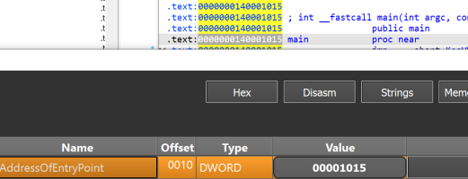
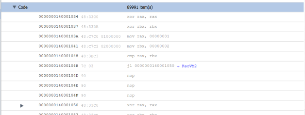
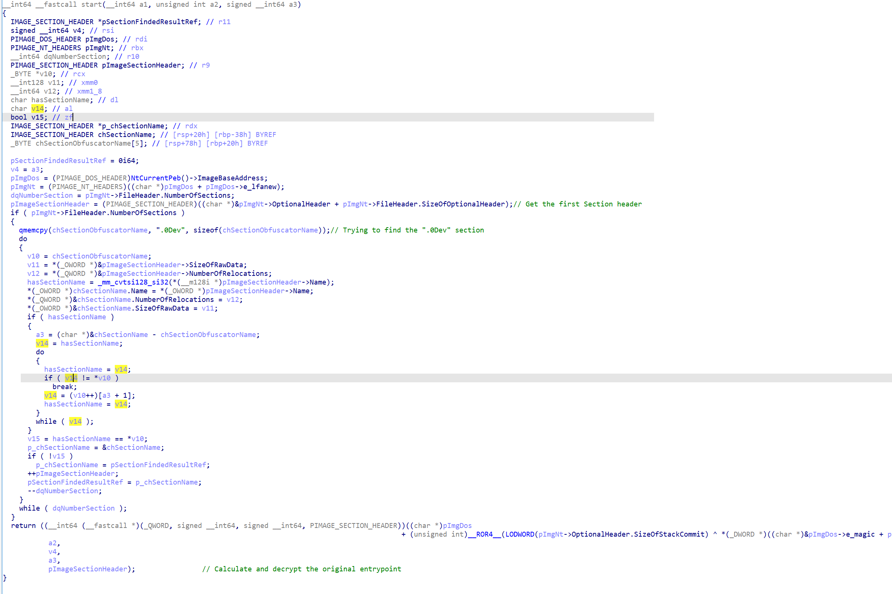
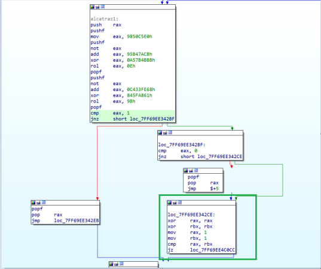
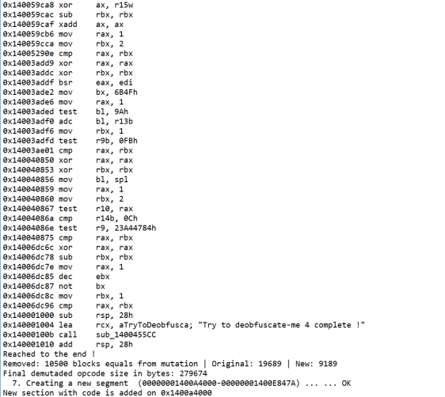
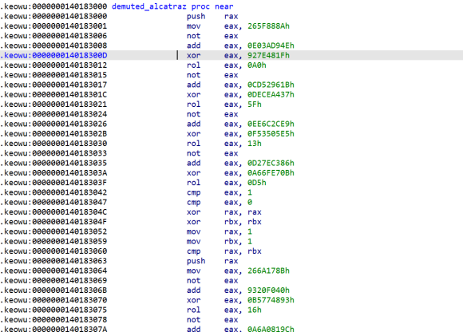
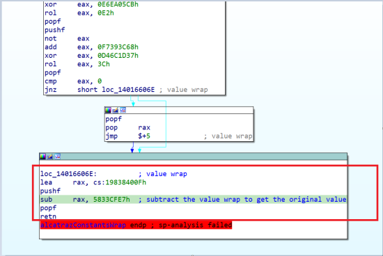

# Analyzing Mutation-Coded - VM Protect and Alcatraz

Author: João Vitor (@Keowu) - Security Researcher

## Introduction

This article aims only to illustrate some of the techniques used in code that has undergone mutation by some protector, be it commercial (as in the case of VM Protect) or Open Source (as in the case of Alcatraz). In addition to the resources offered by the code mutation of VM Protect and Alcatraz, I included my own obfuscated code, composed of assembly stubs forming a flow of several functions that separate the code through decision structures. Therefore, in addition to the techniques already offered by commercial protectors, we will explore our own employed techniques.

## Table of Contents
1. [Introduction](#Introduction)
2. [A short message before proceeding.](#a-short-message-before-proceeding)
3. [Preparing our binaries](#preparing-our-binaries)
4. [Analyzing techniques and mutation of VM Protect](#analyzing-techniques-and-mutation-of-vm-protect)
5. [Analyzing techniques and mutation of Alcatraz.](#analyzing-techniques-and-mutation-of-alcatraz)
6. [On the use of symbolic execution frameworks](#on-the-use-of-symbolic-execution-frameworks)
7. [Deobfuscating VM Protect Mutation](#deobfuscating-vm-protect-mutation)
8. [Deobfuscating Alcatraz](#deobfuscating-alcatraz)
9. [Conclusion](#conclusion)
10. [References](#references)

### A short message before proceeding.

After a long busy period, I have returned with apparently intact mental sanity, as everything indicates.


Well, I hope so. Finally, I managed to find some time to write an article (I actually really enjoy writing). I hope you enjoy reading it, especially my friends from Discord who were always looking for me and waiting for new posts. A hug to the Discord crew. See you again in a few months (or not, who knows, maybe I'll disappear and travel the world and applaud the sun to the sound of... [Forfun - O Viajante](https://www.youtube.com/watch?v=uy1U0DTHNEE), edit: listen after reading).

## Preparing our binaries

Let's prepare two different binaries from a main binary for our tests.

In this binary, I focused solely on using MASM in its creation to facilitate our work and learning. So, we won't rely, for example, on a CRT function (commonly generated in C/C++ or other languages). Therefore, directly, our "Main" will be our own entry point in this case. But don't make the mistake, as a beginner in reverse engineering, of thinking that both are the same because, in fact, they are not. A tip I give you is to compile several binaries in different languages and try to understand how the flow works from the entry point to the main function. After this explanation, I wrote a very simple stub a priori:

```c++

includelib ucrt.lib
includelib legacy_stdio_definitions.lib

extern printf: proc

.data

    msg db "Try to deobfuscate-me 4 complete !", 0

.code

printSomething proc

    sub rsp, 28h

    lea rcx, msg
    call printf

    add rsp, 28h
    ret
printSomething endp


main proc

    call printSomething

    ret
main endp

end
```

The code is quite simple and does not require much detailing; just know that we have a `main` (which, in this case, will be our entry point) and a function that prints a simple string to the console: "Try to deobfuscate-me 4 complete!"

Now, I'm going to complement the fun by using a simple Python script to generate 10 thousand procedures that make different decisions based on simple logic. At the end of all the generated conditions, there is a jump to the print address. Check out the source code below:

```python

def common_code():
    return "  xor rax, rax\n" \
           "  xor rbx, rbx\n" \
           "  mov rax, 1\n"

def keovmtype1(idx):
    assembly_code = f"KeoVM{idx} proc\n"
    assembly_code += common_code()
    assembly_code += "  mov rbx, 1\n"
    assembly_code += "  cmp rax, rbx\n"
    assembly_code += f" je KeoVM{idx+1}\n"
    assembly_code += " nop\n" * 3
    assembly_code += f"KeoVM{idx} endp\n\n"
    return assembly_code

def keovmtype2(idx):
    assembly_code = f"KeoVM{idx} proc\n"
    assembly_code += common_code()
    assembly_code += "  mov rbx, 2\n"
    assembly_code += "  cmp rax, rbx\n"
    assembly_code += f" jl KeoVM{idx+1}\n"
    assembly_code += " nop\n" * 3
    assembly_code += f"KeoVM{idx} endp\n\n"
    return assembly_code

def keovmtypeend(idx):
    return f"KeoVM{idx} proc\n" \
           "  nop\n" * 7 \
           "  jmp printSomething\n" \
           f"KeoVM{idx} endp\n\n"

MAX_VMS = 10_000
OUT_SCRIPT = ""

for i in range(MAX_VMS):
    if i == MAX_VMS-1:
        OUT_SCRIPT += keovmtypeend(i)
    elif i % 2 == 0:
        OUT_SCRIPT += keovmtype1(i)
    else:
        OUT_SCRIPT += keovmtype2(i)

print(OUT_SCRIPT)

```
Basically, the code will generate 10 thousand stubs, and at the end of all of them, that is, in the 9999th stub, a jump to the print function will be executed. A very simple code obfuscation algorithm, yet very functional to confuse and test the patience of anyone analyzing the assembly code. Clearly, this will become much more difficult and problematic when we add the code mutation offered by VM Protect and Alcatraz.

After adding the stubs and compiling, we will obtain the following result when opening it in IDA (and loading the PDB to facilitate visualization, just this once, okay):


As we can see, everything seems fine, and of course, as mentioned, our main (only in this specific case) will have the same address as the Entry Point:



With everything prepared, let's then protect our binary using the mutation and features offered by VM Protect and then the mutation and features offered by Alcatraz.

Starting with VM Protect, I will configure it to apply mutation to all functions of my application. Since we have about 10 thousand procedures and we are not, this time, following any standard alignment that delimits the beginning and end of them, VMProtect itself has the ability to determine all functions and apply mutation to both:


We can confirm that VMProtect correctly determined by expanding and observing the code tab:



After deactivating other protections (which are not so relevant in this case and this tutorial), we will have the binary ready for us to work with (KeowuFuscator.exe.vmp).

Now, let's do the same using Alcatraz; we will protect our PE binary and apply the mutation and protections provided by it. For this, we will simply open our test binary using "Alcatraz-gui.exe":


By default, Alcatraz already applies all available mutation options; we just need to click on the option to select all functions and simply generate our protected binary (KeowuFuscator.obf.exe).

## Analyzing techniques and mutation of VM Protect

Let's now analyze each technique applied by VMProtect. Initially, we'll just list the mutation added and try to identify some patterns to understand how they are done so that we can start writing a deobfuscator for each of them later.

Let's look at our binary that is using our simple control flow obfuscation, generating an execution flow graph using IDA itself (via scripting):


This is the complete execution flow we generated using the script. Wait, please.


Wait, do you only see a black line?! So do I, lmao.

Let's zoom in on this flow graph, and it will make more sense in what we're visualizing here:


Now, much better. We can clearly see each routine and the sequence they follow in the original flow. Basically, these are the procedures executed in each of the 10 thousand procedures we included in our manual control flow obfuscator. In green, we have the "EntryPoint", so we have a complete execution flow from there.


Well, after our little shock with the size, let's start by looking at the VmProtect mutation techniques; beforehand, they are quite simple to understand.

VmProtect mutation has numerous tricks, from junk code (which is the most applied because, in theory, it is the most stable to be used by VmProtect) to CFF (Control Flow Flattening), but it is quite limited, so we use ours, since VmProtect's is very similar to the one presented, and misalignments (mostly applied before virtualized code dispatchers).

When we analyze the instructions generated by VmProtect in our protected binary, the first thing we can observe is the amount of junk code added to it. VmProtect uses instructions not commonly used and, mostly, bit manipulation, as well as registers not used by the original code. VmProtect's "analysis heuristics" are smart enough not to break the original flow and still add a new confusion logic.

Let's take a routine from our original program and compare it to the result generated by VmProtect:


As we can see, our original assembly was indeed distorted; however, the core logic remains the same. We can still achieve the same result when executing. Let's do a simple cleanup of the vmprotect instructions and identify which ones can be removed and which should be kept without altering the execution flow. You will understand why this is important later on.

Analyzing, I have come to the following conclusion:


- In red, we have mnemonics or registers that are not part of the original control flow of the procedure, and we can remove them based on the mnemonics or the register used.

- In green, these are procedures that make no difference whether they are present or not, or that IDA's analysis engine itself will ignore, becoming irrelevant in the context of analysis (thanks to dead code elimination).

If we apply the changes, we get the following result:

```C++
xor rax, rax
sub rbx, rbx
mov rax, 1
or bx, bp
mov rbx, 2
cmp rax, rbx
jl next_code_block
```

The logic is practically the same, and we can understand how the mutation behaves, how it occurred, and how to eliminate it manually. We will automate this using the script later in this article. I advanced the analysis of a few more procedures and identified points where they repeated. I have reached the following conclusion to remove and clean the original code flow.

The mutation applied in this binary uses the following mnemonics (which are part of the scope of mnemonics commonly used by VmProtect mutation):

```
bt
bts
btc
movzx
sar
cmovs
or
stc
clc
cdqe
cmovp
shr
shl
sbb
rcr
sal
rcl
cmc
and
movsx
bsf
movsxd
cbw
```

The following registers are not part of the original flow and can be removed:

```
DIL
SIL
SPL
BP
R9
R10
R11
R13
R14
R15
```

After identifying this information, we already have enough data to write an automated deobfuscator later.

We can observe some steps to tackle VmProtect mutation and counteract the junk code inserted by it:

1. Find the registers that were used and do not affect the control flow.

2. Find the useless mnemonics used (these mnemonics are standardized), meaning VmProtect will always repeat their use in various functions and they are always related to bit and flag manipulation.

3. Write a script to interpret and remove all of this, cleaning and making the code more "understandable," and allowing IDA's "dead code" removal heuristic to handle the rest.

4. Analyze the code as desired.

Finally, let's see how the pseudo-code looks after the applied obfuscation (we will make a new comparison at the end of the complete binary de-mutation/de-obfuscation):


## Analyzing techniques and mutation of Alcatraz.

Let's now analyze each technique applied by Alcatraz to the binaries protected by it. We will list patterns and logic so that we can write a script to completely deobfuscate it.

In this case, I will not generate a control flow graph. Let's go straight to analyzing the changes that we were able to observe right in the EntryPoint stub of our binary:


We can observe that our stub is indeed different, nothing like the old instruction "jmp KeoVM0" that we had to go to the beginning of our obfuscation control flow chain.

This routine is responsible for decrypting our original entry point and only then initiating the execution of the original code with the obfuscation, in summary, where our "jmp KeoVM0" will occur. I analyzed the code and recovered the logic for it:



The routine obtains the base image from the PEB and then analyzes the IMAGE_DOS_HEADER and IMAGE_NT_HEADERS headers and makes a call to IMAGE_FIRST_SECTION using the IMAGE_NT_HEADERS reference to obtain the address of the first section, to then search for the ".0Dev" section, a section added by the obfuscator itself to store the stubs that could not be stored in the ".text" section. The idea is quite creative. Using the value of the "VirtualAddress" field to be part of the decryption algorithm of the original entry point. This works incredibly well, given that the obfuscator can control the address as desired, as long as, of course, it is not used by another section.

In this way, we know exactly what happens and how we can automate the process to recover the entry point using our script. Of all that has been said, the most important part is the following algorithm that we will use in the deobfuscator:

```c++
  return ((__int64 (__fastcall *)(_QWORD, signed __int64, signed __int64, PIMAGE_SECTION_HEADER))((char *)pImgDos + (unsigned int)__ROR4__(LODWORD(pImgNt->OptionalHeader.SizeOfStackCommit) ^ *(_DWORD *)((char *)&pImgDos->e_magic + pSectionFindedResultRef->VirtualAddress), pImgNt->FileHeader.TimeDateStamp)))(
           arg1,
           arg2,
           arg3,
           pImageSectionHeader);
```

The final logic for decryption uses the value of SizeOfStackCommit performing an XOR operation with the value of the virtual address of the ".0Dev" section and then performing a ROR4 with the timestamp number of the PE header. The value is then interpreted as an address and the execution is redirected along with the original arguments (then our original routine starts).

Let's now analyze the other techniques added by Alcatraz, such as junk code and Control Flow Flattening. After manually recovering the original entry point to be able to correct IDA, I generated a flow graph of the binary execution and obtained the following result:


Well, I believe that compared to VmProtect and our original execution flow, we had many changes.


However, calm down, not all is lost, let's understand what's happening here. What Alcatraz did to our binary. Perhaps there's a logic behind it that we can use to get our original binary back.

I've separated a simple stub for us to look at the added patterns. First, let's observe the junk code, then the CFF:


When we observe the new code added by Alcatraz, we can easily identify the pattern it added, which repeats at least twice per stub:

```c++
  pushf ; Store the flags
  not eax
  add eax, SOME_IMM
  xor eax, SOME_IMM
  rol eax, SOME_IMM
  popf ; Restore the flags
```

Advancing a bit further, it's possible to notice that the pattern repeats in other procedures, following the same flow:


If we look for our original routines, we can find them right after the branch, always in the "true" and "false" pattern, with a jump of +5 bytes from the current address, in an indirect manner:



Advancing the analysis, this same pattern repeats in all procedures, meaning the same logic only altering the values used in the immediate values of the mnemonics.

Besides this Control Flow Flattening applied by Alcatraz following a pattern, another technique is also applied in the binary, which is the obfuscation of constants.


The procedure "alcatrazConstantsWrap" is responsible for "decrypting" the address of the constant to be used by the printf function below. Let's examine its logic:


A mnemonic "lea" retrieves the address of the constant and then subtracts a value from rax to obtain the correct address of the string constant to only then use it in "printf".

Let's visualize how our pseudo-code currently looks without deobfuscating it:


Well, I think that's it. We've identified all the techniques applied by the two tools in our binary, and now we're going to start deobfuscating our binaries.


## On the use of symbolic execution frameworks

The purpose of this article is to explain how we can manually deobfuscate binaries, especially for those curious to learn about the subject. I will not use, at least in this article, any symbolic execution framework. We will do everything manually. But that doesn't mean I won't bring new articles with worse obfuscators and much worse logics to find patterns, using symbolic execution to solve them.

## Deobfuscating VM Protect Mutation

Let's start our adventures with VmProtect. I will set some goals here that we should accomplish by the end of this topic:

1. Deobfuscate our own Control Flow Flattening that we have added.
2. Remove all mutation added by VmProtect (based on the logic we have identified).
3. We will analyze identical opcodes in each stub on a list, identifying identical stubs, and removing useless and repeated code added by us and VmProtect (significantly reducing the size of opcodes in the new section).
4. We will add a new section in the binary to receive the deobfuscated source code so that we will have corrected, functional, and analyzable code.

Firstly, let's start by obtaining the jumps that always occur in our graph flow, from our pattern of jumps inserted by our stub generator. I have generated a constant list with each of the sequence possibilities that our analysis may have:

```python
#Common branchs used by KeoVM
branchs = [ idaapi.NN_jmp, idaapi.NN_jz, idaapi.NN_jl ]
```
When our interpreter encounters any of these mnemonics, we will automatically follow the associated address to track the program flow.

Next, we will create a second constant to store all the junkcode instructions from VmProtect mutation, along with the registers that are not part of the original program logic:

```python
#Common menemonics used by the vmprotect mutation
vmprotect_operands = [ idaapi.NN_neg, idaapi.NN_btr, idaapi.NN_cmovbe, idaapi.NN_bt, idaapi.NN_bts, idaapi.NN_btc, idaapi.NN_movzx, idaapi.NN_sar, idaapi.NN_cmovs, idaapi.NN_or, idaapi.NN_stc, idaapi.NN_clc, idaapi.NN_cdqe, idaapi.NN_cmovp, idaapi.NN_shr, idaapi.NN_shl, idaapi.NN_sbb, idaapi.NN_rcr, idaapi.NN_sal, idaapi.NN_rcl, idaapi.NN_cmc, idaapi.NN_and, idaapi.NN_movsx, idaapi.NN_bsf, idaapi.NN_movsxd, idaapi.NN_cbw ]

#Common regs that not make part of the original program logic
vmprotect_mutation_regs = [ 24, 27, 26, 5, 9, 10, 11, 13, 14, 15 ] # 24 = R_spl, 27 = R_dil, 26 = R_sil, 5 = R_bp, 9 = R_r9, 10 = R_r10, 11 = R_r11, 13 = R_r13, 14 = R_r14, 15 = R_r15
```

In addition to these constant lists, I will also initiate a bytearray to store our corrected new opcode, so we can copy it to another section that we create, along with declaring a list where each stub and its respective opcodes will be stored:

```python
inst_code = bytearray()
inst_code_block = []
```

Let's start writing our interpreter. I'll take as an initial starting point the first "jmp keovm1" which marks the beginning of our mutated stubs. And for each identified pattern, we'll replace the opcode with 0x90 (NOP mnemonic). All of this repeating for the number of bytes in the disassembly view, considering each branch and following the addresses in case of "true" for each of them until we find the final graph. And, of course, we'll filter out the NOP mnemonics so they don't go into our stub opcode list.

```python
def vmp_mutation_analyser():

	bFound = True
	temporary_block = bytearray()

	ea = idaapi.get_screen_ea()
	
	while True:
		inst = idautils.DecodeInstruction(ea)
		
		if not inst:
			break
		
		if bFound:
			bFound = False
			inst_code_block.append(temporary_block)
			temporary_block = []
	
		if inst.itype in branchs:
			ea = inst[0].addr
			bFound = True
			continue
			
		if inst.itype == idaapi.NN_retn:
			# saving the last block
			temporary_block.extend(idc.get_bytes(ea, inst.size))
			inst_code_block.append(temporary_block)
			break
			
		if inst.itype in vmprotect_operands:
			for i in range(inst.size):
				idaapi.patch_byte(ea+i, 0x90)
			continue
			
		if inst[0].reg in vmprotect_mutation_regs and inst[1].reg in vmprotect_mutation_regs:
			for i in range(inst.size):
				idaapi.patch_byte(ea+i, 0x90)
			continue
		
		# Nop opcode remove from blocks
		if inst.itype == idaapi.NN_nop:
			ea += inst.size
			continue

		temporary_block.extend(idc.get_bytes(ea, inst.size))
	
		print(hex(ea) + " " + idc.GetDisasm(ea))
		
		ea += inst.size
```

After execution, we will have corrected the entire disassembler. And in our "inst_code_block" list, we will have each stub with its respective opcodes. Now let's filter and eliminate identical code. The code below is responsible for removing duplicate code from our list (for optimization), as well as preparing "inst_code" to receive the newly optimized opcodes:

```python
def search_in_list(index, block_to_find):
	for i, block in enumerate(inst_code_block):
	   if block_to_find == block and len(block_to_find) == len(block) and i != index:
		   return i
	return -1

def replace_invalid_opcode_blocks():
	
	removed_count = 0
	before_block_sizes = len(inst_code_block)
	for i, block in enumerate(inst_code_block):
	   
		while True:
			index_to_remove = search_in_list(i, block)
			if index_to_remove == -1: break # no are more blocks equal to remove
			del inst_code_block[index_to_remove]
			removed_count += 1
		
	print(f"Removed: {removed_count} blocks equals from mutation | Original: {before_block_sizes} | New: {len(inst_code_block)}")

	# Save our new data lmao
	for block in inst_code_block:
		inst_code.extend(block)
		
	print(f"Final demutaded opcode size in bytes: {len(inst_code)}")
```

After all, all we have to do is add a new section to our analysis database with the opcodes we have corrected in our global bytearray "inst_code". I created the code below to streamline the process, getting everything ready for analysis, and basically it obtains the last section of the binary and adds a new one, properly calculating its size and, in the end, providing the address of our entry point for the deobfuscated code:

```python
def populate_segment():

    seg = idaapi.get_last_seg()

    if seg:

        if idaapi.add_segm(0x00, seg.end_ea, seg.end_ea+len(inst_code), ".keowu", "CODE", 0):
            seg = idaapi.get_last_seg()
            idc.set_segm_attr(seg.start_ea, idc.SEGATTR_PERM, idaapi.SEGPERM_MAXVAL)
            idc.set_segm_attr(seg.start_ea, idc.SEGATTR_ALIGN, idaapi.saRelPara)
            idaapi.set_segm_addressing(seg, 2) # 2 means 64-bits
            ida_bytes.patch_bytes(seg.start_ea, bytes(inst_code))
            print(f"New section with code is added on 0x{seg.start_ea:x}")
```

Before running our script and seeing our result, I remind you, reader, about the importance of making a simple configuration in your IDA so that you can display, in this example of our article, more than 64 graph nodes in IDA. By default, IDA limits the number of graphs, but we can easily reconfigure this in the "hexrays.cfg" file. I particularly recommend 4096 as a good default value.

When running the script, we obtain a trace of all the "instructions" already corrected and, in the end, the address of the new section added, as well as the configuration tip.



Notice that in some points, we still have some remnants of the VmProtect mutation and even from our old branches. But don't worry. Let IDA itself do the hard work and clean all of this up using the "dead-code remove" technology. When we look again and generate a complete decompilation of the previously mutated code, we'll see the great difference/magic of our adventure.


Our reaction:


Indeed, our effort has yielded results, and we have obtained a completely demutated code. If we compare the before and after, the difference is enormous. Let's recap:

**Before demutation:**


**After demutation:**


We have learned a lot so far, but our adventure is not over yet. Let's move forward and do the same with Alcatraz.

## Deobfuscating Alcatraz

Let's now begin our deobfuscation studies with Alcatraz. Similarly to VmProtect, I will break down into steps what will be done to remove the obfuscation of Alcatraz. In advance, it is much more complex, but I believe we will be fine by following our steps.

1. We will create a script to deobfuscate and find the original entry point replaced by Alcatraz's stub so that we can find the real code.
2. First, we will deobfuscate our own control flows combined with the control flows that were also added by Alcatraz, based on the pattern we discovered in them.
3. We will clean up all the mutation added by Alcatraz by analyzing its opcodes and clearing them in a way that is clear and dead code removed from IDA can handle the rest.
4. We will add a new section in the binary to receive the new code we have deobfuscated, so that we have functional and, most importantly, analyzable code.
5. We will deobfuscate strings and constants and fix the offsets based on the preliminary analysis of the obfuscator.

Initially, we will create our script to deobfuscate the original program entry point, replicating the operation of Alcatraz's entry point decryption stub.

As we explained above, all the core logic to resolve the correct entry point address boils down to just this excerpt:

```c++
  return ((__int64 (__fastcall *)(_QWORD, signed __int64, signed __int64, PIMAGE_SECTION_HEADER))((char *)pImgDos + (unsigned int)__ROR4__(LODWORD(pImgNt->OptionalHeader.SizeOfStackCommit) ^ *(_DWORD *)((char *)&pImgDos->e_magic + pSectionFindedResultRef->VirtualAddress), pImgNt->FileHeader.TimeDateStamp)))(
           arg1,
           arg2,
           arg3,
           pImageSectionHeader);
```

The only thing we need to do is find the section '.0Dev' to retrieve the 'VirtualAddress' field and use it in the algorithm to decrypt the address. Therefore, I rewrote and obtained the following result as the first part of our deobfuscator:

```python
def __ROL__(value, count):

    nbits = 8 * value.bit_length()
 
    if count > 0:
        count %= nbits
        high = value >> (nbits - count)
        if value < 0:  # Valor assinado
            high &= ~((1 << count) - 1)
        value = (value << count) & (2 ** nbits - 1)  # Para ter certeza do wrapper equivalente
        value |= high
    else:
        count = -count % nbits
        low = value << (nbits - count)
        value >>= count
        value |= low
 
    return value
    
def __ROR4__(value, count):
    return (__ROL__(value & 0xFFFFFFFF, -count) & 0xFFFF000000000000000000000000) >> 96

def decrypt_original_entry_point():
    pe = pefile.PE(idaapi.get_input_file_path())
    
    section_virtual_address = 0
    
    for section in pe.sections:
        if ".0Dev" in section.Name.decode('utf-8'):
            section_virtual_address = section.VirtualAddress
            break
    
    entry_point = int.from_bytes(idaapi.get_bytes(idaapi.get_imagebase() + section_virtual_address, 4), 'little')
    entry_point ^= pe.OPTIONAL_HEADER.SizeOfStackCommit
    entry_point = __ROR4__(entry_point, pe.FILE_HEADER.TimeDateStamp)
    entry_point += idaapi.get_imagebase()
    print(f"Decrypted EntryPoint: 0x{entry_point:x}")     
```

In general, we replicated the same logic used by Alcatraz to deobfuscate the entrypoint. We found the section, retrieved the VirtualAddress field, and then replicated the decryption algorithm. In the end, we printed the true address of the entrypoint. Let's see it in action:


We are making progress! Let's continue on our mission to completely deobfuscate, continuing with our steps.

Now, we will address our own control flow, combined with Alcatraz. In our obfuscator analysis step, we identified that there was a logic in the flow that was always true, and we could simply simulate the flow to reproduce the original code execution. That's exactly what we're going to do. Of course, we'll clean up everything along the way, extract the opcodes, and fix them so that we can add them to a new section later for further analysis.

Let's get started. Initially, I added a global list to store our mnemonics for the branches used by Alcatraz, in addition to our own flow control obfuscation.

```python
branch_menemonics = [ idaapi.NN_jmp, idaapi.NN_jnz, idaapi.NN_jl, idaapi.NN_jz ]
```

I also created a global bytearray to store our new corrected opcodes:

```python
inst_code = bytearray()
```

Let's then apply the logic to resolve the control flow until we find the last block, applying patches to the patterns used by Alcatraz to add useless code to it. I reached the following result, which I will explain next:

```python
def alcatraz_flow_obfuscation_analyser():

    ea = idaapi.get_screen_ea()
    
    remove_junk_code_begin = False
    addr_begin_junk_code = 0
    
    while True:
        inst = idautils.DecodeInstruction(ea)
        
        if not inst: break
        
        if inst.itype in branch_menemonics:
            ea = inst[0].addr
            continue
            
        if inst.itype == idaapi.NN_pushf:
            if not remove_junk_code_begin:
                remove_junk_code_begin = True
                addr_begin_junk_code = ea
            ea += inst.size
            continue
        
        if inst.itype == idaapi.NN_popf:
            remove_junk_code_begin = False 
            size = (ea - addr_begin_junk_code) + inst.size
            ida_bytes.patch_bytes(addr_begin_junk_code, bytes(bytearray(b"\x90" * size)))
            ea += inst.size
            continue
        
        if inst.itype == idaapi.NN_retn:
            break
        
        ida_bytes.del_items(ea)
        
        inst_code.extend(idc.get_bytes(ea, inst.size))

        print(hex(ea) + " " + idc.GetDisasm(ea))
        
        ea += inst.size
```

The script resolves each jump individually, advancing to the next blocks while encountering the standard junk code added by Alcatraz and removes them. Additionally, of course, it adds the new opcode with the unified original flow and without the junk code, in a way that IDA and its dead code analysis can handle and generate much easier and cleaner code for analysis. After this, we write the contents of our new opcodes present in inst_code to a new section of the analysis database:

```python
def populate_segment():

	seg = idaapi.get_last_seg()
	if seg:
		if idaapi.add_segm(0x00, seg.end_ea, seg.end_ea+len(inst_code), ".keowu", "CODE", 0):
			seg = idaapi.get_last_seg()
			idc.set_segm_attr(seg.start_ea, idc.SEGATTR_PERM, idaapi.SEGPERM_MAXVAL)
			idc.set_segm_attr(seg.start_ea, idc.SEGATTR_ALIGN, idaapi.saRelPara)
			idaapi.set_segm_addressing(seg, 2) # 2 mens 64-bits
			ida_bytes.patch_bytes(seg.start_ea, bytes(inst_code))
			print(f"New section with code is added on 0x{seg.start_ea:x}")
```

Let's decrypt the entrypoint address, position our cursor at the correct address, which is the beginning of all blocks of the flow graph, and finally, execute our script to see the result we obtained with our deobfuscation:


As a quick explanation: we noticed that in some parts the assembly code did not come through, code that was not analyzed by IDA due to the massive amount of control flow blocks. However, our script was able to analyze and solve this problem. ":: address -> address | bytes: x" represents the identified junk code and the number of bytes that were removed until we reached the final block. And finally, we obtain our address with our new analyzable and corrected code, let's go to it to see our new result.



Notice that we still have a bit of dead code, but don't worry, we've eliminated the vast majority of it. Additionally, we removed all invalid control flow. IDA will take care of this small remaining junk code with its analysis technology. But anyway, let's generate our pseudocode to see how our binary looks without Alcatraz:


Our reaction to this progress:


But wait, we still have one last technique to address, Alcatraz's constant obfuscation technique, which we've also discussed earlier in the topic where we explained how Alcatraz's protection works.

Alcatraz adds wrapper procedures in the code to retrieve the address of a constant or retrieve its value:


Podemos recuperar facilmente a informação do wrapper observando o retorno em rax:



The resolution in the script ended up like this:

```python
def unwrap_constants():

    ea = idaapi.get_screen_ea()

    possible_reference = []

    while True:

        inst = idautils.DecodeInstruction(ea)

        if not inst: break

        if inst.itype == idaapi.NN_call:
            ea = inst[0].addr
            continue

        """
            Finding the pattern:
                lea rax, cs:SOMEADDRESS
                pushf
                sub rax, imm
                popf
                ret
        """
        if inst.itype == idaapi.NN_lea:
            if inst[0].reg == 0: #R_ax

                possible_wrapped_value = inst[1].addr
                ea += inst.size
                inst = idautils.DecodeInstruction(ea)

                if inst.itype == idaapi.NN_pushf:
                    ea += inst.size
                    inst = idautils.DecodeInstruction(ea)

                    if inst.itype == idaapi.NN_sub:
                        possible_wrapped_value -= inst[1].value
                        print(f"Possible return value unwraped: 0x{possible_wrapped_value:x}")
                        possible_reference.append(possible_wrapped_value)

        if inst.itype == idaapi.NN_retn:
            idc.set_cmt(idaapi.get_screen_ea(), f"RAX = 0x{possible_reference[0]:x}", False)
            break
        
        ea += inst.size    
    
    print(f"Ended. All list with all possible return address unwraped: {possible_reference}")
```

We managed to recover the original values by unwrapping the added obfuscation.


Finally, let's compare the before and after of our Alcatraz deobfuscation.

**Before the demutation:**


**After the demutation:**


Finally, we can declare that we have fulfilled our mission with Alcatraz and have achieved the expected objective.


## Conclusion

In this article, we explored various techniques used by commercial and open-source obfuscators, and, of course, we created our own control flow obfuscator and gained some understanding of the CRT compiler. Additionally, we fought against obfuscators with the aim of deobfuscating them and obtaining analyzable code, learning a lot along the way. I hope this article turned out interesting. See you in the next ones, if I feel like continuing to write for the Discord folks, who are the only ones reading my articles.


## References

VM Protect. [S. l.], 20 jan. 2024. Disponível em: https://vmpsoft.com. Acesso em: 20 jan. 2024.

ALCATRAZ. [S. l.], 14 jul. 2023. Disponível em: https://github.com/weak1337/Alcatraz. Acesso em: 20 jan. 2024.

QUICK look around VMP 3.x - Part 2 : Code Mutation. [S. l.], 26 jan. 2021. Disponível em: https://whereisr0da.github.io/blog/posts/2021-01-26-vmp-2/. Acesso em: 20 jan. 2024.