# Analisando códigos com mutação - VM Protect e Alcatraz

Author: João Vitor (@Keowu) - Security Researcher

## Introdução

Este artigo visa apenas ilustar algumas das técnicas utilizadas em códigos que sofreram mutação por algum protector sendo ele comercial(como no caso do VM Protect) ou OpenSource(como no caso do Alcatraz). Neste artigo além dos recursos oferecidos pela mutação de código do Vm Protect e Alcatraz eu incluí meu proprio código ofuscado que é composto por stub's de assembly formando um fluxo de diversas funções que separam o código através de estruturas de decisão, então além das técnicas já oferecidas pelos protectors comerciais vamos resolver as nossas próprias técnicas empregadas.

### Uma pequena mensagem antes de prosseguir

Após um longo tempo ocupado, eu voltei, com a sanidade mental intacta ao que tudo indica.


Bom assim eu espero. finalmente consegui um tempo para escrever um artigo(eu de fato gosto muito de escrever) espero que você aprecie a leitura(principalmente aos amigos do Discord que sempre estavam a me procurar e esperar novos posts). Um Abraço a galera do Discord. nos vemos daqui a alguns meses novamente(ou não, quem sabe eu suma e vá viajar o mundo e aplaudir o sol ao som de [Forfun-O Viajante](https://www.youtube.com/watch?v=uy1U0DTHNEE), edit: ouve depois de ler).

## Preparando nossos binários

Vamos preparar dois binários diferentes a partir de um binário principal para nossos testes.

Nesse binário eu foquei em apenas utilizar masm em sua criação para facilitarmos nosso trabalho e aprendizado. então não contaremos por exemplo com uma função CRT(comumemente gerado em linguagens C/C++ ou outras), então de maneira direta nosso "Main" sera nosso próprio entrypoint nesse caso, mas não cometa o erro como iniciante em engenharia reversa de achar que ambos são iguais porque de fato não são e uma dica que eu dou é que você compile diversos binários em linguagens diferentes e tente entender como funciona o fluxo do entrypoint até a função main. após essa explicação escrevi um stub muito simples a priore:

```c++

includelib ucrt.lib
includelib legacy_stdio_definitions.lib

extern printf: proc

.data

    msg db "Try to deobfuscate-me 4 complete !", 0

.code

printSomething proc

    sub rsp, 28h

    lea rcx, msg
    call printf

    add rsp, 28h
    ret
printSomething endp


main proc

    call printSomething

    ret
main endp

end
```

O código é bem simples e não requer muito detalhamento, apena saiba que temos uma main(que nesse caso vai ser nosso entrypoint) e uma função que printa uma simples string no console "Try to deobfuscate-me 4 complete !".

Agora vou complementar a brincadeira utilizando um script python simples para gerar 10 mil procedimentos que tomam decisão diferentes com base em uma lógica simpes e ao final de todas as condições geradas um salto até o endereço para printar ocorre, confira o código fonte abaixo:

```python

def common_code():
    return "  xor rax, rax\n" \
           "  xor rbx, rbx\n" \
           "  mov rax, 1\n"

def keovmtype1(idx):
    assembly_code = f"KeoVM{idx} proc\n"
    assembly_code += common_code()
    assembly_code += "  mov rbx, 1\n"
    assembly_code += "  cmp rax, rbx\n"
    assembly_code += f" je KeoVM{idx+1}\n"
    assembly_code += " nop\n" * 3
    assembly_code += f"KeoVM{idx} endp\n\n"
    return assembly_code

def keovmtype2(idx):
    assembly_code = f"KeoVM{idx} proc\n"
    assembly_code += common_code()
    assembly_code += "  mov rbx, 2\n"
    assembly_code += "  cmp rax, rbx\n"
    assembly_code += f" jl KeoVM{idx+1}\n"
    assembly_code += " nop\n" * 3
    assembly_code += f"KeoVM{idx} endp\n\n"
    return assembly_code

def keovmtypeend(idx):
    return f"KeoVM{idx} proc\n" \
           "  nop\n" * 7 \
           "  jmp printSomething\n" \
           f"KeoVM{idx} endp\n\n"

MAX_VMS = 10_000
OUT_SCRIPT = ""

for i in range(MAX_VMS):
    if i == MAX_VMS-1:
        OUT_SCRIPT += keovmtypeend(i)
    elif i % 2 == 0:
        OUT_SCRIPT += keovmtype1(i)
    else:
        OUT_SCRIPT += keovmtype2(i)

print(OUT_SCRIPT)

```
Basicamente o código vai gerar 10 mil stubs e ao final de todas elas ou seja na 9999 stub um salto para a função de print vai ser efetuado, um algoritmo bem simples de ofuscação de código porem muito funcional para confundir e tirar a paciência de quem estiver analisando o código assembly e claramente isso se tornara muito mais dificultoso e problemático quando adicionarmos a mutação de código oferecidas pelo Vm Protect e Alcatraz.

Após adicionarmos as stubs e compilarmos obteremos o seguinte resultado ao abrir no IDA(e carregar o PDB para facilitar a visualização, apenas dessa vez, ok):


Como podemos ver tudo parece bem, e claro, como mencionado nosso main(apenas nesse caso específico) tera o mesmo endereço do Entry Point:


Com tudo preparado vamos então proteger nosso binário usando a mutação e recursos oferecidos pelo Vm Protect e em seguida a Mutação e recursos oferecidos pelo Alcatraz.

Começando pelo VM Protect vou configurar de forma para aplicar a mutação em todas as funções da minha aplicação. como temos cerca de 10 mil procedimentos e não estamos dessa vez seguindo nenhum alinhamento padrão que delimitem o início e o fim delas. o vmprotect por sí próprio possui a capacidade para determinar todas as funções e aplicar a mutação em ambas:

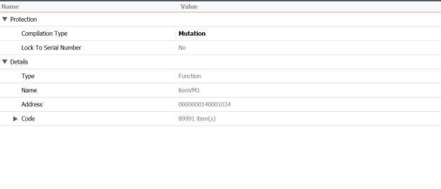

Podemos confirmar que o vmprotect determinou corretamente expandindo e observando a guia code:


Após desativar outras proteções(nesse caso e neste tutorial não tão relevantes), ao final de tudo teremos o binário pronto para trabalharmos (KeowuFuscator.exe.vmp).

Vamos agora fazer o mesmo usando o Alcatraz, vamos proteger nosso binário PE, e aplicar a mutação e proteções fornecidas por ele, para isso vamos simplesmente abrir nosso binário de testes usando o "Alcatraz-gui.exe":

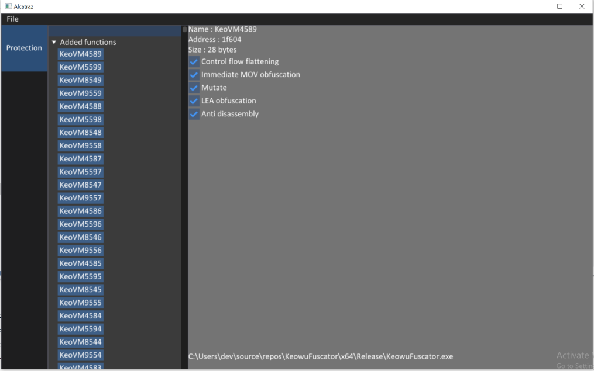

Por padrão o Alcatraz já aplica todas as opções de mutação disponíveis, basta apenas clicarmos na opção para selecionar todas as funções e simplesmente gerar nosso binário protegido (KeowuFuscator.obf.exe).

## Analisando técnicas e mutação do VM Protect

Vamos agora analisar cada técnica aplicada pelo VmProtect. a primeiro momento vamos apenas elencar qual foi a mutação adicionada e vamos tentar identificar algumas lógicas para entender como são feitas para logo a diante começarmos a escrever um desofuscador para cada uma delas.

Vamos olhar para nosso binário que esta utilizando nossa obfuscação control flow simples gerando um flow graph de sua execução usando o proprio IDA(via scripting):


Esse é o fluxo completo da execução que geramos usando o script. calma espere. 

Espere, você só enxerga um traço preto ?! Eu também hehe.

Vamos aproximar esse flow graph e fara mais sentido no que estamos visualizando aqui:

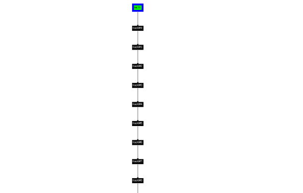

Agora sim, bem melhor conseguimos visualizar cada rotina e a execução que elas seguem no fluxo original. bom é basicamente estes os procedimentos executados em cada um dos 10 mil procedimentos que inserimos no nosso ofuscador manual de fluxo de controle. em verde representa o "EntryPoint" então temos um fluxo completo de execução a partir dele.


Bem, após nosso pequeno choque com o tamanho, Vamos iniciar olhando as técnicas de mutação do VmProtect de antemão elas são bem simples de se compreender.

A mutação do vmprotect tem inumeros truques desde junkcode(que é o mais aplicado por ser em teoria o mais estável para ser utilizado pelo VmProtect) até CFF(Control flow, mas é bem limitado, por isso utilizamos o nosso já que o do vmprotect é bem semelhante ao apresentado) e desalinhamentos(em sua maioria aplicada antes dos dispatchers de código virtualizado).

Quando pegamos para analisar as instruções geradas pelo VmProtect em nosso binário protegido a primeira coisa que conseguimos observar é a quantidade de junkcode adicionado nele, o VmProtect usa instruções não comumente utilizadas e em sua maioria de manipulação de bits bem como registradores não utilizados pelo código original, a "heurística de analise" do VmProtect é inteligente o suficiente para não quebrar o flow original e ainda adicionar uma nova lógica de confusão.

Vamos pegar uma rotina do nosso programa original e comparar com o resultado gerado pelo VmProtect:

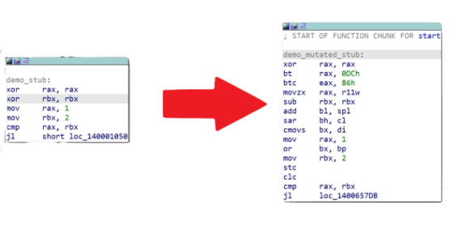

Como podemos ver nosso assembly original foi de fato deturpado, porem a lógica central continua a mesma. ainda conseguimos obter o mesmo resultado ao executar. vamos fazer uma limpeza simples nas instrução do vmprotect e identificar quais podem ser removidas e quais devem ser mantidas sem alterar o fluxo de execução, você entendera o porque disso ser importante mais a frente.

Analisando cheguei na seguinte conclusão:

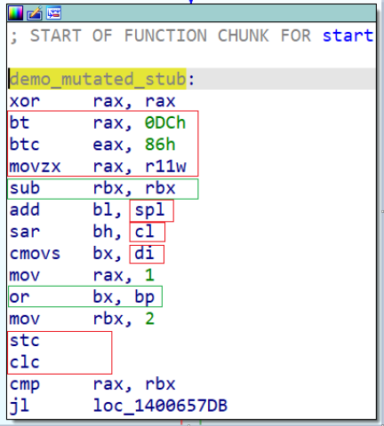

- Em vermelho temos mnemônicos ou registradores que não fazem parte do fluxo de controle original do procedimento e podemos remover com base no mnemônicos ou com base no registrador utilizado.

- Em verde são procedimentos que não fazem diferença estarem ou não presentes. ou, que a propria engine de analise do IDA vai ignorar se tornando irrelevante no contexto da analise(graças ao deadcode elimination).

Se aplicarmos as mudanças conseguimos o seguinte resultado:

```C++
xor rax, rax
sub rbx, rbx
mov rax, 1
or bx, bp
mov rbx, 2
cmp rax, rbx
jl next_code_block
```

A lógica é praticamente a mesma. e conseguimos entender como a mutação se comporta e como aconteceu e como eliminar manualmente. automatizaremos isso utilizando o script mais adiante nesse artigo. adiantei um pouco a analise de mais alguns procedimentos e identifiquei pontos que eles se repetiam e cheguei na seguinte conclusão para remover e limpar o flow original do código:

A mutação aplicada nesse binário utiliza os seguintes menemonicos(que fazem parte do escopo de menemonicos comumente utilizados pela mutação do VmProtect):

```
bt
bts
btc
movzx
sar
cmovs
or
stc
clc
cdqe
cmovp
shr
shl
sbb
rcr
sal
rcl
cmc
and
movsx
bsf
movsxd
cbw
```

Os seguintes registradores não fazem parte do fluxo original e podem ser removidos:

```
DIL
SIL
SPL
BP
R9
R10
R11
R13
R14
R15
```

Após indentificar essas informações já temos informações suficientes para escrever um desofuscador automatizado mais tarde.

Podemos observar alguns steps para enfrentar a mutação do VmProtect para agir contra o junkcode inserido por ele:

1. Encontrar os registradores que foram utilizado, e não fazem diferença no control flow

2. Encontrar os menemonicos inúteis utilizados(esses manemonicos são padronizados) ou seja o VmProtect sempre vai repetir o uso deles em diversas funções e sempre estão relacionado a manipulação de bits e flags.

3. Escrever um script para interpretar e remover tudo isso, limpando, e deixando o código mais "fácil" de se compreender e deixar que a heurística de "deadcode remove" do IDA dê conta do resto.

4. Analisar o código como desejado.

Por fim vamos olhar como o pseudo-código esta graças a ofuscação aplicada(Faremos uma nova comparação ao final da de-mutação/deobfuscação completa do binário):


## Analisando técnicas e mutação do Alcatraz

Vamos agora analisar cada técnica aplicada pelo Alcatraz nos binários protegidos por ele. vamos elencar padrões, e lógicas para que possamos escrever um script para desofuscar-lo completamente.

Nesse caso não gerarei um control flow graph. e vamos direto analisar as mudanças que conseguimos observer logo no EntryPoint stub do nosso binário:

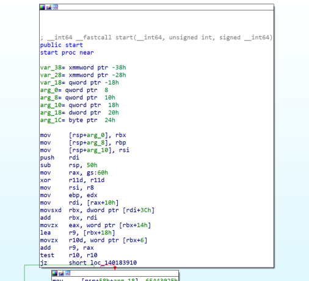

Podemos observar que nossa stub esta realmente diferente, nada igual a velha instrução "jmp KeoVM0" que tinhamos para ir ao início da nossa cadeia de control flow obfuscation.

Essa rotina é responsável por descriptografar o nosso entrypoint original e só então iniciar a execução do código original com a ofuscação, em resumo, onde nosso "jmp KeoVM0" ocorrera. analisei o código e recuperei a lógica para isso:


A rotina obtem a imagem base a partir da PEB e então parseia os cabeçalhos IMAGE_DOS_HEADER e IMAGE_NT_HEADERS e faz uma chamada para IAMGE_FIRST_SECTION utilizando a referência de IMAGE_NT_HEADERS para obter o endereço da primeira seção. para então procurar pela seção ".0Dev" seção adicionada pelo proprio ofuscador para armazenar as stubs que não puderam ser armazenadas na própria seção ".text". a ideia é bem criativa. utilizar o valor do field "VirtualAddress" para fazer parte do algoritmo de descriptografia do entrypoint original. isso funciona incrivelmente bem. dado que o ofuscador pode controlar o endereço como desejado, desde que é claro, ele não seja utilizado por outra seção.

Dessa forma sabemos exatamente o que acontece e como podemos automatizar o processo para recuperar o entrypoint utilizando nosso script. de tudo falado a parte mais importante é o seguinte algoritmo que usaremos no desofuscador:

```c++
  return ((__int64 (__fastcall *)(_QWORD, signed __int64, signed __int64, PIMAGE_SECTION_HEADER))((char *)pImgDos + (unsigned int)__ROR4__(LODWORD(pImgNt->OptionalHeader.SizeOfStackCommit) ^ *(_DWORD *)((char *)&pImgDos->e_magic + pSectionFindedResultRef->VirtualAddress), pImgNt->FileHeader.TimeDateStamp)))(
           arg1,
           arg2,
           arg3,
           pImageSectionHeader);
```

A lógica final para descriptografar utiliza o valor de SizeOfStackCommit efetuando uma operação de XOR com o valor do endereço virtual da seção ".0Dev" e em seguida efetuando um ROR4 com o número do timestamp do header do PE. o valor então é interpretado como um endereço e a execução é redirecionada junto com os argumentos originais(então a nossa rotina original inícia).

Vamos agora analisar as outroas ténicas adicionadas pelo Alcatraz, como junkcode e Control Flow Flattening. após recuperar o entrypoint original de forma manual para conseguir corrigir o IDA. eu gerei um flow graph da execução do binário e obtive o seguinte resultado:


Bom, acredito que comparado ao VmProtect e o nosso Flow Original de execução tivemos muitas mudanças.


Porem, acalma-se, nem tudo esta perdido, vamos entender o que esta acontecendo aqui. o que o Alcatraz fez no nosso binário. talvez exista uma lógica por trás que possamos utilizar para obter nosso binário original de volta.

Separei uma stub simples para olharmos os padrões adicionados. primeiro vamos observar o junkcode, depois o CFF:

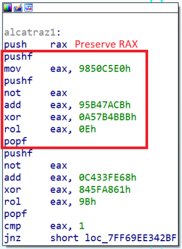

Ao olharmos o novo código adicionado pelo Alcatraz conseguimos observar facilmente o padrão adicionado por ele e que se estende pelo menos duas vezes por stub:

```c++
  pushf ; Store the flags
  not eax
  add eax, SOME_IMM
  xor eax, SOME_IMM
  rol eax, SOME_IMM
  popf ; Restore the flags
```

Avançando um pouco mais é possível ver que o padrão se repete em outros procedimentos seguindo o mesmo fluxo:

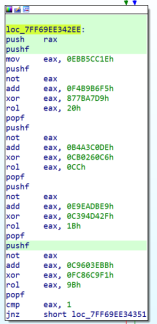

Se procurarmos pelas nossas rotinas originais, conseguimos encontra-las logo após a branch sempre no padrão, true e false com um salto de +5 bytes do endereço atual de maneira indireta:


Adiantando a analise. esse mesmo padrão se repete por todos os procedimentos ou seja a mesma lógica apenas alterando os valores utilizados nos imediates values dos menemonicos.

Além desse Control Flow Flattening aplicado pelo Alcatraz seguindo um padrão. outra tecnica também é aplicada no binário, sendo a ofuscação de constantes:

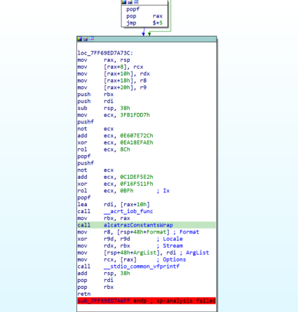

O procedimento "alcatrazConstantsWrap" é responsável por "descriptografar" o endereço da constante a ser utilizado pela função printf abaixo. vamos olhar sua lógica:


Um menemonico "lea" recuperando o endereço da constante. e em seguida subtraindo um valor de rax para obter o endereço correto da constante string para só então utilizar no "printf".

Vamos visualizar como nosso pseudo-código esta atualmente sem desofusca-lo:


Bom acho que é isso, conseguimos elencar todas as técnicas aplicadas pelas duas ferramentas em nosso binário e agora vamos começar a desofuscar nossos binários.


## Sobre o uso de frameworks de execução symbolica

O intúito desse artigo é explicar como podemos desofuscar binários manualmente em especial para quem tiver curiosidade de aprender sobre o assunto. eu não utilizarei, pelo menos nesse artigo, nenhum framework de execução symbolica faremos tudo manualmente. mas isso não significa que eu não trarei novos artigos com ofuscadores piores e lógicas muito piores para encontrar padrões utilizando a execução symbolica para resolve-los.


## Desofuscando o VM Protect

Vamos iniciar nossas aventuras pelo VmProtect. eu vou colocar algumas metas aqui que deveremos cumprir ao final desse tópico:
1. Desofuscar os nossos próprios Control Flow Flattening aos quais adicionamos.
2. Remover toda a mutação adicionada pelo VmProtect(com base na lógica que identificamos).
4. Vamos analisar opcodes iguais em cada stub em uma lista, identificando stubs iguais e removendo código inútil e repetido adicionado por nós e pelo vmprotect(reduzindo muito o tamanho dos opcodes na nova seção).
3. Adicionaremos uma nova seção no binário para receber o código fonte desofuscado de maneira que teremos um código corrigido e funcional e analisavel.

Primeiramente vamos iniciar obtendo os saltos que sempre ocorrem no nosso flow graph do nosso padrão de saltos inseridos pelo nosso gerador de stubs. eu gerei uma lista constante com cada uma das possibilidades de sequência que nossa analise pode ter:

```python
#Common branchs used by KeoVM
branchs = [ idaapi.NN_jmp, idaapi.NN_jz, idaapi.NN_jl ]
```
Quando nosso interpretador encontrar algum desses menemonicos vamos automaticamente seguir o endereço associado a eles de maneira a acompanhar o fluxo do programa.

Em seguida vamos criar uma segunda constante para armazenar todas as instruções de junkcode da mutação do vmprotect além dos registradores que não fazem parte da lógica original do programa:

```python
#Common menemonics used by the vmprotect mutation
vmprotect_operands = [ idaapi.NN_neg, idaapi.NN_btr, idaapi.NN_cmovbe, idaapi.NN_bt, idaapi.NN_bts, idaapi.NN_btc, idaapi.NN_movzx, idaapi.NN_sar, idaapi.NN_cmovs, idaapi.NN_or, idaapi.NN_stc, idaapi.NN_clc, idaapi.NN_cdqe, idaapi.NN_cmovp, idaapi.NN_shr, idaapi.NN_shl, idaapi.NN_sbb, idaapi.NN_rcr, idaapi.NN_sal, idaapi.NN_rcl, idaapi.NN_cmc, idaapi.NN_and, idaapi.NN_movsx, idaapi.NN_bsf, idaapi.NN_movsxd, idaapi.NN_cbw ]

#Common regs that not make part of the original program logic
vmprotect_mutation_regs = [ 24, 27, 26, 5, 9, 10, 11, 13, 14, 15 ] # 24 = R_spl, 27 = R_dil, 26 = R_sil, 5 = R_bp, 9 = R_r9, 10 = R_r10, 11 = R_r11, 13 = R_r13, 14 = R_r14, 15 = R_r15
```

Além dessas listas constantes também inciarei um bytearray para armazenarmos o nosso novo opcode corrigido para que possamos copiar para outra section que criarmos, além de declarar uma lista onde serão armazenadas cada stub e seus respectivos opcodes:

```python
inst_code = bytearray()
inst_code_block = []
```

Vamos começar a escrever nosso interpretador. vou obter como ponto de partida inícial o primeiro "jmp keovm1" que marca início das nossas stubs mutadas. e para cada padrão identificado vamos trocar o opcode por 0x90(Menemonico NOP) tudo isso reptindo para a quantidade de bytes no disassembly view, considerando cada branch e seguindo os endereços em caso "verdadeiro" para cada uma delas até encontrar o grafo final, e claro filtraremos os menemonicos NOP para não irem a nossa lista de opcode stubs:

```python
def vmp_mutation_analyser():

	bFound = True
	temporary_block = bytearray()

	ea = idaapi.get_screen_ea()
	
	while True:
		inst = idautils.DecodeInstruction(ea)
		
		if not inst:
			break
		
		if bFound:
			bFound = False
			inst_code_block.append(temporary_block)
			temporary_block = []
	
		if inst.itype in branchs:
			ea = inst[0].addr
			bFound = True
			continue
			
		if inst.itype == idaapi.NN_retn:
			# saving the last block
			temporary_block.extend(idc.get_bytes(ea, inst.size))
			inst_code_block.append(temporary_block)
			break
			
		if inst.itype in vmprotect_operands:
			for i in range(inst.size):
				idaapi.patch_byte(ea+i, 0x90)
			continue
			
		if inst[0].reg in vmprotect_mutation_regs and inst[1].reg in vmprotect_mutation_regs:
			for i in range(inst.size):
				idaapi.patch_byte(ea+i, 0x90)
			continue
		
		# Nop opcode remove from blocks
		if inst.itype == idaapi.NN_nop:
			ea += inst.size
			continue

		temporary_block.extend(idc.get_bytes(ea, inst.size))
	
		print(hex(ea) + " " + idc.GetDisasm(ea))
		
		ea += inst.size
```

Após a execução teremos corrigidos todo o disassembler. e em nossa lista "inst_code_block" teremos cada stub com seus respectivos opcodes. agora vamos filtrar e eliminar código igual. o código abaixo é responsável por eliminar o código repetido de nossa lista(para otimização) bem como por fim preperar "inst_code" para receber os novos opcodes já otimizados:

```python
def search_in_list(index, block_to_find):
	for i, block in enumerate(inst_code_block):
	   if block_to_find == block and len(block_to_find) == len(block) and i != index:
		   return i
	return -1

def replace_invalid_opcode_blocks():
	
	removed_count = 0
	before_block_sizes = len(inst_code_block)
	for i, block in enumerate(inst_code_block):
	   
		while True:
			index_to_remove = search_in_list(i, block)
			if index_to_remove == -1: break # no are more blocks equal to remove
			del inst_code_block[index_to_remove]
			removed_count += 1
		
	print(f"Removed: {removed_count} blocks equals from mutation | Original: {before_block_sizes} | New: {len(inst_code_block)}")

	# Save our new data lmao
	for block in inst_code_block:
		inst_code.extend(block)
		
	print(f"Final demutaded opcode size in bytes: {len(inst_code)}")
```

Após tudo, só nos basta adicionarmos uma nova seção ao nosso banco de analises com os opcodes que temos corrigidos no nosso bytearray global "inst_code". eu criei o código abaixo para agilizar o processo deixar tudo pronto para analise, e basicamente ele obtem a última section do binário e adiciona uma nova calculando devidamente seu tamanho e ao final fornecendo o endereço do nosso entry do código desofuscado:

```python
def populate_segment():

    seg = idaapi.get_last_seg()

    if seg:

        if idaapi.add_segm(0x00, seg.end_ea, seg.end_ea+len(inst_code), ".keowu", "CODE", 0):
            seg = idaapi.get_last_seg()
            idc.set_segm_attr(seg.start_ea, idc.SEGATTR_PERM, idaapi.SEGPERM_MAXVAL)
            idc.set_segm_attr(seg.start_ea, idc.SEGATTR_ALIGN, idaapi.saRelPara)
            idaapi.set_segm_addressing(seg, 2) # 2 means 64-bits
            ida_bytes.patch_bytes(seg.start_ea, bytes(inst_code))
            print(f"New section with code is added on 0x{seg.start_ea:x}")
```

Antes de executar o nosso script e ver nosso resultado. eu lembro você leitor sobre a importância de fazer uma configuração simples no seu IDA para que consiga exibir nesse nosso exemplo de artigo mais do que 64 nodes de gráfo no IDA. por padrão o ida limita o número de grafos porem podemos facilmente re-configurar isso no arquivo "hexrays.cfg", eu particularmente recomendo 4096 como um bom valor padrão.

Ao executar o script obtemos um trace de todas as "instruções" já corrigidas e ao final o endereço da nova section adicionada bem como a dica de configuração.


Perceba que em alguns pontos temos alguns restícios da mutação do VmProtect e até mesmo de nossas branchs antigas. mas não se preocupe. deixe o próprio IDA fazer o trabalho difícil e limpar tudo isso usando a técnologia de "dead-code remove". ao olharmos novamente e gerarmos uma decompilação completa do código anteriormente mutado veremos a grande diferença/mágica de nossa aventura:


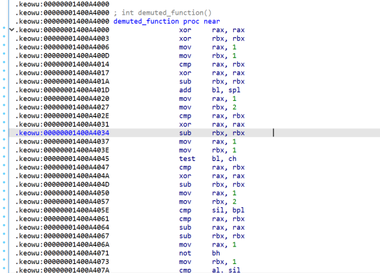

Nossa reação:


De fato, nosso esforço gerou resultado e obtemos um código totalmente desmutado. se compararmos o antes e depois a diferença é gigantesca, vamos relembrar:

**Antes da desmutação:**


**Depois da desmutação:**


Aprendemos muito até agora, mas nossa aventura ainda não terminou. vamos em frente fazer o mesmo com o Alcatraz.

## Desofuscando o Alcatraz

Vamos agora começar nossos estudos de desofuscação com o Alcatraz. de igual ao VmProtect vou separar em passos o que sera feito para remover a ofuscação do alcatraz. de antemão, ela é bem mais complexa, mas acredito que ficaremos bem ao seguir nossos passos.


1 - Vamos fazer um script para desofuscar e encontrar o ponto de entrada original substituido pela stub do Alcatraz para que encontremos o código real
2 - Primeiro vamos desofuscar os nosso próprios control flows combinados com os control flows que também foram adicionados pelo Alcatraz com base no padrão que descobrimos neles.
3 - Vamos limpar toda a mutação adicionada pelo Alcatraz analisando seus opcodes e limpando-os de maneira que fique claro e o dead-code remove do IDA possa lidar com o restante.
4 - Adicionaremos uma nova seção no binário para receber o novo código que desofuscamos de maneira a termos um código corrigido funcional e o mais importante, analisavel.
5 - Vamos desofuscar strings e constantes, e corrigir os deslocamentos com base indentificamos na analise preliminar do ofuscador.

A primeiro momento vamos criar nosso script para desofuscar o entrypoint original do programa replicando o funcionamento da stub de descriptografia do entrypoint do Alcatraz.

Como explicamos acima toda a lógica central para resolver o endereço correto do entry point se resume apenas a este trecho:

```c++
  return ((__int64 (__fastcall *)(_QWORD, signed __int64, signed __int64, PIMAGE_SECTION_HEADER))((char *)pImgDos + (unsigned int)__ROR4__(LODWORD(pImgNt->OptionalHeader.SizeOfStackCommit) ^ *(_DWORD *)((char *)&pImgDos->e_magic + pSectionFindedResultRef->VirtualAddress), pImgNt->FileHeader.TimeDateStamp)))(
           arg1,
           arg2,
           arg3,
           pImageSectionHeader);
```

A única coisa que devemos fazer é encontrar o seção ".0Dev" para recuperar o field "VirtualAddress" para utilizar no algoritmo para descriptografar o endereço. sendo assim reescrevi e obti o seguinte resultado como primeira parte de nosso desofuscador:

```python
def __ROL__(value, count):

    nbits = 8 * value.bit_length()
 
    if count > 0:
        count %= nbits
        high = value >> (nbits - count)
        if value < 0:  # Valor assinado
            high &= ~((1 << count) - 1)
        value = (value << count) & (2 ** nbits - 1)  # Para ter certeza do wrapper equivalente
        value |= high
    else:
        count = -count % nbits
        low = value << (nbits - count)
        value >>= count
        value |= low
 
    return value
    
def __ROR4__(value, count):
    return (__ROL__(value & 0xFFFFFFFF, -count) & 0xFFFF000000000000000000000000) >> 96

def decrypt_original_entry_point():
    pe = pefile.PE(idaapi.get_input_file_path())
    
    section_virtual_address = 0
    
    for section in pe.sections:
        if ".0Dev" in section.Name.decode('utf-8'):
            section_virtual_address = section.VirtualAddress
            break
    
    entry_point = int.from_bytes(idaapi.get_bytes(idaapi.get_imagebase() + section_virtual_address, 4), 'little')
    entry_point ^= pe.OPTIONAL_HEADER.SizeOfStackCommit
    entry_point = __ROR4__(entry_point, pe.FILE_HEADER.TimeDateStamp)
    entry_point += idaapi.get_imagebase()
    print(f"Decrypted EntryPoint: 0x{entry_point:x}")     
```

De maneira geral replicamos a mesma lógica utilizada pelo Alcatraz para desofuscar o entrypoint. encontrando a seção recuperando o field do VirtualAddress e então replicando o algoritmo de descriptografia e ao final printando o endereço verdadeiro do entrypoint. vamos ver isso em funcionamento:

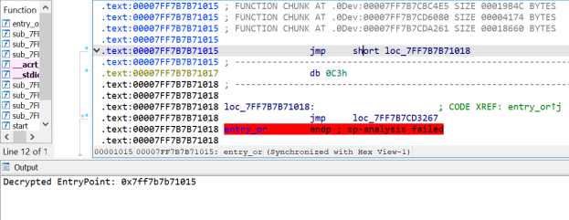


Estamos evoluindo! vamos em frente na nossa missão de desofuscar completamente dando continuidade em nossos passos.

Vamos agora resolver o nosso próprio control flow combinado com o Alcatraz. na nossa etapa de analise do ofuscador identificamos que havia uma lógica no fluxo para sempre verdadeiro e poderiamos simplesmente simular o fluxo de maneira a simular a execução original do código. é exatamente isso que vamos fazer. é claro limpando tudo que estiver pelo caminho, extraindo os opcodes e corrigindo-os para que possamos adicionar em uma nova seção posteriormente para analisarmos posteriormente. 

Vamos iniciar. a priore adicionei uma lista global para armazenar nossos menemonicos para as branchs usadas pelo Alcatraz, além é claro da nossa própria ofuscação de control flow.

```python
branch_menemonics = [ idaapi.NN_jmp, idaapi.NN_jnz, idaapi.NN_jl, idaapi.NN_jz ]
```

Também criei um bytearray global para armazenar nossos novos opcodes corrigidos:

```python
inst_code = bytearray()
```

Vamos então aplicar a lógica para resolver os control flow até encontrar o último block, aplicando patchs nos padrões usados pelo Alcatraz para adicionar junk code a ele. cheguei no seguinte resultado que explicarei em seguida:

```python
def alcatraz_flow_obfuscation_analyser():

    ea = idaapi.get_screen_ea()
    
    remove_junk_code_begin = False
    addr_begin_junk_code = 0
    
    while True:
        inst = idautils.DecodeInstruction(ea)
        
        if not inst: break
        
        if inst.itype in branch_menemonics:
            ea = inst[0].addr
            continue
            
        if inst.itype == idaapi.NN_pushf:
            if not remove_junk_code_begin:
                remove_junk_code_begin = True
                addr_begin_junk_code = ea
            ea += inst.size
            continue
        
        if inst.itype == idaapi.NN_popf:
            remove_junk_code_begin = False 
            size = (ea - addr_begin_junk_code) + inst.size
            ida_bytes.patch_bytes(addr_begin_junk_code, bytes(bytearray(b"\x90" * size)))
            ea += inst.size
            continue
        
        if inst.itype == idaapi.NN_retn:
            break
        
        ida_bytes.del_items(ea)
        
        inst_code.extend(idc.get_bytes(ea, inst.size))

        print(hex(ea) + " " + idc.GetDisasm(ea))
        
        ea += inst.size
```

O script resolve cada salto individualmente avançando para os próximos blocos enquanto encontra o junkcode padrão adicionado pelo Alcatraz e os remove. além é claro adicionando o novo opcode com o fluxo original unificado e sem o junkcode. de uma maneira que o IDA e sua analise de deadcode consiga lidar e gerar um código bem mais fácil e limpo para analise. após isso gravamos o conteúdo de nossos novos opcodes presentes em inst_code em uma nova seção do banco de analise:

```python
def populate_segment():

	seg = idaapi.get_last_seg()
	if seg:
		if idaapi.add_segm(0x00, seg.end_ea, seg.end_ea+len(inst_code), ".keowu", "CODE", 0):
			seg = idaapi.get_last_seg()
			idc.set_segm_attr(seg.start_ea, idc.SEGATTR_PERM, idaapi.SEGPERM_MAXVAL)
			idc.set_segm_attr(seg.start_ea, idc.SEGATTR_ALIGN, idaapi.saRelPara)
			idaapi.set_segm_addressing(seg, 2) # 2 mens 64-bits
			ida_bytes.patch_bytes(seg.start_ea, bytes(inst_code))
			print(f"New section with code is added on 0x{seg.start_ea:x}")
```

Vamos descriptografar o endereço do entrypoint. posicionar nosso cursos no endereço correto que é o início de todos os blocos do flow graph e  por fim executar nosso script para ver o resultado que conseguimos obter com nossa desofuscação:


Como uma rápida explicação: percebemos que em algumas partes o código assembly não veio. código este que não foi analisado pelo ida por conta da quantidade massiva de control flow block. porem nosso script foi capaz de analisar e resolver esse problema. ":: address -> address | bytes: x" representa o junkcode identificado e a quantidade de bytes que foram removidos até chegarmos no bloco final. e por fim, obtemos nosso endereço com nosso novo código analisavel e corrigido, vamos até ele para vermos nosso novo resultado:


Perceba que ainda temos um pouco de deadcode, mas não se preocupe eliminamos a grande massiva maioria, além disso removemos todos os invalid control flow. o IDA vai cuidar dessa pequena parte de junkcode restante com sua tecnologia de analise. mas em fim vamos gerar o nosso pseudocódigo para vermos como ficou nosso binário sem alcatraz:


Nossa reação com esse avanço:


Mas espere, ainda temos uma última técnica para resolver, a técnica de obfuscação de constantes do alcatraz, a qual também já abordamos anteriormente no tópico que explicamos como funcionava a proteção do alcatraz.

O Alcatraz adiciona procedimentos wrappers no código para recuperar o endereço de uma contante ou recuperar o seu valor:

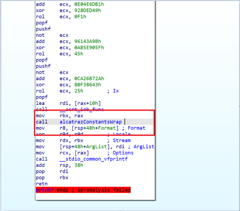

Podemos recuperar facilmente a informação do wrapper observando o retorno em rax:


A resolução no script ficou assim:

```python
def unwrap_constants():

    ea = idaapi.get_screen_ea()

    possible_reference = []

    while True:

        inst = idautils.DecodeInstruction(ea)

        if not inst: break

        if inst.itype == idaapi.NN_call:
            ea = inst[0].addr
            continue

        """
            Finding the pattern:
                lea rax, cs:SOMEADDRESS
                pushf
                sub rax, imm
                popf
                ret
        """
        if inst.itype == idaapi.NN_lea:
            if inst[0].reg == 0: #R_ax

                possible_wrapped_value = inst[1].addr
                ea += inst.size
                inst = idautils.DecodeInstruction(ea)

                if inst.itype == idaapi.NN_pushf:
                    ea += inst.size
                    inst = idautils.DecodeInstruction(ea)

                    if inst.itype == idaapi.NN_sub:
                        possible_wrapped_value -= inst[1].value
                        print(f"Possible return value unwraped: 0x{possible_wrapped_value:x}")
                        possible_reference.append(possible_wrapped_value)

        if inst.itype == idaapi.NN_retn:
            idc.set_cmt(idaapi.get_screen_ea(), f"RAX = 0x{possible_reference[0]:x}", False)
            break
        
        ea += inst.size    
    
    print(f"Ended. All list with all possible return address unwraped: {possible_reference}")
```

Conseguimos recuperar os valores originais fazendo o unwrap da ofuscação adicionada:


Por fim vamos comparar o antes e o depois de nossa desofuscação do Alcatraz:

**Antes da desmutação:**


**Depois da desmutação:**


Por fim podemos declarar que cumprimos nossa missão com o Alcatraz e conseguimos atingir o objetivo esperado.


## Conclusão

Nesse artigo exploramos diversas técnicas usadas por ofuscadores comerciais e de código aberto. além é claro de criarmos o nosso próprio ofuscador de control flow, e entender um pouquinho de compiler CRT. além disso lutamos contra os ofuscadores com o intúito de desofusca-los e obter um código analisável aprendendo muito pelo caminho. espero que este artigo tenha ficado interessante. nos vemos nos próximos. se eu me animar a continuar escrevendo para a galera do discord que são os únicos que lê meus artigos.


## References

VM Protect. [S. l.], 20 jan. 2024. Disponível em: https://vmpsoft.com. Acesso em: 20 jan. 2024.

ALCATRAZ. [S. l.], 14 jul. 2023. Disponível em: https://github.com/weak1337/Alcatraz. Acesso em: 20 jan. 2024.

QUICK look around VMP 3.x - Part 2 : Code Mutation. [S. l.], 26 jan. 2021. Disponível em: https://whereisr0da.github.io/blog/posts/2021-01-26-vmp-2/. Acesso em: 20 jan. 2024.