# Malware Analysis Writeup | Amadey + Custom Dropper's with Redline Stealer with Net Reactor on shellcode's and mutant Avkiller

Author: João Vitor (@Keowu) - Malware Security Researcher

# Sample identification hash

This malware belongs to the Amadey family, its goal is to create a botnet, it emerged in October 2018 and is sold for about $500.00 in Russian underground forums. It sends system information and information about security tools (Antivirus) installed to a C2 server and also receives orders and allows execution of payloads on its infected devices, depending on the choice and objectives of the controller.

| Arch                                 | PE Header                        | '.text' Section                  | '.rsrc' Section                  | '.data' Section                  |
|--------------------------------------|----------------------------------|----------------------------------|----------------------------------|----------------------------------|
| PE - Cabinet - IA-32 | 313786d781922dd3736aa179747781c0 | b0b66b32f4ca82e2e157c51b24da0be7 | a10103f38bec9abc54cbab1c30aead2f | 7b9890a93c0516bb070e1170cfde54d5 |

# Overview

The scope of Amadey's attack is to impersonate legitimate software. The affected range from cracks for commercial software to Microsoft products or Office document loaders. A current form of exploitation includes sites indexed on Google with keywords such as "Software ZZZ Cracked" or "How to download and install Software ZZZ cracked," but not limited to the examples mentioned.

# Analyzing

- 1 - The first stage is characterized by an executable file that extracts two binary files on disk (y69Lh26.exe and zap7146.exe) and executes them impersonating an installer (not MSI, but a Cabinet Self Extractor).
- 2 - The second stage of Amadey begins at the moment of the first execution (zap7146.exe), which extracts two more binaries (xXdsh93.exe and zap9018.exe).
- 3 - The third stage begins with the first binary extracted in the second stage (zap9018.exe) and extracts two more binary files (zap1202.exe and w38dM76.exe).
- 4 - The fourth stage begins with the first binary of the third stage (zap1202.exe), which performs the final extraction of the last two binaries (tz3801.exe and v6837xU.exe).

Let's start our analysis:


As the file is a Cabinet, we can extract it using tools like 7-Zip, and then we will obtain the second stage, which consists of two binaries:


The first binary, nicknamed "y69Lh26.exe," is a sample of Amadey. Let's analyze its behavior and purpose:


At the beginning, we can identify all the methods responsible for the infection process. However, when we perform a more in-depth analysis of the first call itself, we come across a technique used by the malware developer to obfuscate its strings:


The malware author uses a std::string declaration to store the content of their encrypted string.


When we direct our attention to the global reference used by the malware, we can see a call to std::string::assign, which is the equivalent in standard C++ code to something similar to the following excerpt:

```c++
std::string g_string_desconhecida("");

int init_desconhecida() {
    g_string_desconhecida.assign("WbNAPdSTPOlnFH==", 0x10);
}

```

However, the same pattern repeats throughout the malware's execution scope, meaning that all its strings are obfuscated following the same code snippet previously presented. Given this, we are left with two alternatives: to analyze the encryption in its entirety (which would take a lot of time, and time is money), or to make our lives easier and eliminate a part that will not add much value to our analysis. Therefore, let's examine how this call is made and the call and return flow of the string encryption function used by Amadey:


Let's direct our attention to the highlighted code snippet below:

```asm
sub esp, 18h ; Let's take this as our starting point.
mov ecx, esp ; We move the pointer of the std::string context.
push 0xBC912C ; We pass the global string that we want to store in the std::string.
call std::string::assign ; call std::string::assign
lea ecx, [ebp+var_494] ; We obtain the size of the std::string.
call decrypt_string ; We call the method to decrypt the content of the string.
.
.
mov esi, eax ; We obtain the return for the encrypted string.
```

The decryption routine is repeated every time the malware needs a new string for its operation, and the routine is exactly the same in all these calls (the same assembly code snippet with the only difference being the address of the stored global std::string). Given this, we can understand a pattern to decrypt these strings and their input and output flow. By changing only the ```push 0xADD1``` snippet, we can create a script that changes this address to the address of the next string to be decrypted, and so on until we reach the last address. Of course, we must read the return address and store this string to use in IDA, always setting the EIP to the beginning of the snippet when necessary. There are several ways to automate x64dbg (for the insiders, x96dbg) from assembly, python (they have good support and work very well). However, this time I will use a very cool and functional project that offers many useful resources, called ```LyScript```. It allows us to code automation scripts for x64dbg and execute them locally or remotely. Therefore, I created a script that makes x64dbg do all the hard work for us:

```python

...
encrypted_string_offsets = [
    0x38ACC, 0x3915C, 0x38C1C,
    0x38964, 0x38CAC, 0x38FAC,
    .
    .
    .
]

jsonobj = []

for addy in encrypted_string_offsets:
    module_base = dbg.get_module_base("y69lh26.exe")

    # The EIP must be set to module_base+0x986C -> sub esp, 0x18.
    dbg.set_register("EIP", (module_base + 0x986C))

    wait(module_base + 0x9871)

    dbg.assemble_at(module_base + 0x9871, "push {}".format(hex(module_base + addy)))

    wait(module_base + 0x9889)

    ida_dict = {
        'IDA_OFFSET': addy,
        'IDA_STR': get_fixed_strings(get_string_pointer()) + get_fixed_strings(get_string_reference()),
        'IDA_OR': get_string_pointer() + get_string_reference()
    }

    jsonobj.append(ida_dict)

    dbg.set_register("EIP", (module_base + 0x986C))

dbg.close()

f = open("out.json", "wb")
f.write(json.dumps(jsonobj).encode())

```

The script above can be found in the repository of this analysis, under the name "AmadeyDecrypt".

The script works by shifting the instruction pointer EIP to the initial address of the decryption routine. Based on a list of addresses exported from IDA, it loops through, changing the parameter address of the stack, and reads the data from the return pointer, which can be a string present only in the return pointer or in the reference of the return pointer. It stores this information in a python json object and finally saves these obtained information and strings to disk.

An example output of this file is presented below:


The IDA_OFFSET key stores the address where the string belongs, the IDA_STR key stores the string that will be used in IDA (to name your global variables), and the IDA_OR key is used to add comments to each of its xrefs.

Now we need to apply this information in IDA to speed up our analysis process. To make our lives easier, I also developed a script that we can use for this task:

```python

def trata_ida_string(strs):
    if strs == "" or len(strs) <= 1:
        return "a_" + strs + str(random.randint(0, 10000)) + "_fix"
    elif strs[0] in "0123456789":
        strs = list(strs)
        strs[0] = 'f'
        return trata_ida_string(''.join(strs))

    string = ""
    for c in strs:
        if c in "abcdefghijklmnopqrstuvwxyzABCDEFGHIJKLMNOPQRSTUVWXYZ":
            string += c

    string = string + "_fix"

    if string == '_fix':
        return 'b_' + str(random.randint(0, 10000)) + string

    return "c_" + str(random.randint(0, 10000)) + string


def rename_string_constantes(json):
    print("Velho nome: " + ida_name.get_name(json['IDA_OFFSET']) + " -> " + trata_ida_string(json['IDA_STR']))
    ida_name.set_name(json['IDA_OFFSET'], trata_ida_string(json['IDA_STR']), ida_name.SN_CHECK)
    for xref in idautils.XrefsTo(json['IDA_OFFSET'], flags=0):
        print(hex(xref.frm))
        idc.set_cmt(xref.frm, json['IDA_STR'], 0)
        idc.set_cmt(xref.frm, json['IDA_STR'], 1)


jsonobj = json.loads(open("out.json", "rb").read())

for json in jsonobj:
    print("Decrypting string at: {}".format(hex(json['IDA_OFFSET'])))
    rename_string_constantes(json)

```

With this script, we can automate the task of renaming each string we have deobfuscated in the malware binary. It will rename the global declaration used, and the IDA has some variable naming rules. Therefore, the "trata_ida_string" method was created to ensure that no errors reach the user by validating all possible ways a string can be renamed incorrectly. In addition, the original string is defined in each xrefs to the global declaration used, ensuring that we can perfectly understand which string/value we are dealing with.

Let's see how this script works and how it helped us save time in our analysis:


In this example, the script will automatically decrypt the strings and store them so that we can apply them in our IDB.

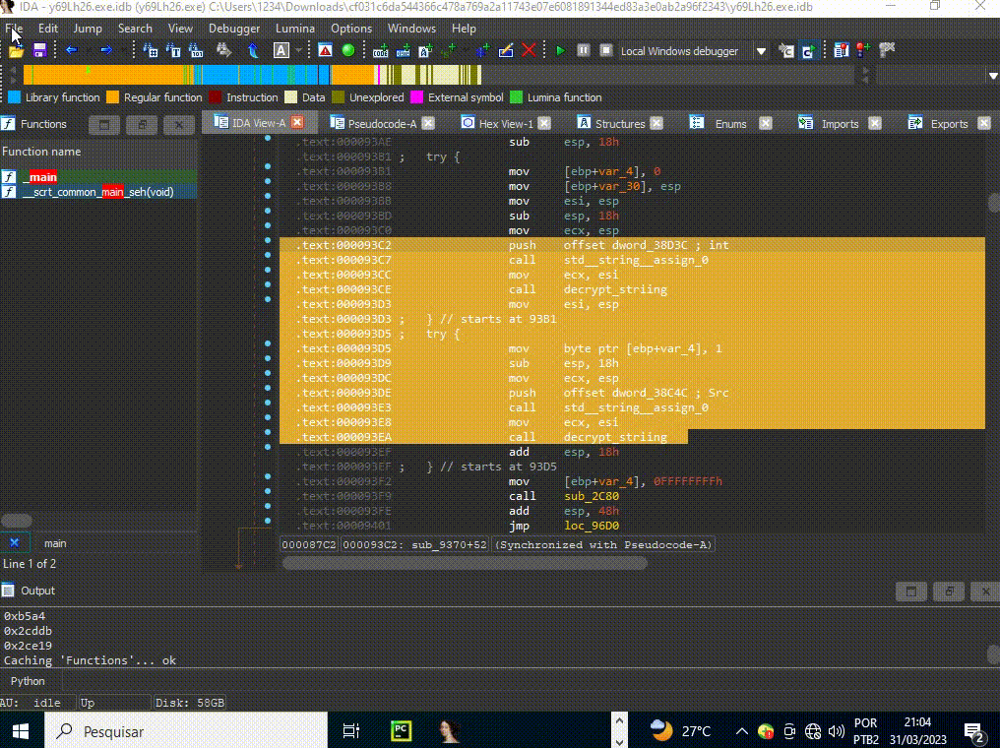

In this example, the script using IDAPython will apply the strings to our IDB to facilitate our analysis in a matter of seconds.

After correcting the strings and conducting a thorough analysis of this stage of the malware, it is possible to reach the following scope of operation, which will be presented in a summarized way as this malware has several stages:

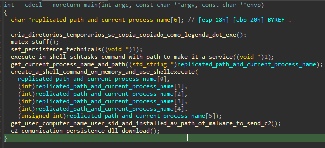

At the beginning of the malware, there is a call to ```cria_diretorios_temporarios_se_copia_copiado_como_legenda_dot_exe```, which despite the long name, explains exactly the intention of this procedure. It will copy the malware to the directory ```C:\Users\PC\AppData\Local\Temp\f22b669919``` with the new name "legenda.exe".

In summary, the malware will decrypt the string with the name of the directory to be created, call ```GetTempPathA```, convert it to ```std::string```, concatenate it with the decrypted string containing the path name, call ```GetModuleFileNameA``` to retrieve its name, create a directory with ```CreateDirectoryA```, call ```CopyFileA```, and finally call ```shell_execute``` to create its process.


Moving forward with the explanation of how the malware works, let's skip the procedure called ```mutext_stuff``` which is only used to synchronize threads used by the malware. Instead, let's analyze ```set_persistence_thechnicals()``` which is responsible for ensuring that the malware is always running by using some techniques present in Windows. In total, this malware uses two persistence mechanisms, by registry keys and by service, which will be explained later. In this procedure, the following techniques are used:

|                      **Registry Keys**                     |
|:---------------------------------------------------------------:|
| SOFTWARE\Microsoft\Windows\CurrentVersion\RunOnce               |
| Software\Microsoft\Windows NT\CurrentVersion\Run                |
| SOFTWARE\Microsoft\Windows\CurrentVersion\Explorer\ShellFolders |

The registry key definition flow consists of two separate procedures. The first one involves calling ```RegOpenKeyExA```, ```RegSetValueExA```, and ```RegCloseKey```. The second procedure is used only to verify that the changes were made correctly, calling ```RegOpenKeyA```, ```RegQueryValueExA```, and finally ```RegCloseKey```.


We will now analyze another persistence technique used by the malware. This time, our attention is directed to the procedure named ```execute_in_shell_schtasks_command_with_path_to_make_it_a_service()```. The purpose of this procedure is to build a schtasks command to create a service, passing the current execution path as an argument to ensure that the malware is always running on the victim's operating system.


At the beginning of the procedure, there is a call to GetModuleFileNameA, which is used to retrieve the name of the malware executable.


Moving forward, we can see the command being built, ```schtasks /Create /SC MINUTE /MO 1 /TN y69Lh26.exe /TR "y69Lh26.exe```, used to set up a Windows service command and ensure it is executed at specific times.

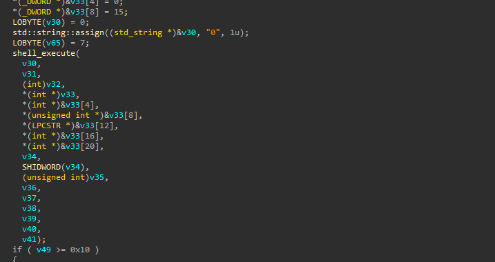

Finally, a call to ```shell_execute``` is made to create the service that will start at the time defined by the malware creator.

This technique may not be very effective as it is not silent enough and depends on the user granting administrator permission to the malware. However, it is important to note that administrator execution permission is standard in this type of attack thanks to the social engineering applied by the attacker and the context created.

We will skip the explanation of the ```get_current_process_name_and_path()``` procedure as it is only used to retrieve the name and current execution path of the malware to be used in the next routine nicknamed ```create_a_shell_command_on_memory_and_use_shellexecute()```. This procedure is responsible for creating a batch shell command that will be used to remove execution permissions from the malware binary of the current user, preventing, for example, its deletion. This is a guarantee that the malware will always remain on the victim's computer. This technique has a high guarantee of functioning and has a low chance of being detected by security mechanisms.

Let's understand how this string is formed:


At the beginning of the procedure, we can find a call to the WinAPI function ```GetUserNameA```, which is used to retrieve the name of the current user logged into the system. After obtaining the name, it is converted to a ```std::string```. Then we have a call to ```SetCurrentDirectoryA```, which is used to retrieve the current execution path of the malware.

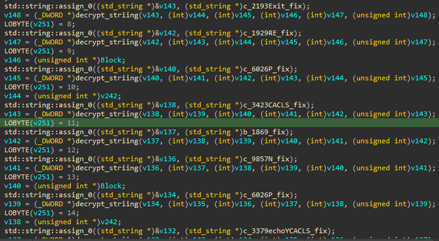

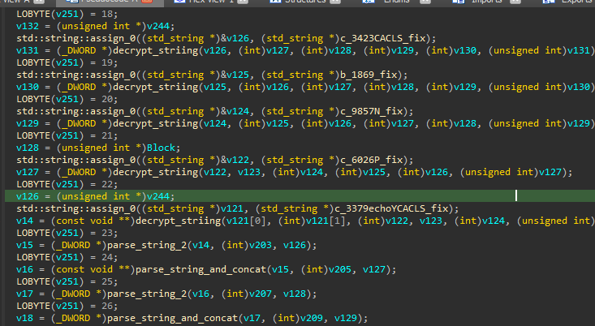

Next, we can observe several decrypted strings assembled to form the shell command to be executed via ```shell_execute```.

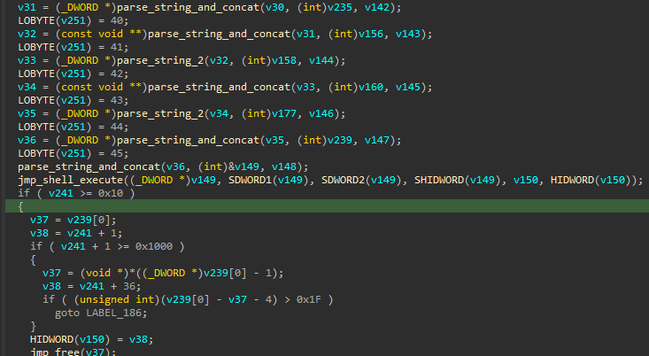

After the strings are concatenated, they are passed as a ```std::string``` to a function wrapper responsible for making a call to ```ShellExecuteA```.

The executed command is:

``` echo Y|CACLS "y69Lh26.exe" /P "1234:N" ```

The command allows the malware to redirect the output flow to the command-line tool CACLS, which manages the file and folder access control list. Then, the executable name to which we want to apply the rules and access permissions is passed as an argument. /P indicates that Windows will modify the access control list (ACL). 1234 is the user to which we want to apply the rule, and finally, N represents denying all permissions. After execution, all file permissions are removed, and computer users lose access to the malware file, preventing it from being deleted without assigning new permissions first:

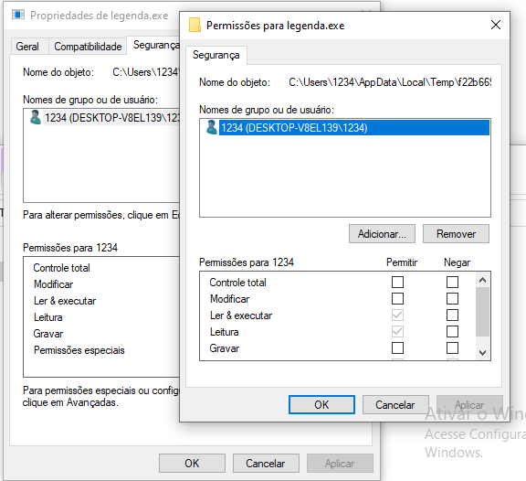

Let's now focus our attention on the next procedure nicknamed ```get_user_computer_name_user_sid_and_installed_av_path_of_malware_to_send_c2```. It is responsible for collecting information about the infected computer, which is then sent to its command and control server. Let's analyze how this collection procedure is done:


Right at the beginning, we have a call to determine_os_version, this procedure is responsible for determining the victim's operating system version, let's see how it works:


Firstly, the malware makes a call to ```getVersionExW``` in an attempt to retrieve the current operating system of its victim. However, it is worth noting that this API is old and may not work as intended. Therefore, the malware makes a call to the ```GetNativeSystemInfo``` export present in ```kernel32```, which is done dynamically at runtime for more effective retrieval of operating system information. (This runtime call is made because some antivirus programs can detect the call and generate maliciousness scores for the binary.) It is important to mention that this API is only available for Windows 64 (WOW64, which is the x64 subsystem in Windows). If the processor is not x64, the malware makes a call to the other API, GetSystemInfo.


In addition to these techniques, the malware also queries registry keys using the previously presented procedures of ```openkey_queryvalue_closekey```.


For this query, the malware uses the following key and field to search for the build value:

```HKEY_LOCAL_MACHINE -> SOFTWARE\Microsoft\WindowsNT\CurrentVersion -> CurrentBuild```

This key stores the current version of the victim's operating system, which will be used later by the attacker.

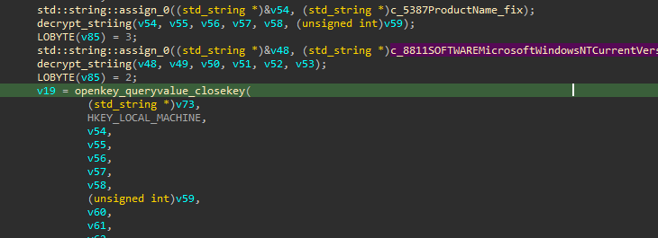

The malware also retrieves the value of the ProductName key from the same path as the previously presented registry key, to collect the name of the victim's system version, for example, ```Windows 10 Pro```.

Now let's explain the next procedure of the ```get_user_computer_name_user_sid_and_installed_av_path_of_malware_to_send_c2``` method, which is nicknamed ```get_native_sys_info``` and is responsible for providing the malware author with a second guarantee that victim information will be collected. Its only function is to make dynamic calls to ```GetNativeSystemInfo``` in x64 environments, and if running on x86, to ```GetSystemInfo```. Continuing our analysis of the main procedure, we can find calls to registry keys responsible for collecting the victim's computer name.

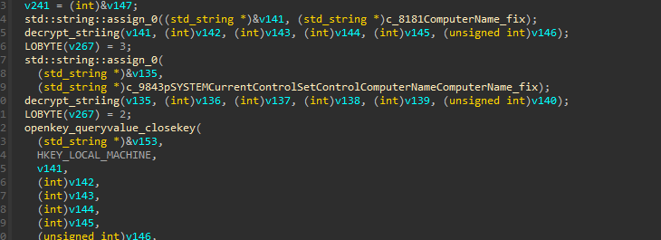

In this way, accessing the value at:

`` HKEY_LOCAL_MACHINE -> SOFTWARE\Microsoft\WindowsNT\CurrentVersion -> ComputerName ``

The malware also collects other information:


The victim's username is also collected using ```GetUserNameA```. Additionally, the malware is capable of obtaining the DNS name associated with the local computer on the internal network (which can be very dangerous in the case of companies). For this, a call to ```GetComputerNameExW``` is made, passing the parameter referring to the local DNS name query ```ComputerNameDnsDomain```.

Another capability of this malware procedure is to capture and identify third-party security mechanisms present on the victim's computer (also known as antivirus tools). For this function, it uses a procedure nicknamed ```find_antivirus_in_temp_path_to_get_folder_atributes```. This procedure is used to store the vendor's name to be sent to the attacker's C2 server. Let's understand how it works:


The beginning of the procedure is enough to explain the whole scope of operation of the malware used to detect which antivirus mechanisms are installed on the victim's computer.

Directly, the malware decrypts a string with the name/path of the victim's antivirus, in this example, the path of AVAST is used. Then, it calls the ```get_temp_path()``` procedure, which is responsible for obtaining the ProgramData path of the victim (```C:\ProgramData\```), and then concatenating it with the decrypted solution folder reference (```AVAST Software```). This way, it makes a call to GetFileAttributes passing the chosen path, ```C:\ProgramData\AVAST Software```, then checking the return of the call and comparing if the directory indeed exists.

This employed technique is quite effective, and return references such as INVALID_FILE_ATTRIBUTES and FILE_ATTRIBUTE_DIRECTORY indicate that it does not exist.

By analyzing the entire rest of the call, we can make a list of the affected ones by this search.

| **Security Vendor List** |
|---------------------------------|
| AVAST Software                  |
| Avira                           |
| Kaspersky Lab                   |
| ESET                            |
| Panda Security                  |
| Doctor Web                      |
| AVG                             |
| 360 Total Security              |
| Bit Defender                    |
| Norton                          |
| Sophos                          |
| Comodo                          |

After the latest data collection from antivirus vendors, the malware now has all the necessary information to be sent to the C2 server. Our next step in this analysis is to proceed accordingly.

We will now analyze the last procedure of this malware stage, called ```c2_communication_persistence_dll_download()```. This procedure is responsible for sending the collected data to a C2 server using a POST request, and then downloading a DLL file using the ```InternetReadFile``` API. The downloaded DLL is saved to disk and executed using the ```rundll.exe``` technique. Let's understand how these steps work together:


At the beginning of the procedure, the malware uses two techniques. The first technique is used to connect to the C2 server, send the collected information, and download a DLL file. The second technique is used to ensure that this DLL file starts running as soon as it is saved to disk. Let's analyze how these techniques work:

Starting with our analysis of the first procedure executed by the first thread, ```remote_c2_connector```:


Right at the beginning, we can observe a decrypted string containing the IPV4 address. The malware will use this address to connect to the C2 server. Let's proceed and understand how this communication is carried out.


Right at the beginning of the procedure, the malware makes a call to the WinApi ```InternetOpenW```, which will initialize the use of functions from the Winet family of Windows. After that, it makes a call to ```InternetConnectA```, which is responsible for configuring the destination parameters and network communication protocol. At this point, the malware will pass the IP address of its C2 as a parameter, along with the flag ```INTERNET_DEFAULT_HTTP_PORT``` to establish a simple HTTP connection.

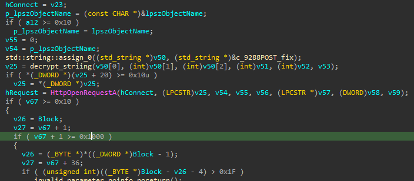

Next, the malware makes a call to ```HttpOpenRequestA```, with the purpose of creating an HTTP request handle. The malware defines the parameter ```lpszVerb``` as an HTTP request of type ```POST```, and also sets ```lpszObjectName``` as ```/joomla/index.php```. There is a reason behind this, which will become clearer as we progress through this explanation.


At this point, the malware uses the WinApi ```HttpSendRequestA``` to actually send the previously collected data to its C2 server. First, the malware sets the content type for the HTTP request (lpszHeaders), in this case ```application/x-www-form-urlencoded```. Next, it sets the lpOptional to a string containing all the collected data that will be sent to the POST request to its C2 server. For example, ```id=872447961413&vs=3.68&sd=e2b41a&os=1&bi=1&ar=1&pc=DESKTOP-V8EL139&un=1234&dm=&av=8&lv=0&og=1```. The id is a unique identifier of the computer previously collected, along with various other information such as the installed antivirus, and by obvious reasons defining a numerical index for it.

Let's move forward and understand how the malware downloads a DLL from its C2 server right after sending the information to it.


After the data is sent to the C2 via POST, the malware starts the process of reading a network buffer. At first, an attempt is made and it is validated whether this buffer was read.

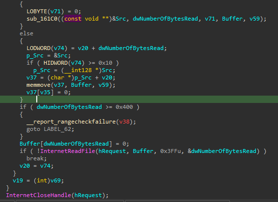

If the buffer is successfully read from the C2, the malware then enters a loop where it reads and stores ```1024-byte buffers``` until it can no longer read, thus ending its connection by closing the handle. This buffer is a DLL that will be executed via rundll in the next main thread, ```garant_rundll_execute```. Let's understand how it works.

At first, the malware saves the buffer read from its C2 to disk with the name ```clip64.dll``` in a local app data path. Then it checks if this file exists. If it does, it calls ```rundll.exe``` and passes the path of the DLL and the export to be executed as parameters in the command line.

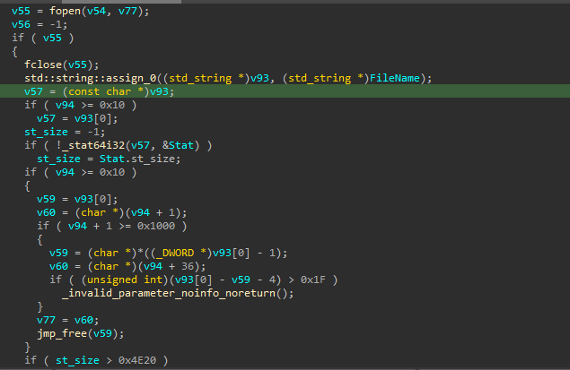

The malware checks the existence and size of the file before executing it.


After verifying the size of the file, the malware decrypts a string with the name ```Main``` and passes the temporary PATH and the ```Main``` export so that the malicious DLL is executed. Here is an example:


It should be noted that the DLL nicknamed ```clip64.dll``` is capable of stealing data from the user's clipboard and saving it to a file. Unfortunately, during this analysis, the file was not available for analysis due to the C2 being taken down. In addition to ```clip64.dll```, there is another DLL that is also downloaded nicknamed cred64.dll, but similarly to ```clip64```, it was not possible to recover it.

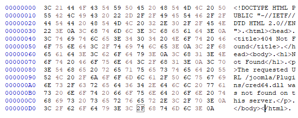

It should be noted that it is very possible to find the files ```cred64.dll``` and ```clip64.dll``` online, but some malware authors tend to modify their source code to insert customized routines. Thus, to ensure that the analysis is faithful and based solely on the information available in the file itself, without using OSINT techniques or any other means.

From the information collected from this sample and the information gathered through reverse engineering, we can list the information about this IOC:


The server was hosted in Russia, but it has already undergone a take down.


|                                        **Informations**                                        	|
|:----------------------------------------------------------------------------------------------:	|
| 62.204.41.87                                                                                   	|
| /joomla/index.php                                                                              	|
| POST                                                                                           	|
| id=872447961413&vs=3.68&sd=e2b41a&os=1&bi=1&ar=1&pc=DESKTOP-V8EL139&un=1234&dm=&av=8&lv=0&og=1 	|
| content-type: appication/x-www-form-urlencoded                                                 	|


Let's now analyze the second stage, which is characterized by being dropped by the CAB file nicknamed ```zap7146.exe```. It is responsible for dropping two more files, one of which is a ```Redline malware``` (our good old friend) nicknamed ```xXdsh93.exe```, and of course, another CAB file nicknamed ```zap9018.exe```.

The Redline malware family has already been analyzed by me in the past, not that they are less important, on the contrary, but let's extract the most important information from it right away, its IOC server and C2 ID. And of course, a configuration/target file, only this information will be sufficient for a possible take down. So let's start our analysis.

To extract the configuration settings, we need to find the base64-encoded string and its XOR key.


And apply the algorithm:


To finally obtain the necessary configuration data from the malware:

|  **Configuration** 	|      **Objective**     	|
|:------------------:	|:----------------------:	|
| 193.233.20.33:4125 	| C2 Messager Server TCP 	|
| fort               	| ID                     	|
| Mulling            	| String XOR Key         	|

The C2 server for the Redline malware was also hosted in Russia before undergoing a takedown.

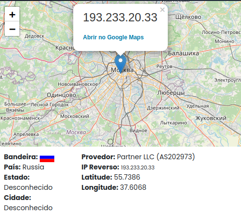

We have additional data regarding potential targets of the controller of this specific redline malware:

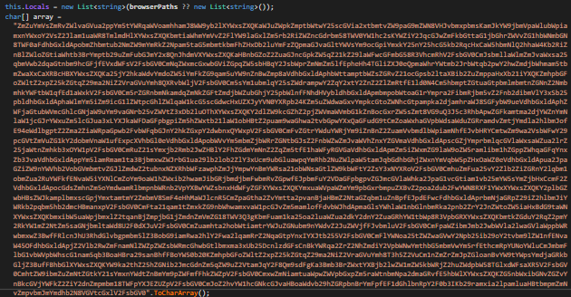

Upon decryption, we obtain:

```
ffnbelfdoeiohenkjibnmadjiehjhajb|YoroiWallet
ibnejdfjmmkpcnlpebklmnkoeoihofec|Tronlink
jbdaocneiiinmjbjlgalhcelgbejmnid|NiftyWallet
nkbihfbeogaeaoehlefnkodbefgpgknn|Metamask
afbcbjpbpfadlkmhmclhkeeodmamcflc|MathWallet
hnfanknocfeofbddgcijnmhnfnkdnaad|Coinbase
fhbohimaelbohpjbbldcngcnapndodjp|BinanceChain
odbfpeeihdkbihmopkbjmoonfanlbfcl|BraveWallet
hpglfhgfnhbgpjdenjgmdgoeiappafln|GuardaWallet
blnieiiffboillknjnepogjhkgnoapac|EqualWallet
cjelfplplebdjjenllpjcblmjkfcffne|JaxxxLiberty
fihkakfobkmkjojpchpfgcmhfjnmnfpi|BitAppWallet
kncchdigobghenbbaddojjnnaogfppfj|iWallet
amkmjjmmflddogmhpjloimipbofnfjih|Wombat
fhilaheimglignddkjgofkcbgekhenbh|AtomicWallet
nlbmnnijcnlegkjjpcfjclmcfggfefdm|MewCx
nanjmdknhkinifnkgdcggcfnhdaammmj|GuildWallet
nkddgncdjgjfcddamfgcmfnlhccnimig|SaturnWallet
fnjhmkhhmkbjkkabndcnnogagogbneec|RoninWallet
aiifbnbfobpmeekipheeijimdpnlpgpp|TerraStation
fnnegphlobjdpkhecapkijjdkgcjhkib|HarmonyWallet
aeachknmefphepccionboohckonoeemg|Coin98Wallet
cgeeodpfagjceefieflmdfphplkenlfk|TonCrystal
pdadjkfkgcafgbceimcpbkalnfnepbnk|KardiaChain
.
.
.
.
```

Let's move on to the next stage, the third one, which starts from the CAB file nicknamed ```zap9018.exe```. From this file, two more files are dropped: a ransomware nicknamed ```w38dM76.exe``` and another CAB file nicknamed ```zap1202.exe```.

This file nicknamed ```w38dM76.exe``` is a loader that unpacks another stage of shellcode, which in turn unpacks another stage of shellcode that finally has a binary packed using ```Net Reactor```. Let's learn together, and I hope it will be as beneficial for you as it was for my learning, so let's get started.

It is worth noting that I wrote an article before explaining step by step how the first stage works, in a binary that had only one packing stage in a redline malware family, [Click here for read](https://joaovitor.gq/posts/Malware-Analysis-Writeup-RedLine-Stealer-English/).

I will be brief in this first stage of unpacking.

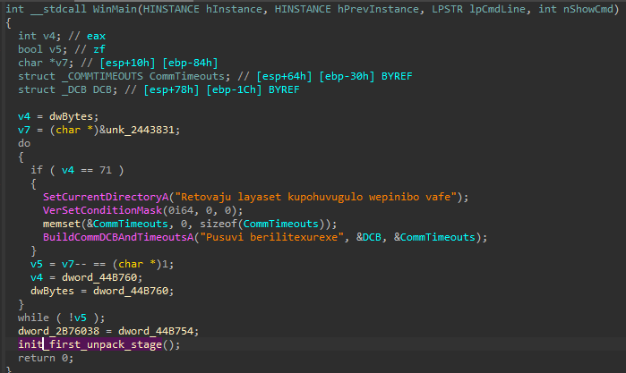

Let's move on to the ```init_first_unpack_stage()``` procedure. We'll look for how the bytes are being allocated using the winapi ```GlobalAlloc```.


After finding it, we will discover the size of the allocated region, and in this context, ```VirtualProtect``` doesn't matter, as we only want the shellcode. In this case, the value we want is 0x2D4D0. With this information, we will obtain the memory-mapped region from the WinApi return and look for the step just before it is executed.


After obtaining the decrypted shellcode, we will start our analysis in IDA:

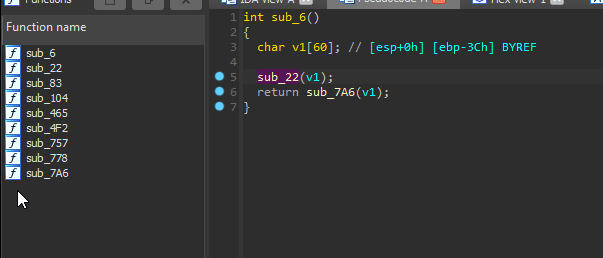

Let's now improve our shellcode analysis by adding some ```LocalTypes``` and also ```TypeLibraries```. You can access these views through the ```View -> OpenSubViews``` option.


In my case, in ```TypeLibraries```, I chose to use the Windows 10 SDK because it's the most up-to-date version for the IDA version I have available here. You can use the right mouse button to add a new library.

Now let's add the ```LocalTypes``` from ```ntdll.h``` present in the x64dbg repository. It is the most complete and well-organized and will help our decompiler to generate more objective code (although this does not matter much for our goal here).


The above result should be expected if you do everything right. Just right-click and select the ```Insert``` option, and paste all the contents of ```ntdll.h```. Some errors may occur, but canceling everything will be fine. Then select everything, right-click, and choose to synchronize, and we're ready to analyze.

In the main function, we have two calls. The first one is used by the malware to resolve its WinAPIs in the ```PEB``` via hash, and the second one will decrypt the shellcode and execute it. We can go straight to what matters and find the allocated region and get part three of the shellcode. However, it's cool to see how including ```ntdll.h``` made a difference in our analysis.

I advanced and created some structs, defined all names, and resolved all APIs used.

Here's how the reversed code organization looks like now:


Main function of the shellcode, I organized the calls by assigning new names and created a new struct to store the references.

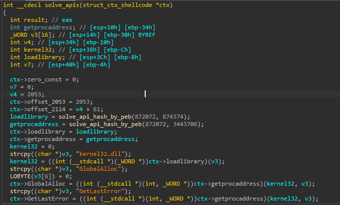

This procedure is responsible for resolving APIs and loading/mapping the necessary modules to load the third stage.


The above function is responsible for resolving the hashes from the ```PEB```.

Now, let's move on to what matters most in our analysis, which is to find the decrypted (unpacked) third stage.

To do this, I found that the API responsible for allocating memory for the shellcode is the WinApi ```VirtualAlloc```. So, we'll use it to collect the necessary information and get the mapped address and find where it will finally be executed.

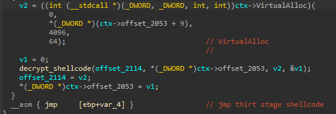

Once we have decrypted the shellcode, we finally obtain the third stage. Let's open it in IDA, configure the same types and library settings presented before, and start our preliminary analysis:


The first procedure is responsible for resolving necessary APIs via hash from the ```PEB```. The shellcode main receives the image base of the current malware process as a parameter and maps the new shellcode, decrypts it, and executes it in the second procedure nicknamed ```mapp_new_memory_call_new_shellcode.```


Moving on to what matters, at this stage it will allocate memory to store the binary before mapping and executing it.


By default, the shellcode is encrypted, but in a specific part, it is copied byte by byte to the mapped execution permission region. Afterwards, the old region is cleared to avoid evidence.

Now, let's retrieve the fifth stage, which is a protected ```.NET Reactor PE binary```.

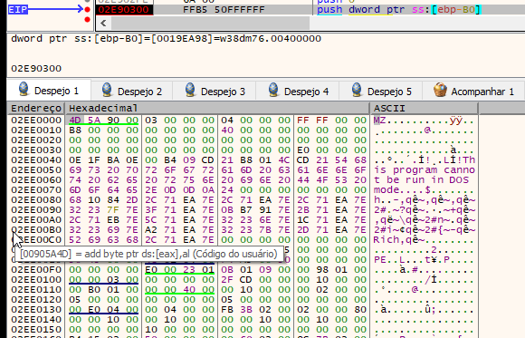


When unpacking the fifth stage, we found a ```.NET binary``` protected with ```.NET Reactor```, similar to the fourth stage. Reactor also maps the PE binary in memory for execution. This protector is paid, and the malware author likely used a cracked version. Therefore, we will start the unpacking process to obtain the mapped ```.NET binary```.

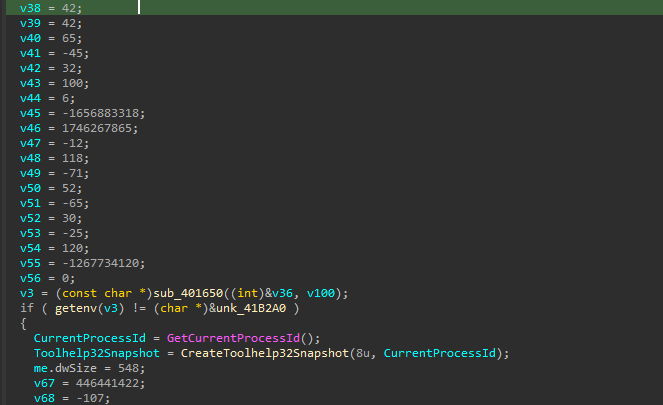

As expected, ```.NET Reactor``` also obfuscates the code. Therefore, let's search for the ```memcpy``` function, where it copies the decrypted bytes to the region before execution and before clearing the region used for decryption:


Here, we can find the pointer of the new region that stores the unpacked binary and also retrieve its size:


Now, we have the fully decrypted binary before it is mapped and executed.


Now, we can start our analysis of this stage of the malware, after completing the six unpacking stages to finally obtain the binary that will be mapped and executed in memory with two shellcodes at the same time. This new binary also belongs to the Red Line family.

Let's extract the configurations of this new malware now:


|  **Configuration** 	|      **Objective**     	|
|:------------------:	|:----------------------:	|
| 193.233.20.33:4125 	| C2 Messager Server TCP 	|
| sony               	| ID                     	|
| Militants            	| String XOR Key         	|

This IP address is the same as the other Red Line binary analyzed earlier, but using a different ID and a new XOR key for its string.

Finally, let's analyze the last stage of this malware. The CAB file ```zap1202.exe``` is responsible for dropping the last two malware files, ```tz3801.exe``` and ```v6837xU.exe```.

The first dropped binary, ```tz3801.exe```, is a type of avkiller/disabler malware. Its characteristic is to attempt to bypass any protection system installed on the victim's machine.

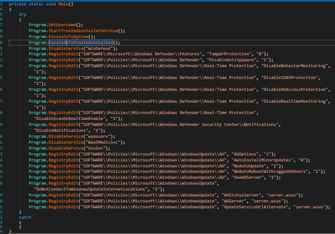

Directly, the malware attempts to perform various attempts of privilege escalation and changes to Windows and Windows Defender registry keys. It also kills security services of the operating system. In the near future, I will write an article solely dedicated to these techniques and how to recognize each one of them. The goal of the malware author is to ensure that nothing prevents the execution of the dropped Red Line malware and that the other infected binaries of it run perfectly.

As for the second dropped binary, ```v6837xU.exe```, it is another avkiller/disabler, also having 6 layers of ```packing``` like the binary that concealed a Red Line family binary. This time, I will go through the layers and go straight to the final binary obtained after unpacking the ```.NET Reactor protection```.


As we confirmed, the unpacked file that would be mapped and executed is indeed ```tz3801.exe```. The malware author uses this technique to ensure that all stages of their malware execute without being detected by security mechanisms. The shellcode packing and mapping technique in memory works well, ensuring that the malware author reaches an increasing number of victims.

## Yara Rules:

```
import "pe"

rule Amadey_Detect {

    meta:
        author = "João Vitor - Keowu"
        date_created = "15/04/2023 :)"
        description = "Essa regra detecta samples de malware da família Amadey | This rule detect samples of Amadey malware family"
    
    strings:
        $Powershell = "Ryd5QRDqbBWi3t2h9CV="
        $Main = "QOKr3a=="
        $ScriptPowerShell = "WOSq3svQgzOrHRuPCyJ="
         
        /*
                        inc EAX
			cmp ECX, 1000h
			?? ?? - maybe change
			mov edx [eax-4]
			add ecx, 23h
			sub eax, edx
        */
        $StringDecrypt_function = { 41 81 F9 00 10 00 00 ?? ?? 8B 50 FC 83 C1 23 2B C2 }


    condition:
         (
            (
                uint16(0) == 0x5A4D 
                and
                pe.is_pe
            )
         and 
         (
            $StringDecrypt_function 
         and 
         (
            $Powershell
             or
            $Main
            or
            $ScriptPowerShell
         )
         )
         )
         
}

```

```
import "pe"

rule AvKillerDisabler {
    
    meta:
        author = "João Vitor - Keowu"
        date_created = "15/04/2023 :)"
        description = "Essa regra detecta custom AVKiller | This rule detect custom AVKiller"

    strings:
        $WindowsDefender = { 57 00 69 00 6E 00 44 00 65 00 66 00 65 00 6E 00 64 00  }
        $TamperProtection = { 54 00 61 00 6D 00 70 00 65 00 72 00 50 00 72 00 6F 00 74 00 65 00 63 00 74 00 69 00 6F 00 6E 00 }
        $DisableAntiSpyware = { 44 00 69 00 73 00 61 00 62 00 6C 00 65 00 41 00 6E 00 74 00 69 00 53 00 70 00 79 00 77 00 61 00 72 00 65 00 }
        $DisableOnAccessProtection = { 44 00 69 00 73 00 61 00 62 00 6C 00 65 00 4F 00 6E 00 41 00 63 00 63 00 65 00 73 00 73 00 50 00 72 00 6F 00 74 00 65 00 63 00 74 00 69 00 6F 00 6E 00 }
        $Server_wsus = { 73 00 65 00 72 00 76 00 65 00 72 00 2E 00 77 00 73 00 75 00 73 00 }
        $RegistryKey = { 53 00 4F 00 46 00 54 00 57 00 41 00 52 00 45 00 5C 00 5C 00 50 00 6F 00 6C 00 69 00 63 00 69 00 65 00 73 00 5C 00 5C 00 4D 00 69 00 63 00 72 00 6F 00 73 00 6F 00 66 00 74 00 5C 00 5C 00 57 00 69 00 6E 00 64 00 6F 00 77 00 73 00 5C 00 5C 00 57 00 69 00 6E 00 64 00 6F 00 77 00 73 00 55 00 70 00 64 00 61 00 74 00 65 00 }
        $TrustedInstaller = { 54 00 72 00 75 00 73 00 74 00 65 00 64 00 49 00 6E 00 73 00 74 00 61 00 6C 00 6C 00 65 00 72 00 }

        /*
            Escalate privilege routine:

            ldloc.1
            ldloc.2
            ldelem.ref
            stloc.3
            ldloc.3
            callvirt  instance string [System]System.Diagnostics.Process::get_ProcessName()
            ldstr     "TrustedInstaller"
            call      bool [mscorlib]System.String::op_Equality(string, string)
            brfalse.s IL_004E
            ldloc.3
            callvirt  instance native int [System]System.Diagnostics.Process::get_Handle()
            ldc.i4    131086
            ldloca.s  V_0
            call      bool 
        */
        $EscalatePrivilege = { 07 08 9A 0D 09 6F [4] 72 [4] 28 [4] 2C [1] 09 6F [4] 20 [4] 12 [1] 28 }

    condition:
         (
            uint16(0) == 0x5A4D
            and
            pe.is_pe and pe.imports("mscoree.dll")
         )
         and
         (
            $WindowsDefender
            or
            $TamperProtection
            or
            $DisableAntiSpyware
            or
            $DisableOnAccessProtection
            or
            $Server_wsus
            or
            $RegistryKey
            or
            $TrustedInstaller
         )
         and
         $EscalatePrivilege

}
```

## IOCS

Ip's C2:
- [1] 62.204.41.87, PORT: 80 - HTTP - No Certificate
- [2] 193.233.20.33, PORT: 4125 - TCP - No Certificate

Redline Configs:

- 1º: IP [2] - fort - Mulling
- 2º: IP [2] - sony - Militants

Routes:
/joomla/index.php - POST -> From [1]

Hash's:
- f4ac368c92a39f47ff8c3370796274663912387e2b952e907a10384326d0af63 - y69Lh26.exe - Amadey
- 4f5346c8e163d2433f152db3db4590122f85da8a1f5f8436acb070fc2d00d749 - zap7146.exe - Cab Dropper
- 4fac93d65ffdf72d8c6daa48e86d5ccf0d039171676b401347ee254da38bb035 - xXdsh93.exe - Redline
- 0acd37ec594ac1db83dbd6eaac2e66e145777d2791d23cf404a61ab833b0c1a0 - zap9018.exe - Cab Dropper
- 102c23a20ce74c8859950279d0de4a91091e8912877a332c0e8d5c90473c6c0f - zap1202.exe - Cab Dropper
- 77e22b2ef9a250e95d3cf22a7d72880ec12e7e7b893fac5b78c2d958eeb22ed5 - w38dM76.exe - Packed/ShellCode/Loader/Redline/With .Net Reactor(Finally unpack a binary called Footplate.exe)
- 6d24b108886b08672e33415999a500a65a235fd6e39e5aa9b2bcb338b18aa680 - tz3801.exe - Avkiller/Disabler
- 457c3fae1725e061c26db68d5d4a3616942606368979feb998457411e228c311 - v6837xU.exe - Packed/ShellCode/Loader/Redline/With .Net Reactor(Finally unpack a binary called Healer.exe that's is a AVKILLER)

Amadey Strings List:

```
Please check AmadeyDecrypt folder, the file out.json
```

Redline Strings:

1º:
```
ffnbelfdoeiohenkjibnmadjiehjhajb|YoroiWallet
ibnejdfjmmkpcnlpebklmnkoeoihofec|Tronlink
jbdaocneiiinmjbjlgalhcelgbejmnid|NiftyWallet
nkbihfbeogaeaoehlefnkodbefgpgknn|Metamask
afbcbjpbpfadlkmhmclhkeeodmamcflc|MathWallet
hnfanknocfeofbddgcijnmhnfnkdnaad|Coinbase
fhbohimaelbohpjbbldcngcnapndodjp|BinanceChain
odbfpeeihdkbihmopkbjmoonfanlbfcl|BraveWallet
hpglfhgfnhbgpjdenjgmdgoeiappafln|GuardaWallet
blnieiiffboillknjnepogjhkgnoapac|EqualWallet
cjelfplplebdjjenllpjcblmjkfcffne|JaxxxLiberty
fihkakfobkmkjojpchpfgcmhfjnmnfpi|BitAppWallet
kncchdigobghenbbaddojjnnaogfppfj|iWallet
amkmjjmmflddogmhpjloimipbofnfjih|Wombat
fhilaheimglignddkjgofkcbgekhenbh|AtomicWallet
nlbmnnijcnlegkjjpcfjclmcfggfefdm|MewCx
nanjmdknhkinifnkgdcggcfnhdaammmj|GuildWallet
nkddgncdjgjfcddamfgcmfnlhccnimig|SaturnWallet
fnjhmkhhmkbjkkabndcnnogagogbneec|RoninWallet
aiifbnbfobpmeekipheeijimdpnlpgpp|TerraStation
fnnegphlobjdpkhecapkijjdkgcjhkib|HarmonyWallet
aeachknmefphepccionboohckonoeemg|Coin98Wallet
cgeeodpfagjceefieflmdfphplkenlfk|TonCrystal
pdadjkfkgcafgbceimcpbkalnfnepbnk|KardiaChain
bfnaelmomeimhlpmgjnjophhpkkoljpa|Phantom
fhilaheimglignddkjgofkcbgekhenbh|Oxygen
mgffkfbidihjpoaomajlbgchddlicgpn|PaliWallet
aodkkagnadcbobfpggfnjeongemjbjca|BoltX
kpfopkelmapcoipemfendmdcghnegimn|LiqualityWallet
hmeobnfnfcmdkdcmlblgagmfpfboieaf|XdefiWallet
lpfcbjknijpeeillifnkikgncikgfhdo|NamiWallet
dngmlblcodfobpdpecaadgfbcggfjfnm|MaiarDeFiWallet
ffnbelfdoeiohenkjibnmadjiehjhajb|YoroiWallet
ibnejdfjmmkpcnlpebklmnkoeoihofec|Tronlink
jbdaocneiiinmjbjlgalhcelgbejmnid|NiftyWallet
nkbihfbeogaeaoehlefnkodbefgpgknn|Metamask
afbcbjpbpfadlkmhmclhkeeodmamcflc|MathWallet
hnfanknocfeofbddgcijnmhnfnkdnaad|Coinbase
fhbohimaelbohpjbbldcngcnapndodjp|BinanceChain
odbfpeeihdkbihmopkbjmoonfanlbfcl|BraveWallet
hpglfhgfnhbgpjdenjgmdgoeiappafln|GuardaWallet
blnieiiffboillknjnepogjhkgnoapac|EqualWallet
cjelfplplebdjjenllpjcblmjkfcffne|JaxxxLiberty
fihkakfobkmkjojpchpfgcmhfjnmnfpi|BitAppWallet
kncchdigobghenbbaddojjnnaogfppfj|iWallet
amkmjjmmflddogmhpjloimipbofnfjih|Wombat
fhilaheimglignddkjgofkcbgekhenbh|AtomicWallet
nlbmnnijcnlegkjjpcfjclmcfggfefdm|MewCx
nanjmdknhkinifnkgdcggcfnhdaammmj|GuildWallet
nkddgncdjgjfcddamfgcmfnlhccnimig|SaturnWallet
fnjhmkhhmkbjkkabndcnnogagogbneec|RoninWallet
aiifbnbfobpmeekipheeijimdpnlpgpp|TerraStation
fnnegphlobjdpkhecapkijjdkgcjhkib|HarmonyWallet
aeachknmefphepccionboohckonoeemg|Coin98Wallet
cgeeodpfagjceefieflmdfphplkenlfk|TonCrystal
pdadjkfkgcafgbceimcpbkalnfnepbnk|KardiaChain
bfnaelmomeimhlpmgjnjophhpkkoljpa|Phantom
fhilaheimglignddkjgofkcbgekhenbh|Oxygen
mgffkfbidihjpoaomajlbgchddlicgpn|PaliWallet
aodkkagnadcbobfpggfnjeongemjbjca|BoltX
kpfopkelmapcoipemfendmdcghnegimn|LiqualityWallet
hmeobnfnfcmdkdcmlblgagmfpfboieaf|XdefiWallet
lpfcbjknijpeeillifnkikgncikgfhdo|NamiWallet
dngmlblcodfobpdpecaadgfbcggfjfnm|MaiarDeFiWallet
bhghoamapcdpbohphigoooaddinpkbai|Authenticator
ookjlbkiijinhpmnjffcofjonbfbgaoc|TempleWallet
```

## References

OPENSOURCE. X64DBG TEAM. Ntdll.h Reverse C++ Structures. [S. l.], 27 out. 2017. Disponível em: https://github.com/x64dbg/x64dbg/blob/development/src/dbg/ntdll/ntdll.h. Acesso em: 9 abr. 2023.
