# Malware Analysis Writeup | Amadey + Custom Dropper's with Redline Stealer with Net Reactor on shellcode's and mutant Avkiller

Author: João Vitor (@Keowu) - Malware Security Researcher

# Sample identification hash

Este malware pertence a familia Amadey, o seu objetivo é criar uma botnet, seu surgimento se deu em outubro de 2018 e é vendido por cerca de U$ 500,00 em fóruns undergrounds russos. Ele envia informações do sistema e informações sobre ferramentas de segurança(Antivirus) instalados para um servidor C2 e além disso recebe ordens e permite executar payloads em seus dispositivos infectados, dependendo da escolha e objetivos do controlador.

| Arch                                 | PE Header                        | '.text' Section                  | '.rsrc' Section                  | '.data' Section                  |
|--------------------------------------|----------------------------------|----------------------------------|----------------------------------|----------------------------------|
| PE - Cabinet - IA-32 | 313786d781922dd3736aa179747781c0 | b0b66b32f4ca82e2e157c51b24da0be7 | a10103f38bec9abc54cbab1c30aead2f | 7b9890a93c0516bb070e1170cfde54d5 |

# Overview

O escopo de ataque do Amadey é se passar por softwares legitimos, os afetados incluem desde crack's para softwares comerciais até produtos da Microsoft ou loader's de documentos do Office. uma forma atual de exploração incluem sites indexados no google com referência a keyword's como "Software ZZZ Cracked" ou "Como baixar e instalar o Software ZZZ crackeado" porem não limitado aos exemplos em questão.

# Analyzing

1 - O Primeiro estágio se caracteriza por um arquivo executável ao qual extrai dois arquivos binários em disco(y69Lh26.exe e zap7146.exe) e os executa se passando por um instalador(não MSI, e sim Cabinet Self Extractor).
2 - O Segundo estágio do Amadey tem início ao momento da execução do primeiro(zap7146.exe) ao qual executa a extração de mais dois binários(xXdsh93.exe e zap9018.exe).
3 - O Terceiro estágio tem início a partir do primeiro binário extraído no segundo estágio(zap9018.exe) e efetua a extração de mais dois arquivos binários(zap1202.exe e w38dM76.exe).
4 - O Quarto estágio tem início a partir do primeiro binário do terceiro(zap1202.exe) que efetua a extração final dos dois últimos binários(tz3801.exe e v6837xU.exe)

Vamos iniciar nossa analise:


Como o arquivo trata-se de um Cabinet podemos extrair utilizando ferramentas como o 7-Zip, e obteremos então o segundo estágio que é composto por dois binários:


O primeiro binário apelidado de "y69Lh26.exe" trata-se de um sample do Amadey, vamos analisar o seu comportamento e objetivo:

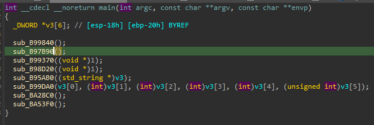

Logo no início, podemos constatar todos os métodos responsáveis pelo processo de infecção. No entanto, quando realizamos uma análise mais aprofundada da primeira chamada em si, nos deparamos com uma técnica usada pelo desenvolvedor do malware para ofuscar suas strings:

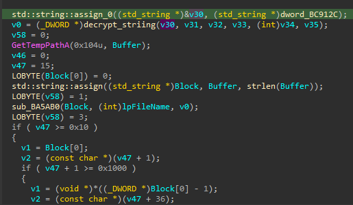

O autor do malware usa uma declaração std::string para armazenar o conteúdo de sua string criptografada.


Quando dirigimos nosso olhar para onde vem a referência global utilizada pelo malware, podemos constatar uma chamada para std::string::assign, o equivalente para código padrão C++ em algo similar ao seguinte trecho:

```c++
std::string g_string_desconhecida("");

int init_desconhecida() {
    g_string_desconhecida.assign("WbNAPdSTPOlnFH==", 0x10);
}

```

Porem o mesmo se repete em todo o escopo de execução do malware, ou seja, todas suas strings estão ofuscadas seguindo o mesmo trecho de código anteriormente apresentado. pensando nisso nos resta duas alternativas, analisar a criptografia por completo(o que levaria muito tempo, e tempo é dinheiro) e facilitar nossa vida e eliminar uma parte que não vai agregar tanto assim em nossa analise. pensando nisso vamos analisar como é feita essa chamada e como é o fluxo de chamada e retorno da função de criptografia de string utilizada pelo Amadey:

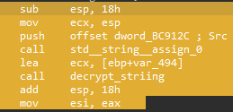

Vamos dirigir nossa atenção para o trecho de código acima destacado abaixo:

```asm
sub esp, 18h ; Vamos ter como nosso ponto de partida
mov ecx, esp ; Movemos o ponteiro do contexto de std::string
push 0xBC912C ; Passamos a string global que queremos armazenar no std::string
call std::string::assign ; chamamos std::string::assign
lea ecx, [ebp+var_494] ; Obtemos o tamanho do std::string
call decrypt_string ; chamamos o método para descriptografar o conteúdo da string
.
.
mov esi, eax ; Obtemos o retorno para string criptografada
```

A rotina de descriptografia repete sempre que o malware necessita de uma nova string para seu funcionamento. e a rotina é exatamente a mesma em todas essas chamadas(o mesmo trecho de código Assembly com a única diferença do endereço da std::string global armazenada), pensando nisso podemos entender um padrão para descriptografar essas strings e seu fluxo de entrada e saída. alterando somente o trecho em ```push 0xADD1```, vamos criar um script que altera esse endereço pelo endereço da próxima string a ser descriptografada, e assim por diante, até chegarmos ao último endereço. e claro lendo o endereço de retorno e armazenando essa string para utilizarmos no IDA, definindo o EIP sempre ao início do trecho quando necessário. existem diversas formas de automatizar o x64dbg(Para os intímos x96dbg) desde assembly, python(eles possuem um suporte e funciona muito bem). porem dessa vez utilizarei de um projeto muito legal e funcional que oferece muitos recursos úteis o nome do projeto é LyScript. ele nos permite codificar script's de automação para o x64dbg e executar localmente ou remotamente. pensando nisso fiz um script que faz com que o x64dbg faça todo o trabalho duro para nós:

```python

...
encrypted_string_offsets = [
    0x38ACC, 0x3915C, 0x38C1C,
    0x38964, 0x38CAC, 0x38FAC,
    .
    .
    .
]

jsonobj = []

for addy in encrypted_string_offsets:
    module_base = dbg.get_module_base("y69lh26.exe")

    # O EIP deve ser definido em module_base+0x986C -> sub esp, 0x18
    dbg.set_register("EIP", (module_base + 0x986C))

    wait(module_base + 0x9871)

    dbg.assemble_at(module_base + 0x9871, "push {}".format(hex(module_base + addy)))

    wait(module_base + 0x9889)

    ida_dict = {
        'IDA_OFFSET': addy,
        'IDA_STR': get_fixed_strings(get_string_pointer()) + get_fixed_strings(get_string_reference()),
        'IDA_OR': get_string_pointer() + get_string_reference()
    }

    jsonobj.append(ida_dict)

    dbg.set_register("EIP", (module_base + 0x986C))

dbg.close()

f = open("out.json", "wb")
f.write(json.dumps(jsonobj).encode())

```

O Script acima pode ser encontrado no repositório dessa analise, com o nome de "AmadeyDecrypt".

O funcionamento do script é bem simples, ele desloca o ponteiro de instrução EIP até o endereço inicial da rotina de descriptografia, e com base em uma lista de endereços exportados do IDA ele efetua um laço de repetição, alterando o endereço do parâmetro de chamada da stack, e lê os dados do ponteiro de retorno, sendo ele uma string presente somente no ponteiro de retorno ou na referência do ponteiro de retorno. armazenando isso em um objeto json do python e ao final armazenando essas informações e strings obtidas em disco.

Um exemplo de saída desse arquivo é apresentado abaixo:

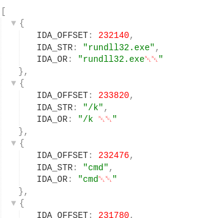

A chave IDA_OFFSET armazena o endereço onde a string pertence, a chave IDA_STR armazena a string que será utilizada no IDA(para nomear suas variáveis globais) e a chave IDA_OR é utilizada para adicionar comentários em cada uma de suas xrefs.

Agora precisamos aplicar essas informações no IDA para acelerar nosso processo de analise, para facilitarmos nossa vida também desenvolvi um script ao qual podemos usar para esta tarefa:

```python

def trata_ida_string(strs):
    if strs == "" or len(strs) <= 1:
        return "a_" + strs + str(random.randint(0, 10000)) + "_fix"
    elif strs[0] in "0123456789":
        strs = list(strs)
        strs[0] = 'f'
        return trata_ida_string(''.join(strs))

    string = ""
    for c in strs:
        if c in "abcdefghijklmnopqrstuvwxyzABCDEFGHIJKLMNOPQRSTUVWXYZ":
            string += c

    string = string + "_fix"

    if string == '_fix':
        return 'b_' + str(random.randint(0, 10000)) + string

    return "c_" + str(random.randint(0, 10000)) + string


def rename_string_constantes(json):
    print("Velho nome: " + ida_name.get_name(json['IDA_OFFSET']) + " -> " + trata_ida_string(json['IDA_STR']))
    ida_name.set_name(json['IDA_OFFSET'], trata_ida_string(json['IDA_STR']), ida_name.SN_CHECK)
    for xref in idautils.XrefsTo(json['IDA_OFFSET'], flags=0):
        print(hex(xref.frm))
        idc.set_cmt(xref.frm, json['IDA_STR'], 0)
        idc.set_cmt(xref.frm, json['IDA_STR'], 1)


jsonobj = json.loads(open("out.json", "rb").read())

for json in jsonobj:
    print("Decrypting string at: {}".format(hex(json['IDA_OFFSET'])))
    rename_string_constantes(json)

```

Com este script's podemos automatizar a tarefa de renomear cada string que desofuscamos no binário do malware. ele vai renomear a declaração global utilizada, obviamente o IDA possuí algumas regras de nomes de variáveis, por isso o método "trata_ida_string" foi criado, ele vai garantir que nenhum erro chegue até o usuário validando todas as possibilidades possíveis de uma string ser renomeada de forma errada. além disso a string original é definida em cada xrefs para a declaração global utilizada garantindo que possamos entender perfeitamente qual string/valor estamos lidando.

Vamos ver o funcionamento desse script e como ele nos ajudou a ganhar tempo em nossa análise:


Nesse exemplo o script vai fazer a descriptografar as strings de forma automazida e armazenar para que possamos aplicar no nosso IDB.


Nesse exemplo o script utilizando IDAPython vai aplicar as strings no nosso IDB para facilitar nossa análise em questão de segundos.

Após corrigirmos as strings e fazer uma analise profunda desse estágio do malware é possível chegar ao seguinte escopo de funcionamento, que sera apresentado de maneira resumida pois esse malware possui diversos estágios:


Logo no início temos uma chamada para ```cria_diretorios_temporarios_se_copia_copiado_como_legenda_dot_exe``` apesar do nome cumprido isso explica exatamente a intenção desse procedimento, ele vai auto copiar o malware para o diretório ```C:\Users\PC\AppData\Local\Temp\f22b669919\``` com o novo nome de "legenda.exe".

De maneira resumida o malware vai descriptografar a string do nome do diretório a ser criado, vai fazer uma chamada para ```GetTempPathA``` vai converter para ```std::string``` vai concatenar com a string descriptografada contendo o nome do path, vai fazer uma chamada para ```GetModuleFileNameA``` para recuperar seu nome, vai criar um diretório com ```CreateDirectoryA```, chamar ```CopyFileA``` e por fim vai chamar ```shell_execute``` para criar seu processo:


Avançando na explicação do funcionamento do malware, vamos pular o procedimento apelidado de ```mutext_stuff``` ele só é utilizado para sincronizar threads utilizadas pelo malware. vamos então analisar ```set_persistence_thechnicals()```, ele é responsável por garantir que o malware esteja sempre em execução, para isso ele usa algumas técnicas presentes no Windows. ao todo esse malware utiliza dois mecanismos de persistência por chaves de registro e por serviço que será explicado posteriormente, neste procedimento são utilizados:

|                      **Chaves de Registro**                     |
|:---------------------------------------------------------------:|
| SOFTWARE\Microsoft\Windows\CurrentVersion\RunOnce               |
| Software\Microsoft\Windows NT\CurrentVersion\Run                |
| SOFTWARE\Microsoft\Windows\CurrentVersion\Explorer\ShellFolders |

O Fluxo de definição das chaves de registro consiste em dois procedimentos separados. sendo o primeiro chamadas para ```RegOpenKeyExA```, ```RegSetValueExA``` e ```RegCloseKey```. já o segundo procedimento é utilizado apenas para verificar se as alterações foram feitas corretamente, sendo chamadas para ```RegOpenKeyA```, ```RegQueryValueExA``` e por fim ```RegCloseKey```.


Vamos agora analisar outra técnica de persistência utilizada pelo malware. dessa vez dirigindo nossa atenção ao procedimento nomeado de ``` execute_in_shell_schtasks_command_with_path_to_make_it_a_service()```, a função desse procedimento é montar um comando schtasks para criar um serviço passando o path atual de execução como argumento para garantir que o malware sempre esteja em execução no sistema operacional da vitíma.

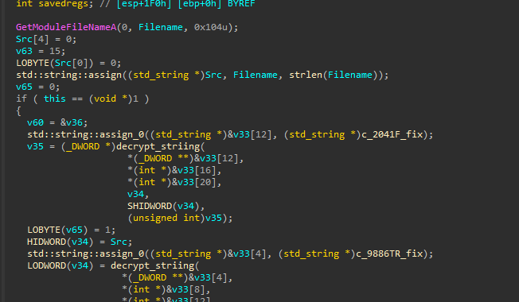

Logo no início do procedimento é possível constatar uma chamada para GetModuleFileNameA, que é usado para recuperar o nome do executável do malware.

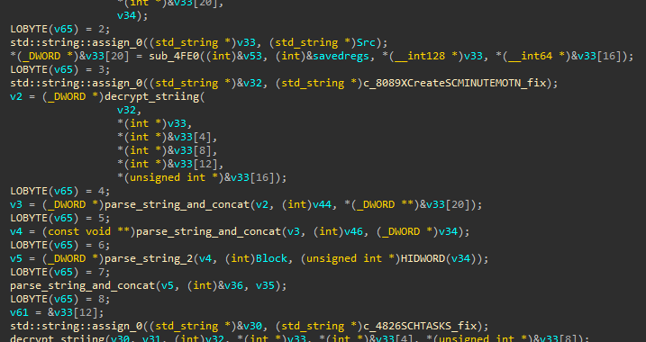

Avançando mais um pouco podemos constatar o comando sendo montado ```schtasks /Create /SC MINUTE /MO 1 /TN y69Lh26.exe /TR "y69Lh26.exe" ``` sendo utilizada para montar o comando de serviço do Windows e garantindo que seja executado em tempos especificos.


Por fim uma chamada para ```shell_execute``` é efetuada para enfim criar o serviço que se derá inicio no tempo definido pelo criador do malware. 

Essa técnica pode não ser muito efetiva por não ser silenciosa o suficiente e depender que o usuário conceda permissão de administrador ao malware. porem é necessário destacar que a permissão de execução como administrador é padrão nesse tipo de ataque graças a engenharia social aplicada por trás e todo contexto criado pelo atacante.

Vamos pular a explicação do procedimento ```get_current_process_name_and_path()``` pois ele é utilizado apenas para recuperar o nome e o path atual de execução do malware para ser utilizado na próxima rotina apelidada de ```create_a_shell_command_on_memory_and_use_shellexecute()```, esse procedimento é responsável por criar um comando shell bat que sera usado para remover as permissões de execução do binário do malware do usuário atual, impedindo que ele possa excluir por exemplo, isso é uma garantia que o malware ficara sempre presente no computador da vítima, essa técnica tem uma alta garantia de funcionamento e tem uma baixa chance de ser detectada pelos mecanismos de seguranças. 

vamos entender como é formada essa string:

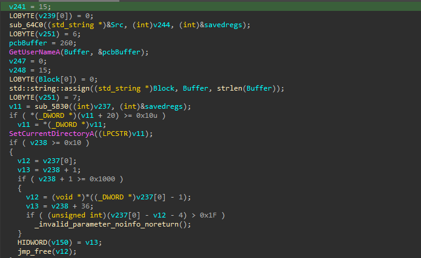

Logo no início do procedimento podemos encontrar uma chamada para a winapi ```GetUserNameA``` que é utilizada para recuperar o nome do usuário atual logado no sistema, logo após o nome obtido é convertido para um ```std::string```. em seguida possuímos uma chamada para ```SetCurrentDirectoryA``` utilizada para recuperar o path atual de execução do malware.


Logo em seguida podemos observar diversas strings descriptografadas e montadas para formarem o comando shell a ser executado via ```shell_execute```.


Após as strings serem concatenadas são passadas como um std::string para um wrapper de uma função responsável por executar uma chamada para ShellExecuteA.

O comando executado é:

``` echo Y|CACLS "y69Lh26.exe" /P "1234:N" ```

O comando permite que o malware direcione o fluxo de saída para a ferramenta de linha de comando CACLS que gerencia a lista de controle de arquivos e pastas, em seguida é passado como argumento o nome do executável ao qual desejamos aplicar as regras e permissões de acesso, /P indica que o windows vai modificar a lista de controle de acesso ACL, 1234 é o usuário ao qual desejamos aplicar a regra, e por fim o N representa negar todas as permissões. logo após a execução todas as permissões do arquivo são removidas e os usuários do computador perdem acesso do arquivo do malware, impedindo que seja excluído sem que antes novas permissões sejam atribuidas:


Vamos agora direcionar nossa atenção ao próximo procedimento apelidado de ```get_user_computer_name_user_sid_and_installed_av_path_of_malware_to_send_c2```, ele é responsável por coletar informações sobre o computador infectado, que é então enviado para seu servidor de comando e controle, vamos analisar como é feito esse procedimento de coleta:


Logo ao início temos uma chamada para determinate_os_version, esse procedimento é responsável por determinar a versão do sistema operacional da vítima, vamos ver como funciona:

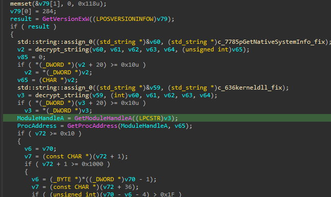

Primeiramente o malware efetua uma chamada para ```getVersionExW``` para efetuar uma tentativa de obter o sistema operacional atual de sua vítima. porem cabe-se destacar que essa API é antiga e pode não funcionar dessa forma o malware utiliza efetua uma chamada para o export ```GetNativeSystemInfo``` presente na ```Kernel32```, além disso esse processo é feito de maneira dinâmica em tempo de execução, dessa vez de forma mais efetiva para recuperar as informações do sistema operacional(além disso a chamada em tempo de execução é feita devido a capacidade de alguns antivirus detectarem essa chamada ao gerar scores de maliciosidade ao binário), cabe-se destacar que essa API é disponível apenas para Windows 64(WOW64 que é o subsistema de x64 no Windows) e caso o processador não seja x64 então o malware efetua uma chamada para a outra API GetSystemInfo:


Além dessas técnicas o malware também faz algumas consultas em chaves de registro utilizando os procedimentos anteriormente apresentados a procedure "openkey_queryvalue_closekey":


Para esta consulta o malware utiliza a seguinte chave e campo em busca do valor de build:

```HKEY_LOCAL_MACHINE -> SOFTWARE\Microsoft\WindowsNT\CurrentVersion -> CurrentBuild```

Essa chave armazena a versão atual do sistema operacional da vítima que sera usada mais a frente pelo atacante.


O Malware também recupera o valor da chave ProductName do mesmo caminho da chave de registro anteriormente apresentada, para coletar o nome da versão do sistema de sua vítima por exemplo ```Windows 10 Pro```.

Vamos agora explicar o próximo procedimento do método ```get_user_computer_name_user_sid_and_installed_av_path_of_malware_to_send_c2```, ele é foi apelidado de ```get_native_sys_info``` e é responsável por ser uma segunda garantia ao autor do malware de que as informações da vítima serão coletadas, sua única função é efetuar chamadas para ```GetNativeSystemInfo``` de maneira dinâmica em ambientes x64, e caso esteja rodando em x86 para ```GetSystemInfo```. dessa forma ao continuarmos nossa análise do procedimento principal, podemos encontrar chamadas para chaves de registro responsáveis por coletar o nome do computador da vítima:


Dessa forma acessando o valor em:

`` HKEY_LOCAL_MACHINE -> SOFTWARE\Microsoft\WindowsNT\CurrentVersion -> ComputerName ``

O malware também coleta outras informações:

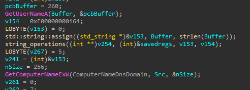

O nome do usuário da vítima também é coletado utilizando ```GetUserNameA```, além disso ele também tem a capacidade de obter o nome do DNS associado ao computador local na rede internal(em caso de empresas isso pode ser bem perigoso) para isso uma chamada para ```GetComputerNameExW``` é efetuada passando o parâmetro referente a consulta de nome de dns local ```ComputerNameDnsDomain```.

Outra capacidade desse procedimento do malware é capturar e identificar os mecanismos de segurança de terceiros presentes no computador de sua vítima(também conhecidos como ferramentas de Antivírus) para essa função ele utiliza de um procedimento apelidado de ```find_antivirus_in_temp_path_to_get_folder_atributes```, esse procedimento é utilizado para armazenar o nome desse vendor para ser enviado ao servidor C2 do atacante, vamos entender como funciona:


O começo do procedimento já é suficiente para explicar todo o escopo de funcionamento do malware utilizado para detectar quais mecanismos de antivírus estão instalados no computador da vítima.

De maneira direta o malware desencripta uma string com o nome/path do antivírus da vítima, nesse exemplo é utilizado o path do AVAST. em seguida ele efetua uma chamada para o procedimento ```get_temp_path()``` que é responsável por obter o path de ProgramData de sua vítima(```C:\\ProgramData\\```), e em seguida concatenar com a referência da pasta da solução descriptografado(```AVAST Software```). dessa forma fazendo uma chamada para ```GetFileAttributes``` passando como parâmetro o path escolhido, ```C:\\ProgramData\\AVAST Software```, então verificando o retorno da chamada e comparando se o diretório de fato existe.

Esta técnica empregada é bastante efetiva, e referências de retorno como INVALID_FILE_ATTRIBUTES e FILE_ATTRIBUTE_DIRECTORY indicam que o mesmo não existe.

Ao analisarmos completamente o restante da chamada podemos montar uma lista dos afetados por essa busca:

| **Security Vendor List** |
|---------------------------------|
| AVAST Software                  |
| Avira                           |
| Kaspersky Lab                   |
| ESET                            |
| Panda Security                  |
| Doctor Web                      |
| AVG                             |
| 360 Total Security              |
| Bit Defender                    |
| Norton                          |
| Sophos                          |
| Comodo                          |

Após a última coleta referente aos vendores de antivírus, o malware já tem todas as informações prontas para serem enviadas ao servidor C2. nosso próximo passo nesta análise.

Vamos agora analisar o último procedimento desta etapa do malware, ```c2_communication_persistence_dll_download()```, esse procedimento é responsável por enviar os dados coletados para um servidor C2 via post, e depois efetuar o download de uma dll via chamada para a API ```InternetReadFile``` que é salvada em disco e executada via técnica de ```rundll.exe```, vamos entender como isso funciona juntos:


No início do procedimento o malware utiliza duas técnicas, a primeira é utilizada para conectar ao servidor C2 enviar as informações coletadas, e efetuar um download de uma DLL, o segundo é utilizado para garantir que essa DLL comece a executar a partir do momento que ele estiver em disco, vamos analisar o funcionamento:

Começando pela nossa analise do primeiro procedimento ao qual é executado pela primeira thread, ```remote_c2_connector```:


Logo no início podemos observar uma string contendo o endereço IPV4 sendo descriptografado, ele será usado pelo malware para conectar-se ao servidor C2, vamos avançar e entender como essa comunicação é feita.


Logo no início do procedimento o malware efetua uma chamada para WinApi ```InternetOpenW``` que vai inicializar o uso de funções da família Winet do Windows. Após ele efetua uma chamada para InternetConnectA responsável por configurar os parâmetros de destino e protocolo de comunicação de rede, nessa parte o malware vai passar como parâmetro o endereço IP de seu C2 e a flag ```INTERNET_DEFAULT_HTTP_PORT``` para definir uma conexão HTTP simples.


Logo em seguida o malware efetua uma chamada para ```HttpOpenRequestA```, o intuíto dele é criar um handle de requisição HTTP, o malware define o parâmetro ```lpszVerb``` como requisição http do tipo ```POST```, além de definir o lpszObjectName como ```/joomla/index.php```, existe um motivo por trás que ficara mais claro conforme avançamos nesta explicação.


Neste ponto o malware utiliza a WinApi ```HttpSendRequestA``` para de fato enviar os dados para seu servidor C2. dados estes anteriormente coletados. Primeiro o malware define o content type para a requisição HTTP(lpszHeaders), neste caso ```appication/x-www-form-urlencoded```, logo em seguida ele define o lpOptional uma string contendo todos os dados coletados que serão enviados para a requisição POST ao seu C2, por exemplo ``id=872447961413&vs=3.68&sd=e2b41a&os=1&bi=1&ar=1&pc=DESKTOP-V8EL139&un=1234&dm=&av=8&lv=0&og=1``, id é um identificador único do computador anteriormente coletado, junto com diversas outras informações como por exemplo o antivírus instalado e por questão óbvias definindo um índice númerico para ele.

Vamos avançar mais um pouco e entender como o malware faz o download de uma DLL a partir do seu C2 logo após o envio das informações para ele.


Após os dados serem enviados ao C2 via POST o malware inicia o processo de leitura de um buffer da rede, a primeiro momento é feita uma tentativa e validado se esse buffer foi lido.


Caso o buffer tenha sido lido corretamente do C2, então o malware executa um loop lendo e armazenando buffer de ```1024 bytes``` até que não seja mais possível ler, dessa forma encerrando sua conexão ao fechar o handle. este buffer em questão trata-se de uma DLL que será executada via rundll, na próxima thread principal destacada anteriormente, a ```garant_rundll_execute```, vamos entender como ela funciona.

A primeiro momento o malware grava o buffer lido do seu c2 em disco com o nome de ```clip64.dll```, em um path local app data, e logo em seguida valida se este arquivo existe, caso exista ele chama ```rundll.exe``` passando como parâmetro na command line, o path da dll, e o export ao qual devera ser executado:


O malware valida a existência do arquivo e seu tamanho, antes de executar propriamente dito.


Após a verificação do tamanho do arquivo o malware desencripta uma string com o nome Main, e passa o PATH temporário e o export Main de forma que a execução da DLL maliciosa ocorra, veja um exemplo:

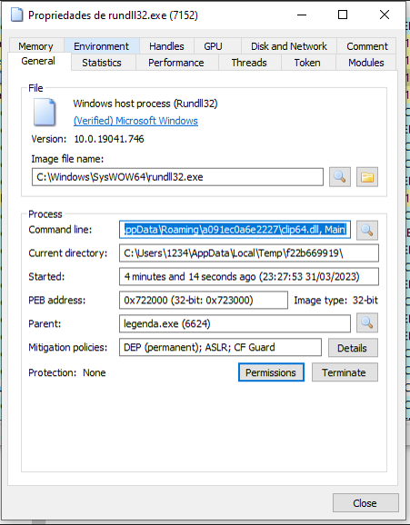

Cabe-se destacar que a dll apelidada de ```clip64.dll``` é uma DLL capaz de roubar dados da área de transferência do usuário e gravar em um arquivo. durante esta analise infelizmente o arquivo não estava disponível para uma analise graças ao C2 ter sido derrubado. além da ```clip64.dll``` existe outra dll que também é baixada apelidada de ```cred64.dll```, porem similar a ```clip64``` não foi possível recuperar:


! Cabe-se destacar que é super possível encontrar os arquivos ```cred64.dll``` e ```clip64.dll``` online, porem alguns autores de malware costumam modificar seus códigos fontes para inserir rotinas personalizadas, dessa forma para garantir que a analise seja fiel, e somente com as informações disponíveis no próprio arquivo sem técnicas de OSINT ou qualquer outra.

A partir das informações coletadas desta amostra e as informações coletadas através de engenharia reversa podemos listas as informações sobre este IOC:

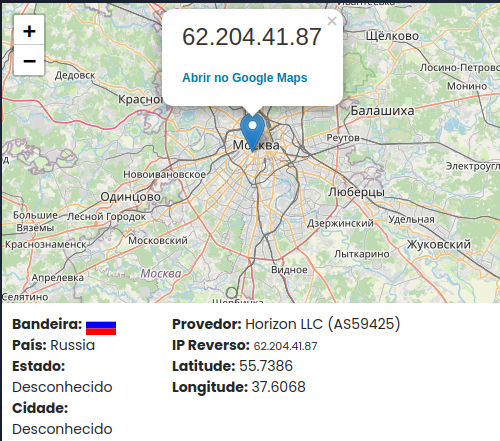

O servidor estava hospedado na rússia, porem já sofreu um Take Down.


|                                        **Informations**                                        	|
|:----------------------------------------------------------------------------------------------:	|
| 62.204.41.87                                                                                   	|
| /joomla/index.php                                                                              	|
| POST                                                                                           	|
| id=872447961413&vs=3.68&sd=e2b41a&os=1&bi=1&ar=1&pc=DESKTOP-V8EL139&un=1234&dm=&av=8&lv=0&og=1 	|
| content-type: appication/x-www-form-urlencoded                                                 	|


Vamos analisar agora o segundo estágio, que tem como característica ser dropado pelo arquivo CAB apelidado de ```zap7146.exe```, ele é responsável por dropar mais dois arquivos, sendo um malware da família redline(nosso bom e velho conhecido) apelidado de ```xXdsh93.exe```, e claro, outro arquivo CAB apelidado de ```zap9018.exe```.

Os malwares da família redline já foram analisados por mim no passado, não que sejam menos importantes, muito pelo contrario, porem vamos extrair logo de uma vez as informações mais importantes presente nele, seu servidor IOC e ID do seu C2. e claro um arquivo de configuração/target, só estas informações serão de bom tamanho para um possível take down. então vamos iníciar nossa analise:

Para o processo de extração das configurações precisamos encontrar as string em base64 e sua chave xor:

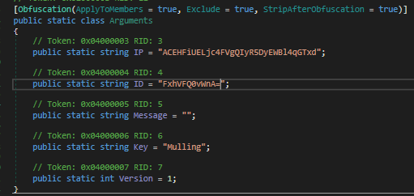

E aplicar o algoritmo:

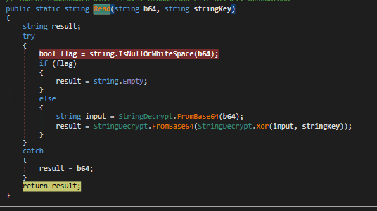

Para enfim obtermos os dados necessários de configurações do malware:

|  **Configuration** 	|      **Objective**     	|
|:------------------:	|:----------------------:	|
| 193.233.20.33:4125 	| C2 Messager Server TCP 	|
| fort               	| ID                     	|
| Mulling            	| String XOR Key         	|

O servidor C2 de seu redline também estava hospedado na rússia antes de sofrer um take down.


Além desses dados temos outros dados de possível alvos do controlador desse malware redline em específico:


Ao descriptografar obtemos:

```
ffnbelfdoeiohenkjibnmadjiehjhajb|YoroiWallet
ibnejdfjmmkpcnlpebklmnkoeoihofec|Tronlink
jbdaocneiiinmjbjlgalhcelgbejmnid|NiftyWallet
nkbihfbeogaeaoehlefnkodbefgpgknn|Metamask
afbcbjpbpfadlkmhmclhkeeodmamcflc|MathWallet
hnfanknocfeofbddgcijnmhnfnkdnaad|Coinbase
fhbohimaelbohpjbbldcngcnapndodjp|BinanceChain
odbfpeeihdkbihmopkbjmoonfanlbfcl|BraveWallet
hpglfhgfnhbgpjdenjgmdgoeiappafln|GuardaWallet
blnieiiffboillknjnepogjhkgnoapac|EqualWallet
cjelfplplebdjjenllpjcblmjkfcffne|JaxxxLiberty
fihkakfobkmkjojpchpfgcmhfjnmnfpi|BitAppWallet
kncchdigobghenbbaddojjnnaogfppfj|iWallet
amkmjjmmflddogmhpjloimipbofnfjih|Wombat
fhilaheimglignddkjgofkcbgekhenbh|AtomicWallet
nlbmnnijcnlegkjjpcfjclmcfggfefdm|MewCx
nanjmdknhkinifnkgdcggcfnhdaammmj|GuildWallet
nkddgncdjgjfcddamfgcmfnlhccnimig|SaturnWallet
fnjhmkhhmkbjkkabndcnnogagogbneec|RoninWallet
aiifbnbfobpmeekipheeijimdpnlpgpp|TerraStation
fnnegphlobjdpkhecapkijjdkgcjhkib|HarmonyWallet
aeachknmefphepccionboohckonoeemg|Coin98Wallet
cgeeodpfagjceefieflmdfphplkenlfk|TonCrystal
pdadjkfkgcafgbceimcpbkalnfnepbnk|KardiaChain
.
.
.
.
```

Vamos enfim avançar para o próximo estágio, dessa vez o terceiro, a partir do arquivo CAB apelidado de ```zap9018.exe```, a partir dele são dropados mais dois arquivos, sendo eles um ransonware apelidado de ```w38dM76.exe``` e outro arquivo Cab apelidado de ```zap1202.exe```.

Esse arquivo apelidado de ```w38dM76.exe``` ele é um loader, que faz o unpack de um outro estágio de shellcode, que então faz o unpack de outro estágio de shellcode que enfim possuí um binário packeado usando ```Net Reactor```, dessa forma vamos aprender juntos e espero que seja tão proveitoso para você que esta lendo como foi para meu aprendizado, então vamos iniciar.

Cabe-se destacar que eu fiz um artigo antes explicando passo a passo sobre como o primeiro estágio funciona, em um binário que só possuía um estágio de packing em um malware da família redline, [clique aqui  para conferir](https://joaovitor.gq/posts/Malware-Analysis-Writeup-RedLine-Stealer-Portugu%C3%AAs/).

Serei breve nesse primeiro estágio de unpacking.


Vamos avançar sobre o procedimento ```init_first_unpack_stage()```. e já vamos procurar a maneira como os bytes estão sendo alocados, com a winapi ```GlobalAlloc```:


Ao encontrar vamos descobrir qual o tamanho da região alocada, pouco importa ```VirtualProtect``` nesse contexto, porque só queremos o shellcode. e nesse caso o valor que queremos é 0x2D4D0. com essa informações vamos obter a região mapeada em memória do retorno da WinApi e procurar um passo antes de enfim ser executado.

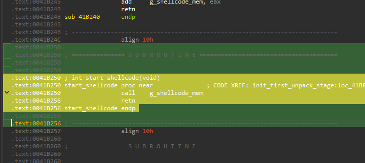

Após pegar o shellcode descriptografado, vamos iníciar nossa análise no IDA:


Vamos agora melhorar nossa análise do shellcode adicionando alguns ```LocalTypes``` e também ```TypeLibraries```, você pode ter acesso a essas views via a opção ```View -> OpenSubViews```:

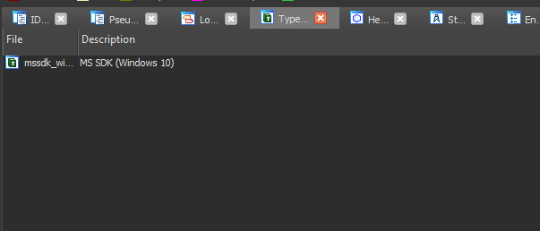

No meu caso em ```TypeLibraries``` eu optei por usar a sdk do Windows 10 por ser a mais atual para a versão do IDA que eu tenho disponível aqui, você pode usar o botão direito do mouse para adicionar uma nova Library.

Vamos agora adicionar os ```LocalTypes``` a partir da ```ntdll.h``` presente no repositório do x64dbg, ela é a mais completa e muito bem organizada e vai ajudar nosso decompiler a gerar um código mais objetivo(apesar disso não importar tanto para o nosso objetivo em questão aqui).

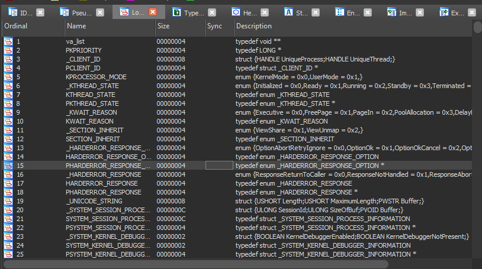

O Resultado acima devera ser o esperado se você fizer tudo certinho, basta você clicar com o botão diretio e selecionar a opção ```Insert``` e colocar todo o conteúdo da ```ntdll.h``` alguns erros podem ocorrer mais ao cancelar tudo estara bem. então selecione tudo e com o botão direito escolha sincronizar, e pronto vamos analisar.

Logo na main temos duas chamadas a primeira é utilizada pelo malware para resolver suas winapi's na ```PEB``` via hash e o segundo vai descriptografar o shellcode e executar(podemos ir direto ao que interessa e encontrar a região alocada e pegar a parte três do shellcode). porem é muito lega a gente ver como incluir a ```ntdll.h``` fez a diferença em nossa analise.

Eu me adiantei e criei algumas structs e defini todos os nomes e resolvei todas as api's utilizadas.

Veja como ficou a organização do código revertido:


Shellcode main, eu organizei as chamadas atribuindo novos nomes e criei uma struct nova para armazenar as referências.


Procedimento responsável por resolver as api's e carregar/mapear os modulos necessários para carregar o terceiro estágio.


A função acima é responsável por resolver as hash a partir da ```PEB```.

Vamos agora ao que interessa na nossa analise que é encontrar o terceiro estágio descriptografado(unpacked).

Para isso eu descobrir que a api responsável por alocar a memória para o shellcode é a WinApi ```VirtualAlloc``` então vamos aproveitar dela para coletar as informações necessárias e pegar o endereço mapeado e encontrar onde ele será enfim executado.


Após descriptografarmos o shellcode enfim obtemos o terceiro estágio. vamos abrir no IDA, fazer as mesmas configurações de Tipos e Library anteriormente apresentados, e iniciar a nossa pré-análise dele.


O primeiro procedimento é responsável por resolver api's necessárias via hash da ```PEB```, o shellcode main recebe como parâmetro a image base do processo atual do malware. e mapeia o novo shellcode, descriptografa e executa no segundo procedimento apelidado de ```mapp_new_memory_call_new_shellcode```:


Avançando ao que nos interessa, nesta etapa ele vai alocar memória para armazenar o binário antes de mapear e executar.


Por padrão o shellcode é criptografado, porem em uma parte específica ele é copiado byte a byte para a região com permissão de execução mapeada. e claro logo após a antiga região é limpada para evitar evidencias.

Vamos então recuperar agora o quinto estágio que é um binário ```PE .NET Protegido com Reactor```.


Ao fazermos o unpack do quinto estágio encontramos um ```binário .Net``` protegido com ```.Net Reactor```, similar ao quarto estágio o Reactor também mapeia o binário PE na memória para executar, esse protector é pago e com certeza o autor do malware utilizou algum versão crackeada. então vamos iniciar o unpacking desse protector para enfim obtermos o ```binário .Net``` mapeado.


Como esperado o ```.Net Reactor``` também ofusca o código, vamos então procurar o ```memcpy``` que é onde ele copia os bytes descriptografados antes da região para execução e antes de zerar a região utilizada para descriptografar:


Aqui podemos encontrar o ponteiro da nova região que armazena o binário unpackeado e também recuperar seu tamanho:

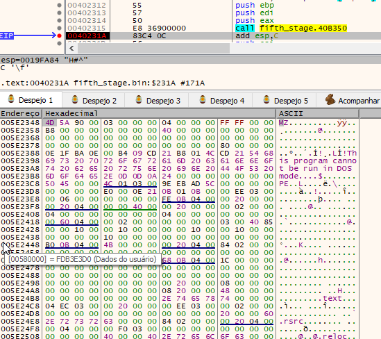

Agora possuímos o binário completamente descriptografado antes de ser mapeado e executado.


Agora podemos iniciar nossa analise desse estágio do malware, após concluírmos as seis etapas de unpacking até obter enfim o binário que sera executado de maneira mapeada na memória de dois shellcode ao mesmo tempo, esse novo binário também pertence a família Red Line.

Vamos agora extrair as configurações desse novo malware:

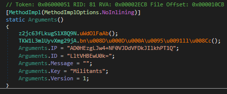


|  **Configuration** 	|      **Objective**     	|
|:------------------:	|:----------------------:	|
| 193.233.20.33:4125 	| C2 Messager Server TCP 	|
| sony               	| ID                     	|
| Militants            	| String XOR Key         	|

Este endereço IP é o mesmo do outro binário redline analisado anteriormente. porem utilizando um ID diferente e uma nova chave XOR da sua string.

Enfim vamos analisar o último estágio deste malware, o arquivo CAB ```zap1202.exe``` é responsável por dropar os últimos dois arquivos do malware ```tz3801.exe``` e ```v6837xU.exe```. 

O primeiro binário dropado ```tz3801.exe``` tem como característica ser um malware do tipo avkiller/disabler, sua característica é tentar bypassar qualquer sistema de proteção instalado na máquina da sua vítima:


De maneira direta o malware tanta efetuar diversas tentativas de elevação de privilégio e alterações em chaves de registro do Windows e Windows Defender. além é claro de matar serviços de segurança do sistema operacional. no futuro próximo vou fazer um artigo somente dedicado a essas técnicas e como reconhecer cada uma delas. o objetivo do autor do malware é fazer com que nada impeça que o seu malware redline dropado execute, além de garantir que os demais binários infectados dele executem perfeitamente.

Já o segundo binário dropado ```v6837xU.exe``` trata-se de um outro avkiller/disabler, também possuindo 6 camadas de ```packing```, igual ao binário que ocultava um binário da família redline, dessa vez vou passar por elas e ir direto ao binário final obtido após fazer o unpack da ```proteção do .Net Reactor```:

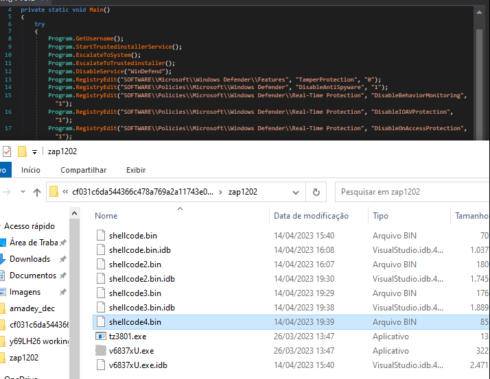

Como pode-se confirmar o arquivo que seria mapeado e executado, após fazermos o unpacking. podemos confirmar que trata-se do próprio ```tz3801.exe```. o autor do malware utiliza esta técnica para garantir que todos os estágios do seu malware executem sem que os mecanismos de segurança descubram. a técnica de shellcode packing e mapeamento do binário em memória funciona muito bem e garante que o autor do malware atinja um número cada vez maior de vítimas.

## Yara Rules:

```
import "pe"

rule Amadey_Detect {

    meta:
        author = "João Vitor - Keowu"
        date_created = "15/04/2023 :)"
        description = "Essa regra detecta samples de malware da família Amadey | This rule detect samples of Amadey malware family"
    
    strings:
        $Powershell = "Ryd5QRDqbBWi3t2h9CV="
        $Main = "QOKr3a=="
        $ScriptPowerShell = "WOSq3svQgzOrHRuPCyJ="
         
        /*
                        inc EAX
			cmp ECX, 1000h
			?? ?? - maybe change
			mov edx [eax-4]
			add ecx, 23h
			sub eax, edx
        */
        $StringDecrypt_function = { 41 81 F9 00 10 00 00 ?? ?? 8B 50 FC 83 C1 23 2B C2 }


    condition:
         (
            (
                uint16(0) == 0x5A4D 
                and
                pe.is_pe
            )
         and 
         (
            $StringDecrypt_function 
         and 
         (
            $Powershell
             or
            $Main
            or
            $ScriptPowerShell
         )
         )
         )
         
}

```

```
import "pe"

rule AvKillerDisabler {
    
    meta:
        author = "João Vitor - Keowu"
        date_created = "15/04/2023 :)"
        description = "Essa regra detecta custom AVKiller | This rule detect custom AVKiller"

    strings:
        $WindowsDefender = { 57 00 69 00 6E 00 44 00 65 00 66 00 65 00 6E 00 64 00  }
        $TamperProtection = { 54 00 61 00 6D 00 70 00 65 00 72 00 50 00 72 00 6F 00 74 00 65 00 63 00 74 00 69 00 6F 00 6E 00 }
        $DisableAntiSpyware = { 44 00 69 00 73 00 61 00 62 00 6C 00 65 00 41 00 6E 00 74 00 69 00 53 00 70 00 79 00 77 00 61 00 72 00 65 00 }
        $DisableOnAccessProtection = { 44 00 69 00 73 00 61 00 62 00 6C 00 65 00 4F 00 6E 00 41 00 63 00 63 00 65 00 73 00 73 00 50 00 72 00 6F 00 74 00 65 00 63 00 74 00 69 00 6F 00 6E 00 }
        $Server_wsus = { 73 00 65 00 72 00 76 00 65 00 72 00 2E 00 77 00 73 00 75 00 73 00 }
        $RegistryKey = { 53 00 4F 00 46 00 54 00 57 00 41 00 52 00 45 00 5C 00 5C 00 50 00 6F 00 6C 00 69 00 63 00 69 00 65 00 73 00 5C 00 5C 00 4D 00 69 00 63 00 72 00 6F 00 73 00 6F 00 66 00 74 00 5C 00 5C 00 57 00 69 00 6E 00 64 00 6F 00 77 00 73 00 5C 00 5C 00 57 00 69 00 6E 00 64 00 6F 00 77 00 73 00 55 00 70 00 64 00 61 00 74 00 65 00 }
        $TrustedInstaller = { 54 00 72 00 75 00 73 00 74 00 65 00 64 00 49 00 6E 00 73 00 74 00 61 00 6C 00 6C 00 65 00 72 00 }

        /*
            Escalate privilege routine:

            ldloc.1
            ldloc.2
            ldelem.ref
            stloc.3
            ldloc.3
            callvirt  instance string [System]System.Diagnostics.Process::get_ProcessName()
            ldstr     "TrustedInstaller"
            call      bool [mscorlib]System.String::op_Equality(string, string)
            brfalse.s IL_004E
            ldloc.3
            callvirt  instance native int [System]System.Diagnostics.Process::get_Handle()
            ldc.i4    131086
            ldloca.s  V_0
            call      bool 
        */
        $EscalatePrivilege = { 07 08 9A 0D 09 6F [4] 72 [4] 28 [4] 2C [1] 09 6F [4] 20 [4] 12 [1] 28 }

    condition:
         (
            uint16(0) == 0x5A4D
            and
            pe.is_pe and pe.imports("mscoree.dll")
         )
         and
         (
            $WindowsDefender
            or
            $TamperProtection
            or
            $DisableAntiSpyware
            or
            $DisableOnAccessProtection
            or
            $Server_wsus
            or
            $RegistryKey
            or
            $TrustedInstaller
         )
         and
         $EscalatePrivilege

}
```

## IOCS

Ip's C2:
[1] 62.204.41.87, PORT: 80 - HTTP - No Certificate
[2] 193.233.20.33, PORT: 4125 - TCP - No Certificate

Redline Configs:

1º: IP [2] - fort - Mulling
2º: IP [2] - sony - Militants

Routes:
/joomla/index.php - POST -> From [1]

Hash's:
- f4ac368c92a39f47ff8c3370796274663912387e2b952e907a10384326d0af63 - y69Lh26.exe - Amadey
- 4f5346c8e163d2433f152db3db4590122f85da8a1f5f8436acb070fc2d00d749 - zap7146.exe - Cab Dropper
- 4fac93d65ffdf72d8c6daa48e86d5ccf0d039171676b401347ee254da38bb035 - xXdsh93.exe - Redline
- 0acd37ec594ac1db83dbd6eaac2e66e145777d2791d23cf404a61ab833b0c1a0 - zap9018.exe - Cab Dropper
- 102c23a20ce74c8859950279d0de4a91091e8912877a332c0e8d5c90473c6c0f - zap1202.exe - Cab Dropper
- 77e22b2ef9a250e95d3cf22a7d72880ec12e7e7b893fac5b78c2d958eeb22ed5 - w38dM76.exe - Packed/ShellCode/Loader/Redline/With .Net Reactor(Finally unpack a binary called Footplate.exe)
- 6d24b108886b08672e33415999a500a65a235fd6e39e5aa9b2bcb338b18aa680 - tz3801.exe - Avkiller/Disabler
- 457c3fae1725e061c26db68d5d4a3616942606368979feb998457411e228c311 - v6837xU.exe - Packed/ShellCode/Loader/Redline/With .Net Reactor(Finally unpack a binary called Healer.exe that's is a AVKILLER)

Amadey Strings List:

```
Please check AmadeyDecrypt folder, the file out.json
```

Redline Strings:

1º:
```
ffnbelfdoeiohenkjibnmadjiehjhajb|YoroiWallet
ibnejdfjmmkpcnlpebklmnkoeoihofec|Tronlink
jbdaocneiiinmjbjlgalhcelgbejmnid|NiftyWallet
nkbihfbeogaeaoehlefnkodbefgpgknn|Metamask
afbcbjpbpfadlkmhmclhkeeodmamcflc|MathWallet
hnfanknocfeofbddgcijnmhnfnkdnaad|Coinbase
fhbohimaelbohpjbbldcngcnapndodjp|BinanceChain
odbfpeeihdkbihmopkbjmoonfanlbfcl|BraveWallet
hpglfhgfnhbgpjdenjgmdgoeiappafln|GuardaWallet
blnieiiffboillknjnepogjhkgnoapac|EqualWallet
cjelfplplebdjjenllpjcblmjkfcffne|JaxxxLiberty
fihkakfobkmkjojpchpfgcmhfjnmnfpi|BitAppWallet
kncchdigobghenbbaddojjnnaogfppfj|iWallet
amkmjjmmflddogmhpjloimipbofnfjih|Wombat
fhilaheimglignddkjgofkcbgekhenbh|AtomicWallet
nlbmnnijcnlegkjjpcfjclmcfggfefdm|MewCx
nanjmdknhkinifnkgdcggcfnhdaammmj|GuildWallet
nkddgncdjgjfcddamfgcmfnlhccnimig|SaturnWallet
fnjhmkhhmkbjkkabndcnnogagogbneec|RoninWallet
aiifbnbfobpmeekipheeijimdpnlpgpp|TerraStation
fnnegphlobjdpkhecapkijjdkgcjhkib|HarmonyWallet
aeachknmefphepccionboohckonoeemg|Coin98Wallet
cgeeodpfagjceefieflmdfphplkenlfk|TonCrystal
pdadjkfkgcafgbceimcpbkalnfnepbnk|KardiaChain
bfnaelmomeimhlpmgjnjophhpkkoljpa|Phantom
fhilaheimglignddkjgofkcbgekhenbh|Oxygen
mgffkfbidihjpoaomajlbgchddlicgpn|PaliWallet
aodkkagnadcbobfpggfnjeongemjbjca|BoltX
kpfopkelmapcoipemfendmdcghnegimn|LiqualityWallet
hmeobnfnfcmdkdcmlblgagmfpfboieaf|XdefiWallet
lpfcbjknijpeeillifnkikgncikgfhdo|NamiWallet
dngmlblcodfobpdpecaadgfbcggfjfnm|MaiarDeFiWallet
ffnbelfdoeiohenkjibnmadjiehjhajb|YoroiWallet
ibnejdfjmmkpcnlpebklmnkoeoihofec|Tronlink
jbdaocneiiinmjbjlgalhcelgbejmnid|NiftyWallet
nkbihfbeogaeaoehlefnkodbefgpgknn|Metamask
afbcbjpbpfadlkmhmclhkeeodmamcflc|MathWallet
hnfanknocfeofbddgcijnmhnfnkdnaad|Coinbase
fhbohimaelbohpjbbldcngcnapndodjp|BinanceChain
odbfpeeihdkbihmopkbjmoonfanlbfcl|BraveWallet
hpglfhgfnhbgpjdenjgmdgoeiappafln|GuardaWallet
blnieiiffboillknjnepogjhkgnoapac|EqualWallet
cjelfplplebdjjenllpjcblmjkfcffne|JaxxxLiberty
fihkakfobkmkjojpchpfgcmhfjnmnfpi|BitAppWallet
kncchdigobghenbbaddojjnnaogfppfj|iWallet
amkmjjmmflddogmhpjloimipbofnfjih|Wombat
fhilaheimglignddkjgofkcbgekhenbh|AtomicWallet
nlbmnnijcnlegkjjpcfjclmcfggfefdm|MewCx
nanjmdknhkinifnkgdcggcfnhdaammmj|GuildWallet
nkddgncdjgjfcddamfgcmfnlhccnimig|SaturnWallet
fnjhmkhhmkbjkkabndcnnogagogbneec|RoninWallet
aiifbnbfobpmeekipheeijimdpnlpgpp|TerraStation
fnnegphlobjdpkhecapkijjdkgcjhkib|HarmonyWallet
aeachknmefphepccionboohckonoeemg|Coin98Wallet
cgeeodpfagjceefieflmdfphplkenlfk|TonCrystal
pdadjkfkgcafgbceimcpbkalnfnepbnk|KardiaChain
bfnaelmomeimhlpmgjnjophhpkkoljpa|Phantom
fhilaheimglignddkjgofkcbgekhenbh|Oxygen
mgffkfbidihjpoaomajlbgchddlicgpn|PaliWallet
aodkkagnadcbobfpggfnjeongemjbjca|BoltX
kpfopkelmapcoipemfendmdcghnegimn|LiqualityWallet
hmeobnfnfcmdkdcmlblgagmfpfboieaf|XdefiWallet
lpfcbjknijpeeillifnkikgncikgfhdo|NamiWallet
dngmlblcodfobpdpecaadgfbcggfjfnm|MaiarDeFiWallet
bhghoamapcdpbohphigoooaddinpkbai|Authenticator
ookjlbkiijinhpmnjffcofjonbfbgaoc|TempleWallet
```
References

OPENSOURCE. X64DBG TEAM. Ntdll.h Reverse C++ Structures. [S. l.], 27 out. 2017. Disponível em: https://github.com/x64dbg/x64dbg/blob/development/src/dbg/ntdll/ntdll.h. Acesso em: 9 abr. 2023.